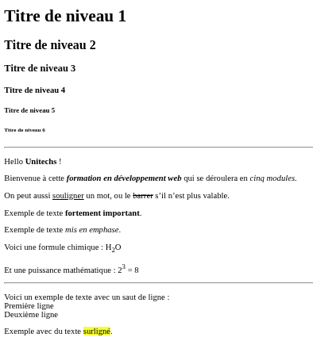
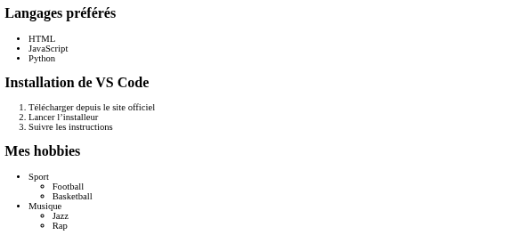
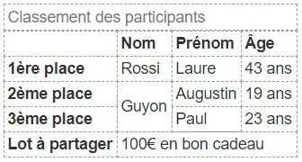
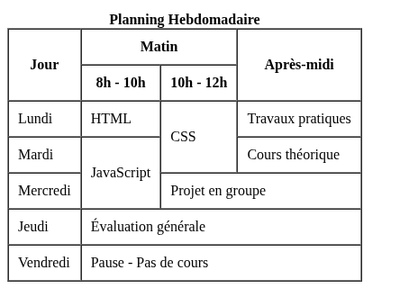
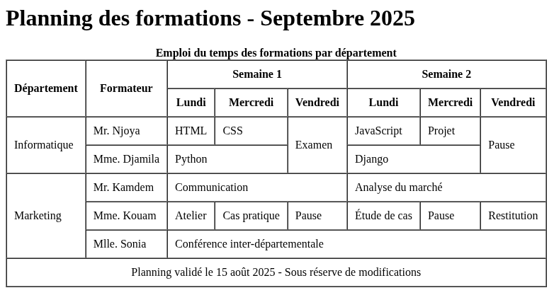
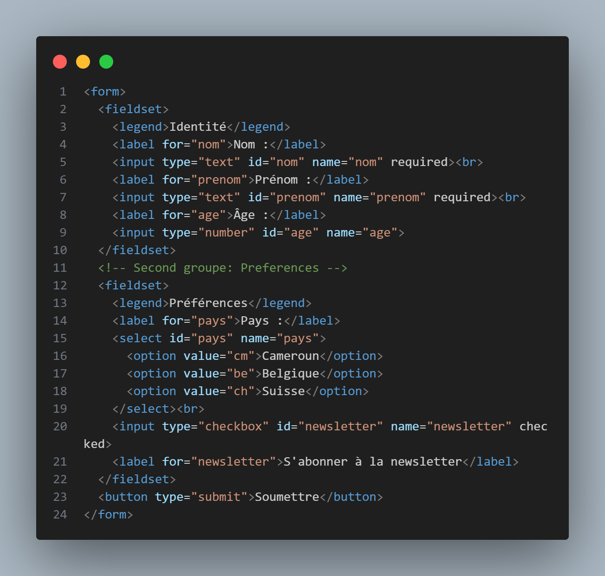
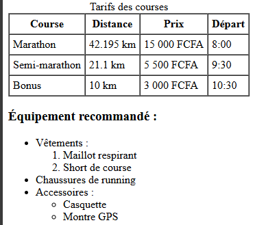

# 1.1 Introduction à HTML5

## Qu'est-ce que HTML ?

- HTML (HyperText Markup Language) est le langage standard utilisé pour créer et structurer des pages web. Il permet de décrire la structure d’un document en utilisant des balises (ou "tags").
- HTML5 (HyperText Markup Language 5) est la dernière version du langage de balisage standard pour créer des pages web.
- Une balise (ou tag en anglais) est un élément de base du langage HTML qui sert à marquer ou délimiter des portions de texte pour indiquer leur rôle ou leur signification sur une page web. On distingue deux types:
     - Les balises simples
     - Les balises doubles

### Nouveautés HTML5 :
- **Éléments sémantiques** : `<header>`, `<nav>`, `<main>`, `<section>`, `<article>`, `<aside>`, `<footer>`
- **APIs intégrées** : Canvas, Audio/Video, Geolocation, Local Storage
- **Formulaires améliorés** : nouveaux types d'input et validation native
- **Meilleure accessibilité** et SEO(pour Search Engine Optimization)

---
layout: two-cols
---

### Structure de base HTML5 :

```html
<!DOCTYPE html>
<html lang="fr">
  <head>
    <meta charset="UTF-8" />
    <title>Titre Page</title>
  </head>
  <body>
    Bonjour, UniTechs
  </body>
</html>

```
::right::

### Explication des balises

- `<!DOCTYPE html>`	Indique que le document est en HTML5
- `<html lang="fr">`	Conteneur de tout le document, ici en français
- `<head>`	Contient les métadonnées (non visibles)
- `<meta charset="UTF-8">`	Permet l'encodage universel (accent, caractères spéciaux)
- `<title>`	Titre affiché dans l’onglet du navigateur
- `<body>`	Contient tout le contenu affiché à l’écran

---

# 1.2 Le Corps du document - body

## Les Commentaires
```html
<!-- Ceci est un commentaire HTML -->
```

## Titres

Les balises de titre vont de `<h1>` (le plus important) à `<h6>` (le moins important).

```html
<h1>Titre principal</h1>
<h2>Sous-titre</h2>
<h3>Sous-sous-titre</h3>
```


## Les Paragraphes 

Chaque paragraphe de texte se place entre balises `<p>` :
```html
<p>Ceci est un paragraphe de texte.</p>

```

---
layout: two-cols
---

## Mise en forme du texte

- `<strong>` `<b>`	Texte en gras (sémantique importante)
- `<em>` `<i>`	Texte en italique (accent mis sur le mot)
- `<mark>`	Texte surligné
- `<u>`	Texte souligné (moins utilisé)
- `<s>` Texte barré 
- `<sup>` Text en exposant
- `<sub>` Text en indice 
- `<br>`	Saut de ligne
- `<hr>`	Ligne horizontale de séparation

::right::

## Exemple
```html
<!DOCTYPE html>
<html lang="fr">
  <head>
    <meta charset="UTF-8" />
    <title>Texte HTML</title>
  </head>
  <body>
    <h1>Mon titre principal</h1>
    <h2>Un sous-titre</h2>
    <p>Ceci est un paragraphe <b>avec du gras</b>.</p>
    <p>Un autre paragraphe <i>avec de l’italique</i>.</p>
    <p>Ligne 1<br>Ligne 2</p>
    <hr>
    <!-- Commentaire invisible à l'écran -->
  </body>
</html>

```

---
layout: two-cols
---

## 📝 Exercice 1
 Realisez le visuel ci dessous
 

::right::

## ✅ Corrigé

<a href="/corrections/html/exercice1.html" target="_blank" rel="noopener" class="btn-view" style="padding: 0.5em 1em; background: #2563eb; color: #fff; border-radius: 6px; text-decoration: none; display: flex; align-items: center; gap: 0.5em;">
    <span>👁️</span> Visualiser la correction
</a>

---
layout: two-cols
---

## Liens et Navigation
🎯 Objectifs
- Créer des liens vers d’autres pages ou sites
- Créer des ancres dans une même page
- Utiliser des liens pour envoyer un email ou télécharger un fichier

### a. Creer un lien
La balise `<a>` permet de créer un hyperlien. Elle comprend en son sein plusieurs attributs dont:
- `href`	Cible du lien (URL ou fichier local)
- `target` il existe plusieurs valeurs 
    - `_self` Affichage dans le cadre courant(Par defaut)
    - `_blank` Ouvre dans un nouvel onglet

::right::	
     - `_top` Affichage dans la totalite de la fenetre ouvrante
- `title`	Texte au survol
- `download` Pour telecharger un document
```html
<a href="https://www.example.com">Visiter un site</a>
<a href="https://openai.com" target="_blank" title="Visitez OpenAI">OpenAI</a>
<a href="page2.html">Aller à la page 2</a>
<a href="fichier.pdf" download>Télécharger le PDF</a>
```

---

### b. Les liens email
Vous pouvez permettre a vos utilisateurs d'ecrire sur votre adresses emails avec la syntaxe `mailto`
```html
<a href="mailto:unietechsdev@gmail.com">Envoyer un mail</a>
```
Vous pouvez renseigner un sujet par defaut, ainsi qu'un corps voire meme les deux:
```html
<a href="mailto:unietechsdev@gmail.com?subject=Sujet du mail">Envoyer un mail</a>
<a href="mailto:unietechsdev@gmail.com?body=Corp du mail">Envoyer un mail</a>
<!-- Pour les deux -->
 <a href="mailto:unietechsdev@gmail.com?subject=Sujet du mail&body=Corps du mail">Envoyer un mail</a>
```


### c. Ancres internes (lien vers une section)

Étape 1 : Ajouter un id à une section
```html
<h2 id="section1">Chapitre 1</h2>
```
Étape 2 : Lien vers cette section
```html
<a href="#section1">Aller au chapitre 1</a>
```

---

### 📝 Exercice 3
Creer une page contenant :
- un lien vers le site "https://wwww.wikipedia.org"
- un lien permettant d'ouvrir sur un autre onglet votre projet de l'exercice1 developpé precedement
- un lien qui télécharge un fichier pdf
- un lien vers votre adresse email
- Une ancre pour aller directement a une section "Contact"

## ✅ Corrigé

<a href="/corrections/html/exercice3.html" target="_blank" rel="noopener" class="btn-view" style="padding: 0.5em 1em; background: #2563eb; color: #fff; border-radius: 6px; text-decoration: none; display: flex; align-items: center; gap: 0.5em;">
    <span>👁️</span> Visualiser la correction
</a>

---

## Les Images
La balise `` permet d'afficher une image avec html qu'elle soit en locale ou distante. Pour cela elle dispose en sont sein plusieurs attributs dont:
- `src`	Lien vers l’image (fichier local ou URL)
- `alt`	Texte alternatif si l’image ne s’affiche pas
- `title`	Texte au survol
- `width`, `height`	Taille en pixels ou en %
```html


```
---

## Les Listes
Les listes en HTML permettent d'organiser le contenu sous forme d'éléments ordonnés ou non ordonnés.
### a. Liste non ordonnée
Utilisée pour afficher des éléments sans ordre particulier 
```html
<p>Liste de courses :</p>
<ul>
  <li>Pomme</li>
  <li>Banane</li>
  <li>Orange</li>
</ul>
```

On va pouvoir jouer sur le design des puces a l'aide de trois types differents. On renseigne le type des puces avec l'attribut `type` de la balise `<ul>`
- `disc` par defaut au niveau 1 d'imbrication
- `circle` par defaut au niveau 2 d'imbrication
- `square` par defaut au niveau 3 et suivant d'imbrication
  
---

### b. Liste ordonnée
Elles sont introduites par la balise `<ol>` et chacun des items est encadré par la balise `<li>`
```html
<p>Top 3 des activitées sportives: </p>
<ol>
  <li>Football</li>
  <li>Basket</li>
  <li>Handball</li>
</ol>
```

Il existe cinq manieres differentes de numéroter les listes ordonnées. On renseigne le type de numerotation avec l'attribut `type` de la balise `<ol>`. Les types sont:
- `1`: numerotation par les chiffres arabes(par défaut)
- `I`: numerotation par les chiffres romains
- `i`: numerotation par les chiffres romains minuscules
- `A`: numerotation par les lettres de l'alphabet
- `a`: numerotation par les lettres de l'alphabet


---

### c. Liste imbriqué
L'imbrication des listes permet une présentation claire et detaillée d'un mmenu ou d'un sommaire

```html
<ul>
  <li>Fruits
    <ul>
      <li>Pomme</li>
      <li>Raisin</li>
    </ul>
  </li>
  <li>Légumes
    <ul>
      <li>Carotte</li>
      <li>Tomate</li>
    </ul>
  </li>
</ul>
```

---

### 📝 Exercice 4
Créer une page contenant :
- Une liste de vos 3 langages préférés
- Une liste numérotée des étapes d’installation de Visual Studio Code
- Une liste imbriquée de vos hobbies (ex: Sport → Foot, Basket / Musique → Jazz, Rap, ...)


## ✅ Corrigé

<a href="/corrections/html/exercice4.html" target="_blank" rel="noopener" class="btn-view" style="padding: 0.5em 1em; background: #2563eb; color: #fff; border-radius: 6px; text-decoration: none; display: flex; align-items: center; gap: 0.5em;">
    <span>👁️</span> Visualiser la correction
</a>


---

# 1.3 Exercice - Structure HTML5

## 🎯 Exercice Pratique 1

Créez une page HTML5 pour un restaurant avec :
- En-tête avec nom du restaurant et navigation
- Section "À propos" avec description
- Section "Menu" avec 3 plats (nom, description, prix)
- Section "Contact" avec adresse et téléphone
- Pied de page avec horaires

### Critères d'évaluation :
- ✅ Structure HTML5 valide
- ✅ Utilisation correcte des éléments sémantiques
- ✅ Métadonnées appropriées
- ✅ Navigation fonctionnelle

**Temps estimé : 30 minutes**

<div class="correction-actions" style="display: flex; gap: 1rem; flex-wrap: wrap; margin-bottom: 2rem;">

  <a href="/corrections/html/exercice pratique 1/index.html" target="_blank" rel="noopener" class="btn-view" style="padding: 0.5em 1em; background: #2563eb; color: #fff; border-radius: 6px; text-decoration: none; display: flex; align-items: center; gap: 0.5em;">
    <span>👁️</span> Visualiser la correction 
  </a>
  <a href="/corrections/html/exercice pratique 1/index.html" download class="btn-download-html" style="padding: 0.5em 1em; background: #059669; color: #fff; border-radius: 6px; text-decoration: none; display: flex; align-items: center; gap: 0.5em;">
    <span>📥</span> Télécharger la correction HTML
  </a>
  <a href="/corrections/html/Exercice Pratique 1.zip" download class="btn-download-zip" style="padding: 0.5em 1em; background: #f59e42; color: #fff; border-radius: 6px; text-decoration: none; display: flex; align-items: center; gap: 0.5em;">
    <span>🗜️</span> Télécharger le ZIP
  </a>
</div>


---
layout: two-cols
---

# 1.4  Les Tableaux en HTML

Suite de lignes et de colonnes qui forment un ensemble de cellules. Elles servent avant tout a presenter des données tabulaires
## Bases d'un tableau
1. Un tableau est delimite par la balise `<table>`. Le contenue d'un tableau est genere horizontalement(lignes par lignes).
2. Pour créer un tableau, nous commencons par des lignes graces aux balises `<tr>` puis nous inserons dans ses lignes les cellules du tableau avec les balises `<th>` `<td>`
3. Le contenu (textes, images, ...) se trouvent uniquement dans les balises `<td>` ou `<th>` et ne doivent en aucun cas se trouver en dehors.

::right::

## Structure de base d’un tableau
```html
<table>
  <tr>
    <th>Eleves</th>
    <th>Francais</th>
    <th>Mathématiques</th>
    <th>Histoire</th>
    <th>Sport</th>
  </tr>
  <tr>
    <td>Laure</td>
    <td>15</td>
    <td>10</td>
    <td>11</td>
    <td>13</td>
  </tr>
  <tr>
    <td>Philippe</td>
    <td>8.5</td>
    <td>12</td>
    <td>9</td>
    <td>15</td>
  </tr>
</table>
```

---

## Ajouter un titre au tableau
```html
<caption>Liste des étudiants</caption>

<caption align="bottom">Liste des étudiants</caption>
```

##  Fusion de cellules
La fusion de cellules peut se faire de deux maniere: 
- 🔸Fusion horizontale : `colspan`, 
- 🔸 Fusion verticale : `rowspan`
## Les differentes parties d'un tableau
Quand on arrive a avoir un tableau de grande taille, il devient moins évident a gérer. Pour cela on peut regrouper les lignes par grandes parties
- 🔸 l'en-tete avec la balise `<thead>`    🔸 le corps avec la balise `<tbody>`  🔸 le pied avec la balise `<tfoot>`

<i>Note: Elles doivent apparaitre dans l'ordre suivant: `<thead>`, `<tfoot>` et `<tbody>`</i>

---
layout: two-cols
---

## 📝 Exercice 5
Donner le code html permettant d'afficher le rendu/visuel ci-dessous:



## ✅ Corrigé

<div class="correction-actions" style="display: flex; gap: 1rem; flex-wrap: wrap; margin-bottom: 2rem;">

  <a href="/corrections/html/exercice5.html" target="_blank" rel="noopener" class="btn-view" style="padding: 0.5em 1em; background: #2563eb; color: #fff; border-radius: 6px; text-decoration: none; display: flex; align-items: center; gap: 0.5em;">
    <span>👁️</span> Visualiser la correction 
  </a>
  <!-- <a href="/corrections/html/exercice5.html" download class="btn-download-html" style="padding: 0.5em 1em; background: #059669; color: #fff; border-radius: 6px; text-decoration: none; display: flex; align-items: center; gap: 0.5em;">
    <span>📥</span> Télécharger la correction HTML
  </a>
  <a href="/corrections/css/exercice2.zip" download class="btn-download-zip" style="padding: 0.5em 1em; background: #f59e42; color: #fff; border-radius: 6px; text-decoration: none; display: flex; align-items: center; gap: 0.5em;">
    <span>🗜️</span> Télécharger le ZIP
  </a> -->
</div>

::right::



## ✅ Corrigé

<div class="correction-actions" style="display: flex; gap: 1rem; flex-wrap: wrap; margin-bottom: 2rem;">

  <a href="/corrections/html/exercice5-2.html" target="_blank" rel="noopener" class="btn-view" style="padding: 0.5em 1em; background: #2563eb; color: #fff; border-radius: 6px; text-decoration: none; display: flex; align-items: center; gap: 0.5em;">
    <span>👁️</span> Visualiser la correction 
  </a>
  <!-- <a href="/corrections/html/exercice5-2.html" download class="btn-download-html" style="padding: 0.5em 1em; background: #059669; color: #fff; border-radius: 6px; text-decoration: none; display: flex; align-items: center; gap: 0.5em;">
    <span>📥</span> Télécharger la correction HTML
  </a>
  <a href="/corrections/css/exercice2.zip" download class="btn-download-zip" style="padding: 0.5em 1em; background: #f59e42; color: #fff; border-radius: 6px; text-decoration: none; display: flex; align-items: center; gap: 0.5em;">
    <span>🗜️</span> Télécharger le ZIP
  </a> -->
</div>

---

## 🎯 Exercice Pratique 2

Créez une page HTML5 permettant d'afficher :


### Critères d'évaluation :
- ✅ Structure HTML5 valide
- ✅ Utilisation correcte des éléments sémantiques
- ✅ Métadonnées appropriées

**Temps estimé : 10 minutes**

## Correctioon

<div class="correction-actions" style="display: flex; gap: 1rem; flex-wrap: wrap; margin-bottom: 2rem;">

  <a href="/corrections/html/exercicePratique2.html" target="_blank" rel="noopener" class="btn-view" style="padding: 0.5em 1em; background: #2563eb; color: #fff; border-radius: 6px; text-decoration: none; display: flex; align-items: center; gap: 0.5em;">
    <span>👁️</span> Visualiser la correction 
  </a>
  <a href="/corrections/html/exercicePratique2.html" download class="btn-download-html" style="padding: 0.5em 1em; background: #059669; color: #fff; border-radius: 6px; text-decoration: none; display: flex; align-items: center; gap: 0.5em;">
    <span>📥</span> Télécharger la correction HTML
  </a>
  <a href="/corrections/css/exercice2.zip" download class="btn-download-zip" style="padding: 0.5em 1em; background: #f59e42; color: #fff; border-radius: 6px; text-decoration: none; display: flex; align-items: center; gap: 0.5em;">
    <span>🗜️</span> Télécharger le ZIP
  </a>
</div>

---

# 1.5 Formulaires HTML

## Qu'est-ce qu'un formulaire ?
Un formulaires permet de collecter des informations saisies par l'utilisateur et de les envoyer à un serveur pour traitement.Elles sont dotés de divers controles comme:
- des champs de saisie,
- des boutons
- listes
- ...

---

## 🏗️ Structure générale

```html
<!DOCTYPE html>
<html lang="fr">
<head>
    <meta charset="UTF-8">
    <title>Mon Formulaire</title>
</head>
<body>
    <form>
        <!-- Éléments du formulaire -->
        <input type="text" name="nom">
        <button type="submit">Envoyer</button>
    </form>
</body>
</html>
```
<p>
  <strong>💡 À retenir :</strong> Un formulaire est un conteneur qui regroupe des éléments interactifs pour collecter des données utilisateur.
</p>

---

# Anatomie d'un Formulaire
Découvrons les composants essentiels d'un formulaire HTML.

```html
<form action="/traitement.php" method="post">
    <!-- 1. Étiquette -->
    <label for="nom">Votre nom :</label>
    
    <!-- 2. Champ de saisie -->
    <input type="text" id="nom" name="nom">
    
    <!-- 3. Bouton d'envoi -->
    <button type="submit">Envoyer</button>
</form>
```

### Rôles des éléments :
- **`<form>`** : Conteneur principal
- **`<label>`** : Étiquette descriptive
- **`<input>`** : Champ de saisie
- **`<button>`** : Bouton d'action
---

## ⚙️ Attributs importants

### Élément `<form>`
- **`action`** : URL de destination des données
- **`method`** : Méthode d'envoi (GET/POST)

### Élément `<input>`
- **`type`** : Type de champ (text, email, date, number, time,...)
- **`name`** : Nom du champ pour le serveur
- **`id`** : Identifiant unique

### Élément `<label>`
- **`for`** : Lie l'étiquette au champ (même valeur que l'`id`)

---
layout: two-cols
---

## 📝 Exercice 6 
Créez votre premier formulaire HTML simple :

### Objectifs :
1. Créer un fichier `exercice6.html`
2. Ajouter un formulaire avec :
   - Un champ "Prénom"
   - Un champ "Nom de famille"
   - un champ "Email"
   - Un bouton "Valider"
3. Utiliser les bonnes pratiques :
   - Associer les labels aux inputs
   - Définir les attributs `name` et `id`
::right::

### ✅ À faire

1. **Créer** le fichier HTML avec la structure de base
2. **Ajouter** le formulaire avec les champs demandés
3. **Vérifier** que vous pouvez saisir du texte et cliquer sur le bouton

# Corrigé

[Correction de l’exercice](html/exercice6.html){download}

---
layout: two-cols
---

## L'élément `<form>` et ses Attributs
L'élément `<form>` est le conteneur principal qui définit comment les données seront envoyées.

### `action` - Destination des données
```html
<!-- Envoie vers un fichier PHP -->
<form action="traitement.php">

<!-- Envoie vers une URL complète -->
<form action="https://exemple.com/contact">

<!-- Envoie vers la même page (par défaut) -->
<form action="">
<form> <!-- Sans action = même page -->
```

::right::

### `method` - Méthode d'envoi
```html
<!-- GET : données visibles dans l'URL -->
<form method="get">

<!-- POST : données cachées (recommandé) -->
<form method="post">
```

### `name` - Nom du formulaire
```html
<form name="contact" action="traitement.php">
```

### `target` - Fenêtre de destination
```html
<!-- Ouvre dans une nouvelle fenêtre -->
<form target="_blank">

<!-- Ouvre dans la même fenêtre (défaut) -->
<form target="_self">
```

---
layout: two-cols
---
# Différence entre GET et POST

Comprendre les méthodes d'envoi est crucial pour bien utiliser les formulaires.

## 📤 Méthode GET

Les valeurs envoyes en `GET` passent par l'URL

```html
<form action="recherche.php" method="get">
    <label for="motcle">Rechercher :</label>
    <input type="text" id="motcle" name="q">
    <button type="submit">Chercher</button>
</form>
```


**Résultat dans l'URL :**
```
https://exemple.com/recherche.php?q=formation
```

::right::
### ✅ Avantages :
- URL partageable
- Résultat mis en favoris
- Navigation avec boutons précédent/suivant

### ❌ Inconvénients :
- Données visibles dans l'URL
- Limite de longueur (~2000 caractères)
- Pas sécurisé pour données sensibles

---
layout: two-cols
---

## 📨 Méthode POST

```html
<form action="inscription.php" method="post">
    <label for="email">Email :</label>
    <input type="email" id="email" name="email">
    
    <label for="password">Mot de passe :</label>
    <input type="password" id="password" name="password">
    
    <button type="submit">S'inscrire</button>
</form>
```
**Les données sont envoyées de manière cachée**

::right::

### ✅ Avantages :
- Données cachées dans l'URL
- Pas de limite de taille
- Plus sécurisé
- Permet l'envoi de fichiers

### ❌ Inconvénients :
- URL non partageable
- Pas de favoris possible
- Actualisation = renvoi des données

---

# Quand utiliser GET ou POST ?

## 🔍 Utilisez GET pour :

- **Recherche** : Moteurs de recherche
- **Filtres** : Tri de produits
- **Navigation** : Pagination
- **Consultation** : Affichage de données

```html
<!-- Formulaire de recherche -->
<form action="recherche.php" method="get">
    <input type="search" name="q" placeholder="Rechercher...">
    <button type="submit">🔍</button>
</form>

<!-- Filtre de produits -->
<form method="get">
    <select name="categorie">
        <option value="tous">Tous</option>
        <option value="vetements">Vêtements</option>
    </select>
    <button type="submit">Filtrer</button>
</form>
```

---

## 📝 Utilisez POST pour :

- **Inscription/Connexion** : Données sensibles
- **Contact** : Messages privés
- **Commandes** : Informations personnelles
- **Upload** : Envoi de fichiers

```html
<!-- Formulaire de contact -->
<form action="contact.php" method="post">
    <input type="email" name="email" required>
    <textarea name="message" required></textarea>
    <button type="submit">Envoyer</button>
</form>

<!-- Upload de fichier -->
<form method="post" enctype="multipart/form-data">
    <input type="file" name="photo">
    <button type="submit">Télécharger</button>
</form>
```

---
layout: two-cols
---

## 📝 Exercice 7 : Formulaires GET et POST
Créez deux formulaires pour comprendre la différence entre GET et POST :

### Formulaire 1 - Recherche
- Champ de recherche
- Bouton "Rechercher"
- Action vers `recherche.php`

### Formulaire 2 - Contact
- Champ "Nom"
- Champ "Email"
- Zone de "Message"
- Bouton "Envoyer"
- Action vers `contact.php`

::right::

## 🎯 Travail a Faire

1. **Créer** `exercice7.html`
2. **Implémenter** les deux formulaires
3. **Tester** en remplissant les champs
4. **Observer** la différence dans l'URL après soumission
5. **Comprendre** quand utiliser chaque méthode

---

# Champs de Saisie `<input>`
L'élément `<input>` est polyvalent et change de comportement selon son attribut `type`.
## 🎛️ Syntaxe de base
```html
<input type="type" name="nom" id="identifiant">
```

### Attributs essentiels :
- **`type`** : Définit le type de champ
- **`name`** : Nom du champ (côté serveur)
- **`id`** : Identifiant unique (pour `<label>`)

### Attributs optionnels :
- **`value`** : Valeur par défaut
- **`placeholder`** : Texte d'aide
- **`required`** : Champ obligatoire
- **`disabled`** : Champ désactivé
- **`readonly`** : Lecture seule
---

## 📝 Types d'input principaux

| Type | Usage |
|------|-------|
| `text` | Texte simple |
| `email` | Adresse email |
| `password` | Mot de passe |
| `number` | Nombre |
| `tel` | Téléphone |
| `url` | URL |
| `date` | Date |
| `checkbox` | Case à cocher |
| `radio` | Bouton radio |
| `file` | Fichier |
| `submit` | Bouton d'envoi |
| `reset` | Bouton de renitialisation |
| `button` | Bouton simple |
| `radio` | Bouton radio |
| `file` | Fichier |
| `submit` | Bouton d'envoi |
| `reset` | Bouton de renitialisation |
| `button` | Bouton simple |
---

## Types de Texte

Les différents types de champs texte et leurs spécificités.

### 📝 Type `text` - Texte simple

```html
<!-- Champ texte basique -->
<label for="nom">Nom :</label>
<input type="text" id="nom" name="nom">
<!-- Avec valeur par défaut -->
<input type="text" name="ville" value="Paris">
<!-- Avec placeholder -->
<input type="text" name="prenom" 
       placeholder="Entrez votre prénom">
<!-- Avec contraintes -->
<input type="text" name="pseudo" 
       minlength="3" maxlength="20"
       placeholder="3 à 20 caractères">
```

### ✨ Attributs spécifiques :
- `minlength` / `maxlength` : Longueur min/max
- `pattern` : Expression régulière
- `autocomplete` : Autocomplétion

---

## Les champs texte multilignes

Si vous souhaitez que vos visiteurs puissent saisir de longs textes, comme des champs de commentaires pour des articles d'un blog par exemple, il faudra se tourner vers l'utilisation de la balise `<textarea>`.<br><br> Deux attributs sont necessaires au `<textarea>`: `rows` qui contient le nombre de lignes et `cols` le nombres de colonnes. <br>
|  On peut tout comme le champs de texte monoligne rajouter les attributs `name`, `readonly` et `disabled`

```html
<textarea name="commentaires" cols="30" rows="10"></textarea>

<textarea name="description" id="" cols="6" rows="100">Texte par defaut</textarea>
```
<br>

| <b>Note:</b> L'attribut `maxlenght` n'existe pas sur cette balise, et pour en limiter le nombre de caractères il est possible de passer par du JavaScript.

---

## 📧 Type `email` - Adresse email

```html
<!-- Email simple -->
<label for="email">Email :</label>
<input type="email" id="email" name="email">

<!-- Email obligatoire -->
<input type="email" name="email" required
       placeholder="votre@email.com">

<!-- Plusieurs emails -->
<input type="email" name="emails" multiple
       placeholder="email1@test.com, email2@test.com">
```

## 🔔 Type `tel` - Téléphone

```html
<!-- Téléphone -->
<label for="tel">Téléphone :</label>
<input type="tel" id="tel" name="telephone">

<!-- Avec pattern pour format français -->
<input type="tel" name="tel" 
       pattern="0[1-9][0-9]{8}"
       placeholder="0123456789">
```

---

# Types Spécialisés
Découvrons les types d'input plus spécifiques.

## 🔒 Type `password` - Mot de passe

```html
<!-- Mot de passe simple -->
<label for="password">Mot de passe :</label>
<input type="password" id="password" name="password">
<!-- Avec contraintes -->
<input type="password" name="password" minlength="8" required placeholder="8 caractères minimum">
<!-- Confirmation -->
<label for="confirm">Confirmer :</label>
<input type="password" id="confirm" name="confirm">
```

## 🌐 Type `url` - URL

```html
<!-- URL simple -->
<input type="url" name="site" 
       placeholder="https://monsite.com">
<!-- URL obligatoire -->
<input type="url" name="portfolio" required>
```

---

## 🔢 Type `number` - Nombre

```html
<!-- Nombre simple -->
<label for="age">Âge :</label>
<input type="number" id="age" name="age">

<!-- Avec limites -->
<input type="number" name="note" 
       min="0" max="20" step="0.5"
       placeholder="Note sur 20">

<!-- Quantité -->
<input type="number" name="quantite" 
       min="1" value="1">
```

## 🔍 Type `search` - Recherche

```html
<!-- Champ de recherche -->
<input type="search" name="q" 
       placeholder="Rechercher...">

<!-- Avec autocomplete -->
<input type="search" name="recherche"
       autocomplete="on">
```

---

# Types de Date et Heure

HTML5 offre plusieurs types pour gérer les dates et heures.

## 📅 Dates

```html
<!-- Date complète -->
<label for="naissance">Date de naissance :</label>
<input type="date" id="naissance" name="naissance">

<!-- Avec limites -->
<input type="date" name="reservation"
       min="2024-01-01" max="2024-12-31">

<!-- Mois uniquement -->
<label for="mois">Mois :</label>
<input type="month" id="mois" name="mois">

<!-- Semaine -->
<label for="semaine">Semaine :</label>
<input type="week" id="semaine" name="semaine">
```

---

## ⏰ Heures

```html
<!-- Heure -->
<label for="heure">Heure :</label>
<input type="time" id="heure" name="heure">

<!-- Avec valeur par défaut -->
<input type="time" name="rendez-vous" 
       value="09:30">

<!-- Date et heure complète -->
<label for="datetime">Date et heure :</label>
<input type="datetime-local" id="datetime" 
       name="datetime">

<!-- Avec minimum  -->
<input type="datetime-local" name="reservation"
       min="2025-07-30T10:00">
```

---

## 📝 Exercice 8 : Types d'Input
Créez un formulaire d'inscription utilisant différents types d'input :
<p><b> Champs à créer : </b></p>

1. **Prénom** (text, obligatoire)
1. **Nom** (text, obligatoire)
2. **Email** (email, obligatoire)
3. **Mot de passe** (password, min 8 caractères)
4. **Téléphone** (tel, format french)
5. **Site web** (url, optionnel)
6. **Âge** (number, 16-99 ans)
7. **Date de naissance** (date)
8. **Heure préférée** (time)

### Contraintes :
- Tous les champs obligatoires sauf site web
- Placeholders informatifs
- Validation HTML5 appropriée

---

# Cases à Cocher (`checkbox`)

Les checkboxes permettent de sélectionner une ou plusieurs options.
```html
<!-- Checkbox simple -->
<input type="checkbox" id="newsletter" name="newsletter">
<label for="newsletter">S'abonner à la newsletter</label>

<!-- Checkbox cochée par défaut -->
<input type="checkbox" id="conditions" name="conditions" checked>
<label for="conditions">J'accepte les conditions</label>

<!-- Checkbox obligatoire -->
<input type="checkbox" id="rgpd" name="rgpd" required>
<label for="rgpd">J'accepte la politique de confidentialité *</label>
```

---
layout: two-cols
---

## Les Listes
<b>Les listes</b> permettent de laisser un choix aux visiteurs au meme titre que les boutons `radio` ou `cases à cocher`, mais sont plus pratiques lorsqu'il s'agit de proposer un grand nombre de choix. Elles sont introduites par la balise `<select>` qui comprend les ifferents choix sous forme de balise `<option>` dont on renseigne la valeur qui sera envoyé au serveur grace a l'attribut `value`.

| <b><i>NB:</i></b> On peut suggérer une proposition par defaut en précisant l'attribut `selected` de la balise `<option>`

::right::

## Exemple de liste simple

```html
<select name="couleur_yeux">
  <option value="bleu" selected="selected">Bleu</option>
  <option value="vert">Vert</option>
  <option value="marron">Marron</option>
  <option value="noir">Noir</option>
  <option value="gris">Gris</option>
</select>
```

---

## Listes a choix multiple 
Pour pouvoir proposer plusieurs choix, comme dans les cases à cocher, il suffit de rajouter l'attribut `multiple` qui prend pour seule valeur `multiple`
```html
<select name="langages_preferes" multiple="multiple" size="5">
  <option value="html">HTML</option>
  <option value="css">CSS</option>
  <option value="javascript">JavaScript</option>
  <option value="python">Python</option>
  <option value="java">Java</option>
  <option value="csharp">C#</option>
  <option value="php">PHP</option>
</select>
```

| <b>Note:</b><i> Le choix multiple ne peut pas se faire sur une liste deroulante. L'attribut `size` doit etre renseigné  pour que `multiple` fonctionne.</i>

---

## Groupes d'options

permettent de regrouper des options similaires.
```html
<select name="voiture">
  <optgroup label="Allemandes">
    <option value="bmw">BMW</option>
  </optgroup>
  <optgroup label="Françaises">
    <option value="peugeot">Peugeot</option>
  </optgroup>
</select>
```

---

# Groupage de champs

La balise `<fieldset>` permet de grouper logiquement des champs de formulaires de meme nature. La balise qui va permettre de donner ce nom au groupage de champs est `<legend>`

```html
<form>
  <fieldset>
    <legend>Coordonnées</legend>
    <label for="nom">Nom :</label>
    <input type="text" id="nom" name="nom"><br>
      
    <label for="email">Email :</label>
    <input type="email" id="email" name="email">
  </fieldset>
</form>
```

---
layout: two-cols
---

## Exemple 1:
Créez un formulaire avec :
1. Un groupe "Identité" (nom, prénom, âge).
2. Un groupe "Préférences" avec :
  - Liste déroulante "Pays" (3 options).
  - Case à cocher "Newsletter" (checked par défaut).
3. Un bouton "Soumettre".

:: right::

## Solution


---
layout: center
class: text-center
---

# 📑 Récapitulatifs

<div class="text-6xl text-blue-500 mb-8">
  <carbon-screen/>
</div>


---

## 📑 Balises de structure

| Balises     | Rôle                         |
| ----------- | ---------------------------------------------- |
| `<html>`    | Délimite le document HTML                      |
| `<head>`    | Contient les métadonnées (titre, liens CSS...) |
| `<body>`    | Contient le contenu visible de la page         |
| `<header>`  | En-tête de page ou de section                  |
| `<nav>`     | Menu de navigation                             |
| `<main>`    | Contenu principal de la page                   |
| `<footer>`  | Pied de page ou de section                     |
| `<article>` | Contenu indépendant (article, post…)           |
| `<aside>`   | Contenu complémentaire (barre latérale…)       |
---

## 📑 Balises Méta (Invisibles)
| Balise	| Rôle|
| ------- | --- |
| `<meta>` |	Métadonnées (charset, viewport)|
| `<link>` |	Liaison (CSS, favicon)|
| `<script>` |	Code JavaScript|

```html
<meta charset="UTF-8">
<link rel="stylesheet" href="style.css">
```
---

## 📝 Balises de texte
| Balise          | Rôle                                 |
| --------------- | ------------------------------------ |
| `<h1>` à `<h6>` | Titres (du plus grand au plus petit) |
| `<p>`           | Paragraphe                           |
| `<br>`          | Saut de ligne                        |
| `<hr>`          | Ligne horizontale                    |
| `<strong>`      | Texte en **gras** (important)        |
| `<em>`          | Texte en *italique* (emphase)        |
| `<u>`           | Texte <u>souligné</u>                |
| `<span>`        | Conteneur en ligne (inline)          |
---

## 📋 Balises de liste
| Balise | Rôle                       |
| ------ | -------------------------- |
| `<ul>` | Liste non ordonnée (puces) |
| `<ol>` | Liste ordonnée (numérotée) |
| `<li>` | Élément de liste           |

## 📦 Balises de conteneur
| Balise   | Rôle                             |
| -------- | -------------------------------- |
| `<div>`  | Bloc de contenu (display: block) |
| `<span>` | Conteneur en ligne (inline)      |
| `<p>`    | Paragraphe      |
---
layout: two-cols
---

## 🔗 Balises de lien et média
| Balise     | Rôle                              |
| ---------- | --------------------------------- |
| `<a>`      | Lien hypertexte                   |
| ``    | Image                             |
| `<video>`  | Vidéo                             |
| `<audio>`  | Audio                             |
| `<iframe>` | Contenu externe (YouTube, carte…) |

::right::
## Exemples
- Avec `<video>`:
```html
<video width="640" height="360" controls>
  <source src="ma_video.mp4" type="video/mp4">
  <source src="ma_video.webm" type="video/webm">
  Votre navigateur ne supporte pas la balise vidéo.
</video>
```

- Avec `<iframe>`:
```html
<!-- Exemple : carte Google Maps -->
<iframe 
  src="https://www.google.com/maps/embed?pb=!1m18!1m12!..." 
  width="600" height="450" allowfullscreen="">
</iframe>
<!-- Exemple : vidéo YouTube -->
<iframe 
  width="560" height="315" 
  src="https://www.youtube.com/embed/dQw4w9WgXcQ" 
  title="Vidéo YouTube" 
  frameborder="0" 
  allowfullscreen>
</iframe>
```
---

## 📤 Balises de formulaire

| Balise       | Rôle                       |
| ------------ | -------------------------- |
| `<form>`     | Début d’un formulaire      |
| `<input>`    | Champ de saisie            |
| `<textarea>` | Zone de texte              |
| `<select>`   | Liste déroulante           |
| `<option>`   | Option dans une liste      |
| `<button>`   | Bouton (valider, envoyer…) |
| `<label>`    | Étiquette d’un champ       |

---
layout: two-cols
---

# Exercice Pratique 3:
Créez une page HTML permettant de réserver une place pour un Marathon International.
Le site doit comporter une structure complète avec en-tête, navigation, tableau d’informations et formulaire interactif.<br> 
**Partie 1 – Informations générales & Menu**<br>
| Ajoutez en haut de la page :
- Un titre principal avec le nom de l’événement.
- Un menu de navigation comportant trois liens :
    1. Infos → section présentant les courses disponibles
    2. Réservation → formulaire d’inscription
    3. Contact → liens utiles (email, téléphone, site web)

:: right::

**Partie 2 – Tableau d'information**<br>
| Sous la section Infos, insérez un tableau affichant :
`Nom de la course`, `Distance`, `Prix`, `Heure de départ`.<br>
Ajoutez également une liste d’équipements recommandés avec des listes imbriquées 


---
layout: two-cols
---
 
**Partie 3 – Formulaire de réservation**<br>
| Créez un formulaire HTML avec les sections suivantes :
- Identité
    - Civilité (liste déroulante : M., Mme, Autre)
    - Nom (text, obligatoire)
    - Prénom (text, obligatoire)
    - Email (email, obligatoire)
    - Téléphone (tel, format français à 10 chiffres)
    - Date de naissance (date, obligatoire)
    - Photo d’identité (file, image uniquement)
- Préférences
    - Course choisie (boutons radio : Marathon, Semi-marathon ou le bonus)
    - Numéro de dossard souhaité (number, min 1, max 9999)

:: right::
- 
    - Taille du t-shirt (liste déroulante avec groupes Homme / Femme)
    - Allergies alimentaires (liste multiple avec quelques options)
    - Heure d’arrivée estimée (time, entre 06:00 et 08:00)
    - Newsletter (case à cocher)
- Paiement
    - Mot de passe pour le compte (password, min 8 caractères)
    - Type de carte (liste déroulante : Visa, Mastercard)
    - Numéro de carte (text, 16 chiffres)
    - Date d’expiration (month)
    - Cryptogramme visuel (text, 3 chiffres)

---
layout: two-cols
---

**Partie 4 – Boutons**
- Confirmer la réservation (submit)
- Annuler (reset)

**Partie 5 – Pied de page**

| Ajoutez un pied de page avec :
- Un lien email
- Un lien téléphone
- Un lien vers le site officiel (nouvel onglet)
- Le texte `Marathon International 2025`

::right::

## Correction

[📥 Télécharger](html/exercicePratique3.html){download}

---

# Travaux Pratique

## Enonce

<div class="correction-actions" style="display: flex; gap: 1rem; flex-wrap: wrap; margin-bottom: 3rem; ">

  <a href="/corrections/html/TP/TP HTML5 - Énoncé.pdf" download class="btn-download-html" style="padding: 0.5em 1em; background: #059669; color: #fff; border-radius: 6px; text-decoration: none; display: flex; align-items: center; gap: 0.5em;">
    <span>📥</span> Télécharger l'Enonce 
  </a>
  <a href="/corrections/html/TP/index.html" download target="_blank" rel="noopener" class="btn-view" style="padding: 0.5em 1em; background: #2563eb; color: #fff; border-radius: 6px; text-decoration: none; display: flex; align-items: center; gap: 0.5em;">
    <span>👁️</span> Visualiser la solution Attendu 
  </a>
</div>

## Correction

<a href="/corrections/html/TP.zip" download class="btn-download-zip" style="padding: 0.5em 1em; background: #f59e42; color: #fff; border-radius: 6px; text-decoration: none; display: flex; align-items: center; gap: 0.5em;">
    <span>🗜️</span> Télécharger le ZIP
  </a>

---
layout: two-cols
---

# 1.7 TP Partie 1 - Site Portfolio

## 🛠️ Travail Pratique : Créer un Portfolio Personnel

### Objectifs :
Créer un site portfolio personnel avec HTML5 sémantique et accessible

### Cahier des charges :
1. **Page d'accueil** avec présentation personnelle
2. **Section Compétences** avec liste de technologies
3. **Portfolio de projets** (3 projets minimum)
4. **Section Contact** avec formulaire de contact
5. **Navigation** entre toutes les sections
6. **Accessibilité** : ARIA, alt, navigation clavier
7. **Validation HTML5** pour le formulaire

::right::

### Structure attendue :
```
portfolio/
├── index.html
├── images/
│   ├── photo-profil.jpg
│   ├── projet1.jpg
│   ├── projet2.jpg
│   └── projet3.jpg
└── README.md
```

**Temps alloué : 20 Mins**