## 1. Introduction au JavaScript

### Qu'est-ce que JavaScript ?

<b>JavaScript </b> est un langage de programmation qui permet de rendre vos pages web interactives. Contrairement à HTML (structure) et CSS (style), JavaScript ajoute le comportement à vos pages.


### Comment intégrer JavaScript ?

**Méthode 1 : Script inline**
```html
<script>
    alert("Bonjour le monde !");
</script>
```

**Méthode 2 : Fichier externe (recommandé)**
```html
<script src="script.js"></script>
```

**Méthode 3 : Dans les attributs HTML**
```html
<button onclick="alert('Clic!')">Cliquez-moi</button>
```

### Premiers pas
```javascript
// Afficher un message dans la console
console.log("Mon premier programme JavaScript");

// Afficher une boîte de dialogue
alert("Bienvenue a UNITECHS !");

// Demander une information à l'utilisateur
let nom = prompt("Quel est votre nom ?");
```

---

## 2. Variables et Types de données

### Déclaration de variables

```javascript
// Déclaration avec let (recommandé)
let age = 25;
let nom = "Marie";

// Déclaration avec const (pour les constantes)
const PI = 3.14159;
const COULEUR_PRIMAIRE = "#FF0000";

// Ancienne méthode avec var (à éviter)
var ancienneVariable = "valeur";
```

### Types de données

```javascript
// 1. Number (nombres)
let entier = 42;
let decimal = 3.14;
let negatif = -10;

// 2. String (chaînes de caractères)
let prenom = "Jean";
let message = 'Bonjour tout le monde!';
let template = `Mon nom est ${prenom}`; // Template literals

// 3. Boolean (booléens)
let estVrai = true;
let estFaux = false;

// 4. Undefined
let variableNonDefinie;
console.log(variableNonDefinie); // undefined

// 5. Null
let variableVide = null;

// 6. Array (tableaux)
let couleurs = ["rouge", "vert", "bleu"];

// 7. Object (objets)
let personne = {
    nom: "Dupont",
    age: 30
};
```

---

### Opérations sur les chaînes

```javascript
let prenom = "Jean";
let nom = "Dupont";

// Concaténation
let nomComplet = prenom + " " + nom;
let nomCompletTemplate = `${prenom} ${nom}`;

// Propriétés et méthodes utiles
console.log(prenom.length); // 4
console.log(prenom.toUpperCase()); // JEAN
console.log(prenom.toLowerCase()); // jean
```

---


### **Exercice 1 : Variables et types**
Créez un fichier HTML avec un script qui :
1. Demande le nom de l'utilisateur
2. Demande son âge
3. Affiche un message personnalisé dans la console


### Correction

<div class="correction-actions" style="display: flex; gap: 1rem; flex-wrap: wrap; margin-bottom: 2rem;">

  <a href="/corrections/javascript/exercice1.html" target="_blank" rel="noopener" class="btn-view" style="padding: 0.5em 1em; background: #2563eb; color: #fff; border-radius: 6px; text-decoration: none; display: flex; align-items: center; gap: 0.5em;">
    <span>👁️</span> Visualiser la correction 
  </a>
  <a href="/corrections/javascript/exercice1.html" download class="btn-download-html" style="padding: 0.5em 1em; background: #059669; color: #fff; border-radius: 6px; text-decoration: none; display: flex; align-items: center; gap: 0.5em;">
    <span>📥</span> Télécharger la correction HTML
  </a>
</div>


---

## 3. Opérateurs

### Opérateurs arithmétiques

```javascript
let a = 10;
let b = 3;

console.log(a + b); // Addition : 13
console.log(a - b); // Soustraction : 7
console.log(a * b); // Multiplication : 30
console.log(a / b); // Division : 3.333...
console.log(a % b); // Modulo (reste) : 1
console.log(a ** b); // Puissance : 1000

// Incrémentation et décrémentation
let compteur = 5;
compteur++; // compteur = 6
compteur--; // compteur = 5
```

### Opérateurs de comparaison

```javascript
let x = 5;
let y = "5";

console.log(x == y);  // true (égalité avec conversion de type)
console.log(x === y); // false (égalité stricte)
console.log(x != y);  // false
console.log(x !== y); // true
console.log(x > 3);   // true
console.log(x >= 5);  // true
console.log(x < 10);  // true
console.log(x <= 5);  // true
```

---

### Opérateurs logiques

```javascript
let age = 20;
let aPermis = true;

// ET logique (&&)
if (age >= 18 && aPermis) {
    console.log("Peut conduire");
}

// OU logique (||)
if (age < 18 || !aPermis) {
    console.log("Ne peut pas conduire");
}

// NON logique (!)
let estMineur = !(age >= 18);
```

---

## 4. Structures conditionnelles

### if, else if, else

```javascript
let note = 15;

if (note >= 16) {
    console.log("Très bien !");
} else if (note >= 14) {
    console.log("Bien !");
} else if (note >= 12) {
    console.log("Assez bien !");
} else if (note >= 10) {
    console.log("Passable !");
} else {
    console.log("Insuffisant !");
}
```

### Switch

```javascript
let jour = "lundi";

switch (jour) {
    case "lundi":
        console.log("Début de semaine");
        break;
    case "mardi":
    case "mercredi":
    case "jeudi":
        console.log("Milieu de semaine");
        break;
    case "vendredi":
        console.log("Fin de semaine");
        break;
    case "samedi":
    case "dimanche":
        console.log("Week-end");
        break;
    default:
        console.log("Jour inconnu");
}
```

### Opérateur ternaire

```javascript
let age = 20;
let statut = age >= 18 ? "majeur" : "mineur";
console.log(statut); // "majeur"
```

---

### **Exercice 2 : Conditions**
Créez un programme qui :
1. Demande un nombre entre 1 et 12
2. Affiche le nom du mois correspondant
3. Indique la saison(1,2,12: Hiver; 3,4,5: Printemps; 6,7,8: Ete; 9,10,11: Automne)

**Correction Exercice 2 :**

<div class="correction-actions" style="display: flex; gap: 1rem; flex-wrap: wrap; margin-bottom: 2rem;">

  <a href="/corrections/javascript/exercice2.html" target="_blank" rel="noopener" class="btn-view" style="padding: 0.5em 1em; background: #2563eb; color: #fff; border-radius: 6px; text-decoration: none; display: flex; align-items: center; gap: 0.5em;">
    <span>👁️</span> Visualiser la correction 
  </a>
  <a href="/corrections/javascript/exercice2.html" download class="btn-download-html" style="padding: 0.5em 1em; background: #059669; color: #fff; border-radius: 6px; text-decoration: none; display: flex; align-items: center; gap: 0.5em;">
    <span>📥</span> Télécharger la correction HTML
  </a>
</div>

---

## 5. Boucles

### Boucle for

```javascript
// Boucle for classique
for (let i = 0; i < 5; i++) {
    console.log(`Itération ${i}`);
}

// Boucle for...of (pour les tableaux)
let fruits = ["pomme", "banane", "orange"];
for (let fruit of fruits) {
    console.log(fruit);
}

// Boucle for...in (pour les objets)
let personne = { nom: "Marie", age: 25, ville: "Paris" };
for (let propriete in personne) {
    console.log(`${propriete}: ${personne[propriete]}`);
}
```

### Boucle while

```javascript
let compteur = 0;
while (compteur < 5) {
    console.log(`Compteur: ${compteur}`);
    compteur++;
}
```

---

### Boucle do...while

```javascript
let nombre;
do {
    nombre = parseInt(prompt("Entrez un nombre entre 1 et 10:"));
} while (nombre < 1 || nombre > 10);

console.log("Merci, vous avez entré:", nombre);
```

### Break et continue

```javascript
// Break : sort de la boucle
for (let i = 0; i < 10; i++) {
    if (i === 5) {
        break; // Sort de la boucle quand i = 5
    }
    console.log(i);
}

// Continue : passe à l'itération suivante
for (let i = 0; i < 10; i++) {
    if (i % 2 === 0) {
        continue; // Ignore les nombres pairs
    }
    console.log(i); // Affiche seulement les nombres impairs
}
```

---

### **Exercice 3 : Boucles**
Créez un programme qui :
1. Affiche les tables de multiplication de 1 à 10
2. Calcule la somme des nombres de 1 à 100
3. Affiche les nombres premiers entre 1 et 50


**Correction Exercice 3 :**

<div class="correction-actions" style="display: flex; gap: 1rem; flex-wrap: wrap; margin-bottom: 2rem;">

  <a href="/corrections/javascript/exercice3.html" target="_blank" rel="noopener" class="btn-view" style="padding: 0.5em 1em; background: #2563eb; color: #fff; border-radius: 6px; text-decoration: none; display: flex; align-items: center; gap: 0.5em;">
    <span>👁️</span> Visualiser la correction 
  </a>
  <a href="/corrections/javascript/exercice3.html" download class="btn-download-html" style="padding: 0.5em 1em; background: #059669; color: #fff; border-radius: 6px; text-decoration: none; display: flex; align-items: center; gap: 0.5em;">
    <span>📥</span> Télécharger la correction HTML
  </a>
</div>

---

## 6. Fonctions

### Déclaration et appel de fonction

```javascript
// Déclaration de fonction
function saluer(nom) {
    return `Bonjour ${nom} !`;
}

// Appel de fonction
let message = saluer("Marie");
console.log(message); // "Bonjour Marie !"
```

### Paramètres et valeurs de retour

```javascript
// Fonction avec plusieurs paramètres
function calculerSomme(a, b) {
    return a + b;
}

// Paramètres par défaut
function saluerAvecTitre(nom, titre = "Monsieur/Madame") {
    return `Bonjour ${titre} ${nom}`;
}

console.log(saluerAvecTitre("Dupont")); // "Bonjour Monsieur/Madame Dupont"
console.log(saluerAvecTitre("Martin", "Docteur")); // "Bonjour Docteur Martin"
```

---

### Fonctions fléchées (Arrow functions)

```javascript
// Fonction classique
function multiplier(a, b) {
    return a * b;
}

// Fonction fléchée équivalente
const multiplierFleche = (a, b) => {
    return a * b;
};

// Version courte pour une seule expression
const multiplierCourt = (a, b) => a * b;

// Fonction fléchée avec un seul paramètre
const carre = x => x * x;
```

### Portée des variables (Scope)

```javascript
let variableGlobale = "Je suis globale";

function maFonction() {
    let variableLocale = "Je suis locale";
    console.log(variableGlobale); // Accessible
    console.log(variableLocale);  // Accessible
}

maFonction();
// console.log(variableLocale); // Erreur : non accessible ici
```

---

### **Exercice 4 : Fonctions**
Créez les fonctions suivantes :
1. `calculerMoyenne(notes)` : calcule la moyenne d'un tableau de notes
    - Vous devez recuperer les notes et coefficients
    - Calculer le produits de ses dernier 
    - puis diviser cette somme de produits par la somme des coefficients
2. `estPalindrome(mot)` : vérifie si un mot est un palindrome


### **Correction**

<div class="correction-actions" style="display: flex; gap: 1rem; flex-wrap: wrap; margin-bottom: 2rem;">

  <a href="/corrections/javascript/exercice4.html" target="_blank" rel="noopener" class="btn-view" style="padding: 0.5em 1em; background: #2563eb; color: #fff; border-radius: 6px; text-decoration: none; display: flex; align-items: center; gap: 0.5em;">
    <span>👁️</span> Visualiser la correction 
  </a>
  <a href="/corrections/javascript/exercice4.html" download class="btn-download-html" style="padding: 0.5em 1em; background: #059669; color: #fff; border-radius: 6px; text-decoration: none; display: flex; align-items: center; gap: 0.5em;">
    <span>📥</span> Télécharger la correction
  </a>
</div>

---

## 7. Tableaux

### Création et manipulation de base

```javascript
// Création de tableaux
let fruits = ["pomme", "banane", "orange"];
let nombres = [1, 2, 3, 4, 5];
let melange = ["texte", 42, true, null];

// Accès aux éléments
console.log(fruits[0]); // "pomme"
console.log(fruits.length); // 3

// Modification d'éléments
fruits[1] = "poire";
console.log(fruits); // ["pomme", "poire", "orange"]
```

---

### Méthodes de tableau importantes

```javascript
let nombres = [1, 2, 3, 4, 5];

// Ajouter des éléments
nombres.push(6);        // Ajoute à la fin
nombres.unshift(0);     // Ajoute au début
console.log(nombres);   // [0, 1, 2, 3, 4, 5, 6]

// Supprimer des éléments
let dernier = nombres.pop();     // Supprime le dernier
let premier = nombres.shift();   // Supprime le premier
console.log(nombres);            // [1, 2, 3, 4, 5]

// Recherche
console.log(nombres.indexOf(3));    // 2
console.log(nombres.includes(4));   // true

// Extraire une partie
let portion = nombres.slice(1, 4);  // [2, 3, 4]

// Joindre en chaîne
let chaine = nombres.join(" - ");   // "1 - 2 - 3 - 4 - 5"
```

---

### Méthodes avancées

```javascript
let nombres = [1, 2, 3, 4, 5];

// map : transforme chaque élément
let doubles = nombres.map(x => x * 2);
console.log(doubles); // [2, 4, 6, 8, 10]

// filter : filtre les éléments
let pairs = nombres.filter(x => x % 2 === 0);
console.log(pairs); // [2, 4]

// reduce : réduit à une seule valeur
let somme = nombres.reduce((acc, x) => acc + x, 0);
console.log(somme); // 15

// forEach : exécute une action pour chaque élément
nombres.forEach(x => console.log(x * x));

// find : trouve le premier élément qui correspond
let premierPair = nombres.find(x => x % 2 === 0);
console.log(premierPair); // 2
```

---

### **Exercice 5 : Tableaux**
Créez un programme qui :
1. Gère une liste de courses (ajouter, supprimer, afficher)
2. Trie un tableau de noms par ordre alphabétique


---

## 8. Objets

### Création et manipulation d'objets

```javascript
// Création d'objet
let personne = {
    nom: "Dupont",
    prenom: "Marie",
    age: 30,
    email: "marie.dupont@email.com"
};

// Accès aux propriétés
console.log(personne.nom);        // "Dupont"
console.log(personne["prenom"]);  // "Marie"

// Modification des propriétés
personne.age = 31;
personne["email"] = "marie.d@email.com";

// Ajout de nouvelles propriétés
personne.ville = "Paris";
```

---

### Méthodes d'objets

```javascript
let calculatrice = {
    resultat: 0,
    
    additionner: function(nombre) {
        this.resultat += nombre;
        return this;
    },
    
    soustraire: function(nombre) {
        this.resultat -= nombre;
        return this;
    },
    
    multiplier: function(nombre) {
        this.resultat *= nombre;
        return this;
    },
    
    reset: function() {
        this.resultat = 0;
        return this;
    },
    
    afficher: function() {
        console.log(`Résultat: ${this.resultat}`);
        return this;
    }
};

// Utilisation avec chaînage de méthodes
calculatrice.additionner(10).multiplier(2).soustraire(5).afficher(); // Résultat: 15
```

---
layout: center
class: text-center
---

# Partie 4
## DOM et Événements

<div class="text-6xl text-green-500 mb-8">
  <carbon-cursor-1 />
</div>

Maîtriser la manipulation du DOM et la gestion des événements


---

## 1. Introduction au DOM

### Qu'est-ce que le DOM ?

Le **DOM (Document Object Model)** est une interface de programmation qui représente la structure d'un document HTML/XML sous forme d'arbre d'objets. Chaque élément HTML devient un **nœud** dans cet arbre.

<div class="correction-actions" style="display: flex; gap: 1rem; flex-wrap: wrap; margin-bottom: 2rem; max-height: 60px;">

  
</div>


---

### Structure Arborescente

```html
<!DOCTYPE html>
<html>                    ← Nœud racine
  <head>                  ← Nœud enfant de html
    <title>Ma Page</title> ← Nœud enfant de head
  </head>
  <body>                  ← Nœud enfant de html
    <h1>Titre</h1>        ← Nœud enfant de body
    <p>Paragraphe</p>     ← Nœud enfant de body
  </body>
</html>
```

### Types de Nœuds

```javascript
// Types de nœuds principaux
Node.ELEMENT_NODE        // 1 - Élément HTML (div, p, etc.)
Node.TEXT_NODE          // 3 - Contenu textuel
Node.COMMENT_NODE       // 8 - Commentaires HTML
Node.DOCUMENT_NODE      // 9 - Document entier
```

---

## 2. Structure et Navigation du DOM

### Propriétés de Navigation

```javascript
// Navigation vers les parents
element.parentNode          // Nœud parent direct
element.parentElement       // Élément parent (null si parent n'est pas un élément)

// Navigation vers les enfants
element.childNodes          // Tous les nœuds enfants (inclut texte et commentaires)
element.children            // Seulement les éléments enfants
element.firstChild          // Premier nœud enfant
element.lastChild           // Dernier nœud enfant
element.firstElementChild   // Premier élément enfant
element.lastElementChild    // Dernier élément enfant

// Navigation vers les frères et sœurs
element.nextSibling         // Nœud frère suivant
element.previousSibling     // Nœud frère précédent
element.nextElementSibling  // Élément frère suivant
element.previousElementSibling // Élément frère précédent
```

---

### Exemple Pratique de Navigation

```html
<div id="container">
  <h2>Titre</h2>
  <p>Premier paragraphe</p>
  <p>Deuxième paragraphe</p>
  <ul>
    <li>Élément 1</li>
    <li>Élément 2</li>
  </ul>
</div>
```

```javascript
const container = document.getElementById('container');

// Accéder aux enfants
console.log(container.children.length); // 4 (h2, p, p, ul)
console.log(container.firstElementChild.tagName); // "H2"

// Navigation
const firstP = container.children[1]; // Premier <p>
const secondP = firstP.nextElementSibling; // Deuxième <p>
const ul = secondP.nextElementSibling; // <ul>

// Remonter vers le parent
console.log(firstP.parentElement.id); // "container"
```


---

## 3. Sélection d'Éléments

### Méthodes de Sélection Classiques

```javascript
// Par ID (retourne 1 élément ou null)
const element = document.getElementById('monId');

// Par nom de balise (retourne HTMLCollection)
const paragraphes = document.getElementsByTagName('p');

// Par classe CSS (retourne HTMLCollection)
const elements = document.getElementsByClassName('maClasse');

// Par nom d'attribut name (retourne NodeList)
const inputs = document.getElementsByName('username');
```

### Méthodes de Sélection Modernes (Recommandées)

```javascript
// Sélecteur CSS - Premier élément correspondant
const element = document.querySelector('#monId');
const firstP = document.querySelector('p');
const elementWithClass = document.querySelector('.maClasse');

// Sélecteur CSS - Tous les éléments correspondants
const allP = document.querySelectorAll('p');
const allWithClass = document.querySelectorAll('.maClasse');
const complexe = document.querySelectorAll('div.container > p:first-child');
```


---

## 4. Manipulation du DOM

### Modification du contenu

```javascript
// Modification du texte
let titre = document.getElementById("titre");

titre.textContent = "Nouveau titre"; // Sécurisé, échappe le HTML
tritre.innerText = "Nouveau Titre";
titre.innerHTML = "<strong>Titre en gras</strong>"; // Respecte le CSS (visibility, display)

// Exemple sécurisé pour innerHTML
function setSecureHTML(element, html) {
    // Création d'un élément temporaire pour nettoyer
    const temp = document.createElement('div');
    temp.textContent = html; // Échappe automatiquement
    element.innerHTML = temp.innerHTML;
}


```

---

### Modification des Attributs

```javascript
const img = document.querySelector('img');

// Lecture d'attributs
const src = img.getAttribute('src');
const alt = img.alt; // Propriété directe

// Modification d'attributs
img.setAttribute('src', 'nouvelle-image.jpg');
img.src = "nouvelle-image.jpg"; // Propriete directe
img.alt = "Nouvelle description"; // Propriété directe

// Suppression d'attributs
img.removeAttribute('title');

// Vérification d'existence
if (img.hasAttribute('data-id')) {
    console.log("L'attribut data-id existe");
}

// Attributs data-*
img.dataset.userId = "123"; // Équivaut à data-user-id="123"
console.log(img.dataset.userId); // "123"
```

---

### Manipulation des Classes CSS

```javascript
const element = document.querySelector('.monElement');

// Ajouter une classe
element.classList.add('nouvelle-classe');
element.classList.add('classe1', 'classe2', 'classe3');

// Supprimer une classe
element.classList.remove('ancienne-classe');

// Basculer une classe (toggle)
element.classList.toggle('active'); // Ajoute si absente, supprime si présente

// Vérifier la présence d'une classe
if (element.classList.contains('active')) {
    console.log("L'élément a la classe active");
}

// Remplacer une classe
element.classList.replace('ancienne', 'nouvelle');
```

---

### Modification des Styles CSS

```javascript
const element = document.querySelector('#monElement');

// Style inline direct
element.style.color = 'red';
element.style.backgroundColor = 'blue'; // Notez le camelCase
element.style.fontSize = '18px';

// Propriétés CSS avec tirets (utiliser camelCase ou setProperty)
element.style.borderRadius = '10px';
element.style.setProperty('border-radius', '10px'); // Alternative

// Lire les styles calculés
const computedStyle = window.getComputedStyle(element);
console.log(computedStyle.color); // Couleur calculée finale
console.log(computedStyle.getPropertyValue('font-size'));

// Supprimer un style
element.style.color = ''; // Supprime la propriété
element.style.removeProperty('background-color');
```

---

### Gestion des classes CSS

```javascript
let element = document.querySelector(".monElement");

// Ajouter une classe
element.classList.add("nouvelle-classe");

// Supprimer une classe
element.classList.remove("ancienne-classe");

// Basculer une classe
element.classList.toggle("active");

// Vérifier si une classe existe
if (element.classList.contains("active")) {
    console.log("L'élément est actif");
}
```

---

### Création et Insertion d'Éléments

```javascript
// Créer un nouvel élément
const newDiv = document.createElement('div');
const newP = document.createElement('p');

// Configurer l'élément
newDiv.className = 'nouvelle-div';
newDiv.id = 'monNouveauDiv';
newP.textContent = 'Nouveau paragraphe';
newP.style.color = 'green';

// Méthodes d'insertion
const container = document.querySelector('#container');

// Ajouter à la fin
container.appendChild(newDiv);

// Insérer avant un élément spécifique
const referenceElement = container.querySelector('p');
container.insertBefore(newP, referenceElement);

// Méthodes modernes d'insertion
container.prepend(newDiv);           // Au début
container.append(newP);              // À la fin
referenceElement.before(newDiv);     // Avant l'élément de référence
referenceElement.after(newP);        // Après l'élément de référence

// Insertion avec HTML (attention sécurité)
container.insertAdjacentHTML('beforeend', '<span>Nouveau span</span>');
```

---

### Suppression d'Éléments

```javascript
const elementToRemove = document.querySelector('.a-supprimer');

// Méthode moderne (recommandée)
elementToRemove.remove();

// Ancienne méthode (encore utilisée)
elementToRemove.parentNode.removeChild(elementToRemove);

// Supprimer tous les enfants
const parent = document.querySelector('#parent');
while (parent.firstChild) {
    parent.removeChild(parent.firstChild);
}
// ou plus moderne
parent.replaceChildren(); // Supprime tous les enfants
```

---

## 5. Gestion des Événements

### Ajout d'Écouteurs d'Événements

```javascript
const button = document.querySelector('#monBouton');

// Méthode recommandée - addEventListener
button.addEventListener('click', function(event) {
    console.log('Bouton cliqué!');
    console.log('Élément cliqué:', event.target);
});

// Avec fonction fléchée
button.addEventListener('click', (event) => {
    console.log('Clic avec fonction fléchée');
});

// Fonction nommée (facilite la suppression)
function handleClick(event) {
    console.log('Fonction nommée');
}
button.addEventListener('click', handleClick);

// Suppression d'écouteur
button.removeEventListener('click', handleClick);
```

---

### **Exercice 7 : Manipulation DOM**
Créez une page avec :
1. Un bouton qui change la couleur de fond aléatoirement
2. Une liste où on peut ajouter des éléments
3. Un compteur qui s'incrémente au clic

<br>
<br>

**Correction Exercice 7 :**