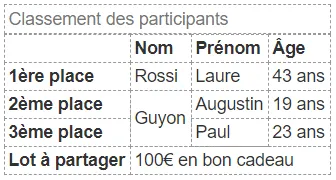

# Les Bases du Développement Web
## Formation Complète pour Débutants

<div class="pt-12">
  <span class="text-lg">
    HTML5 • CSS3 • JavaScript ES6+ • DOM & Événements
  </span>
</div>

<div class="pt-8">
  <span @click="$slidev.nav.next" class="px-4 py-2 rounded cursor-pointer bg-blue-600 text-white hover:bg-blue-700">
    Commencer le cours <carbon:arrow-right class="inline"/>
  </span>
</div>

---
layout: two-cols
---

# Plan du Cours

## 📚 Programme Détaillé

**Partie 1: HTML5 Structure et Sémantique**
- Structure de base HTML5
- Éléments sémantiques
- Formulaires et validation
- Accessibilité
- TP: Page web sémantique

**Partie 2: CSS3 et Design Responsive**
- Sélecteurs et propriétés CSS3
- Flexbox et Grid
- Design responsive
- Animations et transitions
- TP: Site responsive

::right::

**Partie 3: JavaScript ES6+ Fondamentaux**
- Variables et types de données
- Fonctions et classes ES6+
- Structures de contrôle
- Modules et imports
- TP: Application interactive

**Partie 4: DOM et Événements**
- Manipulation du DOM
- Gestion des événements
- AJAX et Fetch API
- Local Storage
- TP: Application complète

**🎯 Projet Final: Plateforme Web Responsive**

---
layout: center
class: text-center
---

# Partie 1
## HTML5 Structure et Sémantique

<div class="text-6xl text-orange-500 mb-8">
  <carbon-html />
</div>

Maîtriser la structure et la sémantique HTML5 pour créer des bases solides

---

# 1.1 Introduction à HTML5

## Qu'est-ce que HTML ?

- HTML (HyperText Markup Language) est le langage standard utilisé pour créer et structurer des pages web. Il permet de décrire la structure d’un document en utilisant des balises (ou "tags").
- HTML5 (HyperText Markup Language 5) est la dernière version du langage de balisage standard pour créer des pages web.
- Une balise (ou tag en anglais) est un élément de base du langage HTML qui sert à marquer ou délimiter des portions de texte pour indiquer leur rôle ou leur signification sur une page web. On distingue deux types:
     - Les balises simples
     - Les balises doubles

### Nouveautés HTML5 :
- **Éléments sémantiques** : `<header>`, `<nav>`, `<main>`, `<section>`, `<article>`, `<aside>`, `<footer>`
- **APIs intégrées** : Canvas, Audio/Video, Geolocation, Local Storage
- **Formulaires améliorés** : nouveaux types d'input et validation native
- **Meilleure accessibilité** et SEO(pour Search Engine Optimization)

---
layout: two-cols
---

### Structure de base HTML5 :

```html
<!DOCTYPE html>
<html lang="fr">
  <head>
    <meta charset="UTF-8" />
    <title>Titre Page</title>
  </head>
  <body>
    Bonjour, UniTechs
  </body>
</html>

```
::right::

### Explication des balises

- `<!DOCTYPE html>`	Indique que le document est en HTML5
- `<html lang="fr">`	Conteneur de tout le document, ici en français
- `<head>`	Contient les métadonnées (non visibles)
- `<meta charset="UTF-8">`	Permet l'encodage universel (accent, caractères spéciaux)
- `<title>`	Titre affiché dans l’onglet du navigateur
- `<body>`	Contient tout le contenu affiché à l’écran

---

# 1.2 Le Corps du document - body

## Les Commentaires
```html
<!-- Ceci est un commentaire HTML -->
```

## Titres

Les balises de titre vont de `<h1>` (le plus important) à `<h6>` (le moins important).

```html
<h1>Titre principal</h1>
<h2>Sous-titre</h2>
<h3>Sous-sous-titre</h3>
```


## Les Paragraphes 

Chaque paragraphe de texte se place entre balises `<p>` :
```html
<p>Ceci est un paragraphe de texte.</p>

```

---
layout: two-cols
---

## Mise en forme du texte

- `<strong>` `<b>`	Texte en gras (sémantique importante)
- `<em>` `<i>`	Texte en italique (accent mis sur le mot)
- `<mark>`	Texte surligné
- `<u>`	Texte souligné (moins utilisé)
- `<s>` Texte barré 
- `<sup>` Text en exposant
- `<sub>` Text en indice 
- `<br>`	Saut de ligne
- `<hr>`	Ligne horizontale de séparation

## Exercice
 consulter exercice1.html dans tes documents

::right::

## Exemple
```html
<!DOCTYPE html>
<html lang="fr">
  <head>
    <meta charset="UTF-8" />
    <title>Texte HTML</title>
  </head>
  <body>
    <h1>Mon titre principal</h1>
    <h2>Un sous-titre</h2>
    <p>Ceci est un paragraphe <b>avec du gras</b>.</p>
    <p>Un autre paragraphe <i>avec de l’italique</i>.</p>
    <p>Ligne 1<br>Ligne 2</p>
    <hr>
    <!-- Commentaire invisible à l'écran -->
  </body>
</html>

```

---
layout: two-cols
---

## Liens et Navigation
🎯 Objectifs
- Créer des liens vers d’autres pages ou sites
- Créer des ancres dans une même page
- Utiliser des liens pour envoyer un email ou télécharger un fichier

### a. Creer un lien
La balise `<a>` permet de créer un hyperlien. Elle comprend en son sein plusieurs attributs dont:
- `href`	Cible du lien (URL ou fichier local)
- `target` il existe plusieurs valeurs 
    - `_self` Affichage dans le cadre courant(Par defaut)
    - `_blank` Ouvre dans un nouvel onglet

::right::	
     - `_top` Affichage dans la totalite de la fenetre ouvrante
- `title`	Texte au survol
- `download` Pour telecharger un document
```html
<a href="https://www.example.com">Visiter un site</a>
<a href="https://openai.com" target="_blank" title="Visitez OpenAI">OpenAI</a>
<a href="page2.html">Aller à la page 2</a>
<a href="fichier.pdf" download>Télécharger le PDF</a>
```

---

### b. Les liens email
Vous pouvez permettre a vos utilisateurs d'ecrire sur votre adresses emails avec la syntaxe `mailto`
```html
<a href="mailto:unietechsdev@gmail.com">Envoyer un mail</a>
```
Vous pouvez renseigner un sujet par defaut, ainsi qu'un corps voire meme les deux:
```html
<a href="mailto:unietechsdev@gmail.com?subject=Sujet du mail">Envoyer un mail</a>
<a href="mailto:unietechsdev@gmail.com?body=Corp du mail">Envoyer un mail</a>
<!-- Pour les deux -->
 <a href="mailto:unietechsdev@gmail.com?subject=Sujet du mail&body=Corps du mail">Envoyer un mail</a>
```


### c. Ancres internes (lien vers une section)

Étape 1 : Ajouter un id à une section
```html
<h2 id="section1">Chapitre 1</h2>
```
Étape 2 : Lien vers cette section
```html
<a href="#section1">Aller au chapitre 1</a>
```

---

### 📝 Exercice 3
Creer une page contenant :
- un lien vers le site "https://wwww.wikipedia.org"
- un lien permettant d'ouvrir sur un autre onglet votre projet de l'exercice1 developpé precedement
- un lien qui télécharge un fichier pdf
- un lien vers votre adresse email
- Une ancre pour aller directement a une section "Contact"

---

## Les Images
La balise `` permet d'afficher une image avec html qu'elle soit en locale ou distante. Pour cela elle dispose en sont sein plusieurs attributs dont:
- `src`	Lien vers l’image (fichier local ou URL)
- `alt`	Texte alternatif si l’image ne s’affiche pas
- `title`	Texte au survol
- `width`, `height`	Taille en pixels ou en %
```html


```
---

## Les Listes
Les listes en HTML permettent d'organiser le contenu sous forme d'éléments ordonnés ou non ordonnés.
### a. Liste non ordonnée
Utilisée pour afficher des éléments sans ordre particulier 
```html
<ul>
  <li>Pomme</li>
  <li>Banane</li>
  <li>Orange</li>
</ul>

```
### b. Liste ordonnée
Utilisée pour les éléments qui suivent un ordre
```html
<ol>
  <li>Étape 1</li>
  <li>Étape 2</li>
  <li>Étape 3</li>
</ol>
```


---

### c. Liste imbriqué
On peut imbriquer des listes pour créer des structures complexes

```html
<ul>
  <li>Fruits
    <ul>
      <li>Pomme</li>
      <li>Raisin</li>
    </ul>
  </li>
  <li>Légumes
    <ul>
      <li>Carotte</li>
      <li>Tomate</li>
    </ul>
  </li>
</ul>
```

---

### 📝 Exercice 4
Créer une page contenant :
- Une liste de vos 3 langages préférés
- Une liste numérotée des étapes d’installation de Visual Studio Code
- Une liste imbriquée de vos hobbies (ex: Sport → Foot, Basket / Musique → Jazz, Rap, ...)


---

# 1.3 Exercice - Structure HTML5

## 🎯 Exercice Pratique

Créez une page HTML5 pour un restaurant avec :
- En-tête avec nom du restaurant et navigation
- Section "À propos" avec description
- Section "Menu" avec 3 plats (nom, description, prix)
- Section "Contact" avec adresse et téléphone
- Pied de page avec horaires

### Critères d'évaluation :
- ✅ Structure HTML5 valide
- ✅ Utilisation correcte des éléments sémantiques
- ✅ Métadonnées appropriées
- ✅ Navigation fonctionnelle

**Temps estimé : 30 minutes**

---

# 1.4  Les Tableaux en HTML

## Structure de base d’un tableau
```html
<table>
  <tr>
    <th>Nom</th>
    <th>Âge</th>
  </tr>
  <tr>
    <td>Fredie</td>
    <td>25</td>
  </tr>
</table>
```

## Ajouter un titre au tableau
```html
<caption>Liste des étudiants</caption>
```

##  Fusion de cellules
La fusion de cellules peut se faire de deux maniere: 
- 🔸Fusion horizontale : `colspan`
- 🔸 Fusion verticale : `rowspan`

---

## 📝 Exercice 5
Realisez le tableau ci-dessous:


---

# 1.5 Formulaires HTML

## Nouveaux Types d'Input et Validation

```html
<form action="/contact" method="post" novalidate>
    <!-- Email avec validation -->
    <div>
        <label for="email">Email *</label>
        <input type="email" id="email" name="email" required 
               pattern="[a-z0-9._%+-]+@[a-z0-9.-]+\.[a-z]{2,}$"
               placeholder="votre@email.com">
        <span class="error" id="email-error"></span>
    </div>
    
    <!-- Téléphone -->
    <div>
        <label for="telephone">Téléphone</label>
        <input type="tel" id="telephone" name="telephone" 
               pattern="[0-9]{2}[0-9]{2}[0-9]{2}[0-9]{2}[0-9]{2}"
               placeholder="01 23 45 67 89">
    </div>
    
    <!-- Date -->
    <div>
        <label for="date-reservation">Date de réservation *</label>
        <input type="date" id="date-reservation" name="date_reservation" 
               required min="2025-01-01" max="2025-12-31">
    </div>
    
    <!-- Nombre -->
    <div>
        <label for="personnes">Nombre de personnes</label>
        <input type="number" id="personnes" name="personnes" 
               min="1" max="10" value="2">
    </div>
    
    <!-- Range -->
    <div>
        <label for="budget">Budget approximatif : <span id="budget-value">50</span>€</label>
        <input type="range" id="budget" name="budget" 
               min="20" max="200" value="50" step="10">
    </div>
    
    <!-- Textarea -->
    <div>
        <label for="message">Message</label>
        <textarea id="message" name="message" rows="4" 
                  maxlength="500" placeholder="Votre message..."></textarea>
    </div>
    
    <!-- Checkbox -->
    <div>
        <input type="checkbox" id="newsletter" name="newsletter" value="oui">
        <label for="newsletter">S'abonner à la newsletter</label>
    </div>
    
    <!-- Radio buttons -->
    <fieldset>
        <legend>Repas préféré</legend>
        <input type="radio" id="dejeuner" name="repas" value="dejeuner">
        <label for="dejeuner">Déjeuner</label>
        
        <input type="radio" id="diner" name="repas" value="diner" checked>
        <label for="diner">Dîner</label>
    </fieldset>
    
    <button type="submit">Envoyer</button>
</form>
```

---

# 1.6 Accessibilité Web

## Bonnes Pratiques d'Accessibilité

### ARIA (Accessible Rich Internet Applications)

```html
<!-- Navigation avec ARIA -->
<nav role="navigation" aria-label="Navigation principale">
    <ul>
        <li><a href="#accueil" aria-current="page">Accueil</a></li>
        <li><a href="#services">Services</a></li>
        <li><a href="#contact">Contact</a></li>
    </ul>
</nav>

<!-- Bouton avec état -->
<button type="button" aria-expanded="false" aria-controls="menu-mobile" 
        onclick="toggleMenu()">
    <span aria-hidden="true">☰</span>
    Menu
</button>

<!-- Contenu conditionnel -->
<div id="menu-mobile" aria-hidden="true" role="menu">
    <!-- Contenu du menu -->
</div>

<!-- Images avec alt descriptif -->


<!-- Liens avec contexte -->
<a href="article-complet.html" aria-describedby="article1-desc">
    Lire la suite
</a>
<div id="article1-desc" class="sr-only">
    de l'article sur les nouveautés JavaScript
</div>

<!-- Formulaire accessible -->
<div>
    <label for="search">Rechercher sur le site</label>
    <input type="search" id="search" name="search" 
           aria-describedby="search-help" required>
    <div id="search-help">
        Tapez au moins 3 caractères pour lancer la recherche
    </div>
</div>

<!-- Structure de titres logique -->
<h1>Titre principal de la page</h1>
    <h2>Section principale</h2>
        <h3>Sous-section</h3>
            <h4>Détail de la sous-section</h4>
```

### CSS pour l'accessibilité :

```css
/* Masquer visuellement mais garder pour les lecteurs d'écran */
.sr-only {
    position: absolute;
    width: 1px;
    height: 1px;
    padding: 0;
    margin: -1px;
    overflow: hidden;
    clip: rect(0, 0, 0, 0);
    white-space: nowrap;
    border: 0;
}

/* Focus visible pour la navigation au clavier */
a:focus, button:focus, input:focus, textarea:focus, select:focus {
    outline: 2px solid #0066cc;
    outline-offset: 2px;
}

/* Contraste suffisant */
.text-primary { color: #0066cc; } /* Ratio 4.5:1 minimum */
.bg-primary { background-color: #0066cc; }
```

---

# 1.7 TP Partie 1 - Site Portfolio

## 🛠️ Travail Pratique : Créer un Portfolio Personnel

### Objectifs :
Créer un site portfolio personnel avec HTML5 sémantique et accessible

### Cahier des charges :
1. **Page d'accueil** avec présentation personnelle
2. **Section Compétences** avec liste de technologies
3. **Portfolio de projets** (3 projets minimum)
4. **Section Contact** avec formulaire de contact
5. **Navigation** entre toutes les sections
6. **Accessibilité** : ARIA, alt, navigation clavier
7. **Validation HTML5** pour le formulaire

### Structure attendue :
```
portfolio/
├── index.html
├── images/
│   ├── photo-profil.jpg
│   ├── projet1.jpg
│   ├── projet2.jpg
│   └── projet3.jpg
└── README.md
```

**Temps alloué : 2 heures**

### Ressources :
- Validateur W3C : https://validator.w3.org/
- Images Pexels : https://www.pexels.com/
- Guide ARIA : https://developer.mozilla.org/fr/docs/Web/Accessibility/ARIA

---

# 1.8 Correction TP Partie 1

## 💡 Solution Portfolio HTML5

```html
<!DOCTYPE html>
<html lang="fr">
<head>
    <meta charset="UTF-8">
    <meta name="viewport" content="width=device-width, initial-scale=1.0">
    <meta name="description" content="Portfolio de Jean Dupont - Développeur Web Frontend spécialisé en HTML5, CSS3 et JavaScript">
    <meta name="keywords" content="développeur web, frontend, HTML5, CSS3, JavaScript, portfolio">
    <title>Jean Dupont - Développeur Web Frontend</title>
</head>
<body>
    <header role="banner">
        <h1>Jean Dupont</h1>
        <p class="tagline">Développeur Web Frontend</p>
        
        <nav role="navigation" aria-label="Navigation principale">
            <ul>
                <li><a href="#accueil" aria-current="page">Accueil</a></li>
                <li><a href="#competences">Compétences</a></li>
                <li><a href="#portfolio">Portfolio</a></li>
                <li><a href="#contact">Contact</a></li>
            </ul>
        </nav>
    </header>
    
    <main role="main">
        <section id="accueil" aria-labelledby="accueil-titre">
            <h2 id="accueil-titre">À propos de moi</h2>
            
            <p>Passionné par le développement web depuis 5 ans, je me spécialise dans la création d'interfaces utilisateur modernes et accessibles. Mon expertise couvre HTML5, CSS3, JavaScript ES6+ et les frameworks modernes.</p>
            <p>Je m'attache à créer des expériences web performantes, responsives et respectueuses des standards d'accessibilité.</p>
        </section>
        
        <section id="competences" aria-labelledby="competences-titre">
            <h2 id="competences-titre">Mes Compétences</h2>
            
            <article>
                <h3>Frontend</h3>
                <ul>
                    <li>HTML5 & Sémantique Web</li>
                    <li>CSS3 & Sass</li>
                    <li>JavaScript ES6+</li>
                    <li>React.js</li>
                    <li>Vue.js</li>
                </ul>
            </article>
            
            <article>
                <h3>Outils & Méthodes</h3>
                <ul>
                    <li>Git & GitHub</li>
                    <li>Webpack & Vite</li>
                    <li>Design Responsive</li>
                    <li>Accessibilité Web (WCAG)</li>
                    <li>Tests unitaires</li>
                </ul>
            </article>
        </section>
        
        <section id="portfolio" aria-labelledby="portfolio-titre">
            <h2 id="portfolio-titre">Mon Portfolio</h2>
            
            <article>
                <h3>E-commerce Responsive</h3>
                
                <p>Site e-commerce complet avec panier, gestion des commandes et paiement sécurisé. Développé avec HTML5, CSS3 Grid et JavaScript vanilla.</p>
                <p><strong>Technologies :</strong> HTML5, CSS3, JavaScript, PHP, MySQL</p>
                <a href="https://github.com/jean/ecommerce-project" 
                   aria-describedby="projet1-desc">Voir le code source</a>
                <div id="projet1-desc" class="sr-only">du projet e-commerce sur GitHub</div>
            </article>
            
            <article>
                <h3>Dashboard Analytique</h3>
                
                <p>Tableau de bord interactif pour visualiser des données analytiques avec graphiques dynamiques et filtres en temps réel.</p>
                <p><strong>Technologies :</strong> React.js, D3.js, REST API</p>
                <a href="https://dashboard-demo.jean-dupont.com" 
                   aria-describedby="projet2-desc">Voir la démo</a>
                <div id="projet2-desc" class="sr-only">du dashboard analytique</div>
            </article>
            
            <article>
                <h3>Application Progressive Web App</h3>
                
                <p>Application web progressive pour la gestion de tâches, fonctionnant hors ligne avec synchronisation automatique.</p>
                <p><strong>Technologies :</strong> Vue.js, PWA, Service Workers, IndexedDB</p>
                <a href="https://tasks-pwa.jean-dupont.com" 
                   aria-describedby="projet3-desc">Essayer l'app</a>
                <div id="projet3-desc" class="sr-only">l'application PWA de gestion de tâches</div>
            </article>
        </section>
        
        <section id="contact" aria-labelledby="contact-titre">
            <h2 id="contact-titre">Me Contacter</h2>
            
            <form action="/contact" method="post" novalidate aria-describedby="form-instructions">
                <div id="form-instructions">
                    <p>Les champs marqués d'un astérisque (*) sont obligatoires.</p>
                </div>
                
                <div>
                    <label for="nom">Nom complet *</label>
                    <input type="text" id="nom" name="nom" required 
                           minlength="2" maxlength="100"
                           aria-describedby="nom-error">
                    <div id="nom-error" class="error" role="alert" aria-live="polite"></div>
                </div>
                
                <div>
                    <label for="email">Adresse email *</label>
                    <input type="email" id="email" name="email" required 
                           pattern="[a-z0-9._%+-]+@[a-z0-9.-]+\.[a-z]{2,}$"
                           placeholder="votre@email.com"
                           aria-describedby="email-help email-error">
                    <div id="email-help">Format attendu : nom@domaine.com</div>
                    <div id="email-error" class="error" role="alert" aria-live="polite"></div>
                </div>
                
                <div>
                    <label for="sujet">Sujet *</label>
                    <select id="sujet" name="sujet" required aria-describedby="sujet-error">
                        <option value="">Choisissez un sujet</option>
                        <option value="collaboration">Proposition de collaboration</option>
                        <option value="freelance">Mission freelance</option>
                        <option value="emploi">Offre d'emploi</option>
                        <option value="question">Question technique</option>
                        <option value="autre">Autre</option>
                    </select>
                    <div id="sujet-error" class="error" role="alert" aria-live="polite"></div>
                </div>
                
                <div>
                    <label for="message">Message *</label>
                    <textarea id="message" name="message" rows="6" required 
                              minlength="10" maxlength="1000"
                              placeholder="Décrivez votre projet ou votre demande..."
                              aria-describedby="message-count message-error"></textarea>
                    <div id="message-count" aria-live="polite">0/1000 caractères</div>
                    <div id="message-error" class="error" role="alert" aria-live="polite"></div>
                </div>
                
                <div>
                    <input type="checkbox" id="confidentialite" name="confidentialite" required>
                    <label for="confidentialite">
                        J'accepte que mes données soient utilisées pour me recontacter *
                    </label>
                </div>
                
                <button type="submit" aria-describedby="submit-help">
                    Envoyer le message
                </button>
                <div id="submit-help" class="sr-only">
                    Le formulaire sera envoyé après validation de tous les champs obligatoires
                </div>
            </form>
            
            <aside>
                <h3>Autres moyens de contact</h3>
                <address>
                    <p>Email : <a href="mailto:jean.dupont@email.com">jean.dupont@email.com</a></p>
                    <p>LinkedIn : <a href="https://linkedin.com/in/jean-dupont-dev" 
                                     target="_blank" rel="noopener noreferrer">
                        Jean Dupont <span class="sr-only">(ouvre dans un nouvel onglet)</span>
                    </a></p>
                    <p>GitHub : <a href="https://github.com/jean-dupont" 
                                   target="_blank" rel="noopener noreferrer">
                        @jean-dupont <span class="sr-only">(ouvre dans un nouvel onglet)</span>
                    </a></p>
                </address>
            </aside>
        </section>
    </main>
    
    <footer role="contentinfo">
        <p>&copy; 2025 Jean Dupont. Tous droits réservés.</p>
        <p>Site développé avec les standards HTML5 et l'accessibilité en priorité.</p>
    </footer>

    <script>
        // Validation simple du formulaire
        document.querySelector('form').addEventListener('submit', function(e) {
            const requiredFields = this.querySelectorAll('[required]');
            let hasErrors = false;
            
            requiredFields.forEach(field => {
                const errorDiv = document.getElementById(field.name + '-error');
                if (!field.value.trim()) {
                    if (errorDiv) {
                        errorDiv.textContent = 'Ce champ est obligatoire';
                        errorDiv.style.display = 'block';
                    }
                    hasErrors = true;
                } else {
                    if (errorDiv) {
                        errorDiv.textContent = '';
                        errorDiv.style.display = 'none';
                    }
                }
            });
            
            if (hasErrors) {
                e.preventDefault();
            }
        });
        
        // Compteur de caractères pour le message
        const messageField = document.getElementById('message');
        const messageCount = document.getElementById('message-count');
        
        messageField.addEventListener('input', function() {
            const count = this.value.length;
            messageCount.textContent = `${count}/1000 caractères`;
            
            if (count > 1000) {
                messageCount.style.color = 'red';
            } else {
                messageCount.style.color = 'inherit';
            }
        });
    </script>
</body>
</html>
```

---
layout: center
class: text-center
---

# Partie 2
## CSS3 et Design Responsive

<div class="text-6xl text-blue-500 mb-8">
  <carbon-screen />
</div>

Maîtriser CSS3 et créer des designs responsives modernes

---

# 2.1 Introduction à CSS3

## Nouveautés et Améliorations CSS3

### Nouveaux Sélecteurs :
```css
/* Sélecteurs d'attribut avancés */
input[type="email"] { border-color: blue; }
div[class*="btn"] { padding: 10px; }

/* Pseudo-classes structurelles */
li:nth-child(2n+1) { background: #f0f0f0; } /* Impair */
li:nth-last-child(3) { font-weight: bold; }
p:first-of-type { margin-top: 0; }
p:last-of-type { margin-bottom: 0; }

/* Pseudo-éléments */
p::first-line { font-weight: bold; }
p::first-letter { font-size: 2em; float: left; }
.tooltip::after {
    content: attr(data-tooltip);
    position: absolute;
    background: black;
    color: white;
    padding: 5px;
}

/* Sélecteurs d'état */
input:valid { border-color: green; }
input:invalid { border-color: red; }
input:focus { outline: 2px solid blue; }
```

### Propriétés CSS3 Avancées :
```css
.modern-element {
    /* Coins arrondis */
    border-radius: 10px 20px 30px 40px;
    
    /* Ombres */
    box-shadow: 0 4px 8px rgba(0,0,0,0.1), 
                inset 0 1px 0 rgba(255,255,255,0.1);
    text-shadow: 1px 1px 2px rgba(0,0,0,0.3);
    
    /* Dégradés */
    background: linear-gradient(45deg, #ff6b6b, #4ecdc4);
    background: radial-gradient(circle at center, #fff, #000);
    
    /* Transformations */
    transform: rotate(45deg) scale(1.2) translateX(50px);
    transform-origin: center center;
    
    /* Transitions */
    transition: all 0.3s cubic-bezier(0.25, 0.46, 0.45, 0.94);
}
```

---

# 2.2 Flexbox - Layout Flexible

## Flexbox Container (Parent)

```css
.flex-container {
    display: flex;
    
    /* Direction */
    flex-direction: row; /* row | row-reverse | column | column-reverse */
    
    /* Retour à la ligne */
    flex-wrap: wrap; /* nowrap | wrap | wrap-reverse */
    
    /* Raccourci flex-direction + flex-wrap */
    flex-flow: row wrap;
    
    /* Alignement horizontal (axe principal) */
    justify-content: space-between; 
    /* flex-start | flex-end | center | space-between | space-around | space-evenly */
    
    /* Alignement vertical (axe transversal) */
    align-items: center; 
    /* stretch | flex-start | flex-end | center | baseline */
    
    /* Alignement des lignes (si flex-wrap) */
    align-content: space-around;
    
    /* Espacement */
    gap: 20px; /* Espacement entre les éléments */
    row-gap: 10px;
    column-gap: 15px;
}
```

## Flexbox Items (Enfants)

```css
.flex-item {
    /* Facteur de croissance */
    flex-grow: 1; /* 0 par défaut */
    
    /* Facteur de rétrécissement */
    flex-shrink: 0; /* 1 par défaut */
    
    /* Taille de base */
    flex-basis: 200px; /* auto par défaut */
    
    /* Raccourci grow shrink basis */
    flex: 1 0 200px;
    
    /* Alignement individuel */
    align-self: flex-end; /* auto | flex-start | flex-end | center | baseline | stretch */
    
    /* Ordre d'affichage */
    order: 2; /* 0 par défaut */
}
```

## Exemple Pratique Flexbox

```html
<div class="navbar">
    <div class="logo">Logo</div>
    <nav class="nav-links">
        <a href="#">Accueil</a>
        <a href="#">Services</a>
        <a href="#">Contact</a>
    </nav>
    <div class="nav-actions">
        <button class="btn-login">Connexion</button>
    </div>
</div>
```

```css
.navbar {
    display: flex;
    justify-content: space-between;
    align-items: center;
    padding: 1rem 2rem;
    background: white;
    box-shadow: 0 2px 4px rgba(0,0,0,0.1);
}

.logo {
    font-size: 1.5rem;
    font-weight: bold;
    color: #333;
}

.nav-links {
    display: flex;
    gap: 2rem;
    list-style: none;
}

.nav-links a {
    text-decoration: none;
    color: #666;
    transition: color 0.3s;
}

.nav-links a:hover {
    color: #007bff;
}

.btn-login {
    background: #007bff;
    color: white;
    border: none;
    padding: 0.5rem 1rem;
    border-radius: 4px;
    cursor: pointer;
}
```

---

# 2.3 CSS Grid - Layout Bidimensionnel

## Grid Container

```css
.grid-container {
    display: grid;
    
    /* Définir les colonnes */
    grid-template-columns: 200px 1fr 100px; /* 3 colonnes : fixe, flexible, fixe */
    grid-template-columns: repeat(3, 1fr); /* 3 colonnes égales */
    grid-template-columns: repeat(auto-fit, minmax(250px, 1fr)); /* Responsive */
    
    /* Définir les lignes */
    grid-template-rows: 60px 1fr 40px; /* header, main, footer */
    grid-template-rows: repeat(3, minmax(100px, auto));
    
    /* Nommer les zones */
    grid-template-areas: 
        "header header header"
        "sidebar main aside"
        "footer footer footer";
    
    /* Espacement */
    gap: 20px;
    grid-gap: 10px 15px; /* row-gap column-gap */
    
    /* Alignement */
    justify-items: center; /* start | end | center | stretch */
    align-items: center;
    justify-content: space-around; /* pour la grille entière */
    align-content: center;
}
```

## Grid Items

```css
.grid-item {
    /* Positionnement par lignes */
    grid-column: 1 / 3; /* de la ligne 1 à 3 */
    grid-column: span 2; /* s'étendre sur 2 colonnes */
    grid-row: 2 / 4;
    
    /* Raccourcis */
    grid-area: 1 / 1 / 3 / 3; /* row-start / col-start / row-end / col-end */
    
    /* Utilisation des zones nommées */
    grid-area: header;
    
    /* Alignement individuel */
    justify-self: end;
    align-self: start;
}
```

## Exemple Layout Complet avec Grid

```html
<div class="page-layout">
    <header class="header">En-tête</header>
    <nav class="sidebar">Navigation</nav>
    <main class="main">Contenu principal</main>
    <aside class="aside">Sidebar</aside>
    <footer class="footer">Pied de page</footer>
</div>
```

```css
.page-layout {
    display: grid;
    grid-template-columns: 250px 1fr 200px;
    grid-template-rows: 60px 1fr 40px;
    grid-template-areas: 
        "header header header"
        "sidebar main aside"
        "footer footer footer";
    min-height: 100vh;
    gap: 1rem;
}

.header {
    grid-area: header;
    background: #333;
    color: white;
    display: flex;
    align-items: center;
    padding: 0 1rem;
}

.sidebar {
    grid-area: sidebar;
    background: #f8f9fa;
    padding: 1rem;
}

.main {
    grid-area: main;
    background: white;
    padding: 1rem;
    overflow-y: auto;
}

.aside {
    grid-area: aside;
    background: #e9ecef;
    padding: 1rem;
}

.footer {
    grid-area: footer;
    background: #333;
    color: white;
    display: flex;
    align-items: center;
    justify-content: center;
}

/* Responsive */
@media (max-width: 768px) {
    .page-layout {
        grid-template-columns: 1fr;
        grid-template-areas: 
            "header"
            "main"
            "sidebar"
            "aside"
            "footer";
    }
}
```

---

# 2.4 Design Responsive

## Media Queries et Breakpoints

```css
/* Mobile First Approach */
.container {
    width: 100%;
    padding: 0 1rem;
}

/* Tablette */
@media (min-width: 768px) {
    .container {
        max-width: 750px;
        margin: 0 auto;
    }
}

/* Desktop */
@media (min-width: 1024px) {
    .container {
        max-width: 1200px;
        padding: 0 2rem;
    }
}

/* Large Desktop */
@media (min-width: 1200px) {
    .container {
        max-width: 1400px;
    }
}

/* Media Queries Avancées */
@media (orientation: landscape) {
    .hero { height: 100vh; }
}

@media (max-width: 768px) and (orientation: portrait) {
    .mobile-menu { display: block; }
}

@media (prefers-reduced-motion: reduce) {
    * {
        animation-duration: 0.01ms !important;
        animation-iteration-count: 1 !important;
        transition-duration: 0.01ms !important;
    }
}

@media (prefers-color-scheme: dark) {
    body {
        background: #121212;
        color: #ffffff;
    }
}
```

## Système de Grille Responsive

```css
/* Grille Flexible */
.row {
    display: flex;
    flex-wrap: wrap;
    margin: 0 -15px;
}

.col {
    flex: 1;
    padding: 0 15px;
}

/* Classes utilitaires */
.col-1 { flex: 0 0 8.333333%; }
.col-2 { flex: 0 0 16.666667%; }
.col-3 { flex: 0 0 25%; }
.col-4 { flex: 0 0 33.333333%; }
.col-6 { flex: 0 0 50%; }
.col-12 { flex: 0 0 100%; }

/* Responsive */
@media (max-width: 768px) {
    .col-sm-12 { flex: 0 0 100%; }
    .col-sm-6 { flex: 0 0 50%; }
}

@media (min-width: 769px) {
    .col-md-4 { flex: 0 0 33.333333%; }
    .col-md-8 { flex: 0 0 66.666667%; }
}
```

## Images et Médias Responsives

```css
/* Images responsives */
img {
    max-width: 100%;
    height: auto;
}

/* Images avec ratio fixe */
.image-container {
    position: relative;
    width: 100%;
    padding-bottom: 56.25%; /* Ratio 16:9 */
    overflow: hidden;
}

.image-container img {
    position: absolute;
    top: 0;
    left: 0;
    width: 100%;
    height: 100%;
    object-fit: cover;
}

/* Vidéos responsives */
.video-responsive {
    position: relative;
    padding-bottom: 56.25%;
    height: 0;
    overflow: hidden;
}

.video-responsive iframe,
.video-responsive video {
    position: absolute;
    top: 0;
    left: 0;
    width: 100%;
    height: 100%;
}

/* Images srcset pour différentes résolutions */
```

```html

```

---

# 2.5 Animations et Transitions CSS3

## Transitions

```css
.button {
    background: #007bff;
    color: white;
    padding: 10px 20px;
    border: none;
    border-radius: 4px;
    cursor: pointer;
    
    /* Transition simple */
    transition: background-color 0.3s ease;
    
    /* Transitions multiples */
    transition: background-color 0.3s ease,
                transform 0.2s ease,
                box-shadow 0.3s ease;
    
    /* Ou avec all */
    transition: all 0.3s cubic-bezier(0.25, 0.46, 0.45, 0.94);
}

.button:hover {
    background: #0056b3;
    transform: translateY(-2px);
    box-shadow: 0 4px 12px rgba(0, 123, 255, 0.3);
}

.button:active {
    transform: translateY(0);
    transition-duration: 0.1s;
}
```

## Animations Keyframes

```css
/* Définition de l'animation */
@keyframes fadeInUp {
    0% {
        opacity: 0;
        transform: translateY(30px);
    }
    100% {
        opacity: 1;
        transform: translateY(0);
    }
}

@keyframes pulse {
    0%, 100% {
        transform: scale(1);
    }
    50% {
        transform: scale(1.05);
    }
}

@keyframes slideInLeft {
    from {
        transform: translateX(-100%);
    }
    to {
        transform: translateX(0);
    }
}

/* Utilisation des animations */
.fade-in-element {
    animation: fadeInUp 0.6s ease-out;
}

.pulsing-element {
    animation: pulse 2s ease-in-out infinite;
}

.slide-element {
    animation: slideInLeft 0.5s ease-out forwards;
}

/* Animation avec délai et répétition */
.delayed-animation {
    animation: fadeInUp 0.6s ease-out 0.3s both;
    /* nom durée timing-function délai fill-mode */
}

/* Animation au hover */
.card:hover {
    animation: pulse 0.3s ease-in-out;
}
```

## Animations Avancées

```css
/* Animation d'un loader */
@keyframes spin {
    0% { transform: rotate(0deg); }
    100% { transform: rotate(360deg); }
}

.loader {
    border: 4px solid #f3f3f3;
    border-top: 4px solid #3498db;
    border-radius: 50%;
    width: 40px;
    height: 40px;
    animation: spin 1s linear infinite;
}

/* Animation de typing */
@keyframes typing {
    from { width: 0; }
    to { width: 100%; }
}

@keyframes blink-caret {
    from, to { border-color: transparent; }
    50% { border-color: orange; }
}

.typewriter {
    overflow: hidden;
    border-right: .15em solid orange;
    white-space: nowrap;
    margin: 0 auto;
    letter-spacing: .15em;
    animation: 
        typing 3.5s steps(40, end),
        blink-caret .75s step-end infinite;
}

/* Animation de particles */
.particle {
    position: absolute;
    border-radius: 50%;
    background: #007bff;
    animation: float 6s ease-in-out infinite;
}

@keyframes float {
    0%, 100% {
        transform: translateY(0px);
        opacity: 1;
    }
    50% {
        transform: translateY(-20px);
        opacity: 0.8;
    }
}

/* Performance avec transform et opacity */
.optimized-animation {
    will-change: transform, opacity;
    animation: optimizedMove 1s ease-in-out;
}

@keyframes optimizedMove {
    0% {
        transform: translateX(0) scale(1);
        opacity: 1;
    }
    50% {
        transform: translateX(50px) scale(1.1);
        opacity: 0.8;
    }
    100% {
        transform: translateX(100px) scale(1);
        opacity: 1;
    }
}
```

---

# 2.6 Exercice - Site E-commerce Responsive

## 🎯 Exercice Pratique

Créer la page d'accueil d'un site e-commerce responsive avec :

### Composants à créer :
1. **Header** : Logo, navigation, panier (Flexbox)
2. **Section Hero** : Bannière promotionnelle
3. **Grille de produits** : 4 colonnes desktop, 2 tablette, 1 mobile (CSS Grid)
4. **Cards produits** : Image, titre, prix, bouton
5. **Footer** : Liens, réseaux sociaux

### Spécifications techniques :
- ✅ Mobile First
- ✅ Breakpoints : 768px, 1024px
- ✅ Flexbox pour la navigation
- ✅ CSS Grid pour les produits
- ✅ Animations au hover
- ✅ Images responsives

### Breakpoints attendus :
- **Mobile** : < 768px (1 colonne)
- **Tablette** : 768px - 1023px (2 colonnes)
- **Desktop** : ≥ 1024px (4 colonnes)

**Temps estimé : 45 minutes**

---

# 2.7 Correction - Site E-commerce

## 💡 Solution CSS Responsive

```html
<!DOCTYPE html>
<html lang="fr">
<head>
    <meta charset="UTF-8">
    <meta name="viewport" content="width=device-width, initial-scale=1.0">
    <title>TechStore - Boutique High-Tech</title>
    <link rel="stylesheet" href="styles.css">
</head>
<body>
    <header class="header">
        <div class="container">
            <div class="header-content">
                <div class="logo">
                    <h1>TechStore</h1>
                </div>
                <nav class="navigation">
                    <ul class="nav-links">
                        <li><a href="#accueil">Accueil</a></li>
                        <li><a href="#produits">Produits</a></li>
                        <li><a href="#categories">Catégories</a></li>
                        <li><a href="#contact">Contact</a></li>
                    </ul>
                </nav>
                <div class="header-actions">
                    <div class="search-box">
                        <input type="search" placeholder="Rechercher...">
                        <button type="submit">🔍</button>
                    </div>
                    <div class="cart">
                        <button class="cart-btn">
                            🛒 <span class="cart-count">3</span>
                        </button>
                    </div>
                </div>
            </div>
        </div>
    </header>

    <main>
        <section class="hero">
            <div class="container">
                <div class="hero-content">
                    <h2>Nouveautés Tech 2025</h2>
                    <p>Découvrez les dernières innovations technologiques</p>
                    <button class="cta-button">Découvrir</button>
                </div>
            </div>
        </section>

        <section class="products-section">
            <div class="container">
                <h2 class="section-title">Produits Populaires</h2>
                <div class="products-grid">
                    <article class="product-card">
                        <div class="product-image">
                            
                            <div class="product-badge">Nouveau</div>
                        </div>
                        <div class="product-info">
                            <h3 class="product-title">Smartphone Pro X</h3>
                            <p class="product-description">Écran OLED 6.7", 256Go, Triple caméra</p>
                            <div class="product-price">
                                <span class="current-price">899€</span>
                                <span class="original-price">999€</span>
                            </div>
                            <button class="add-to-cart">Ajouter au panier</button>
                        </div>
                    </article>

                    <article class="product-card">
                        <div class="product-image">
                            
                        </div>
                        <div class="product-info">
                            <h3 class="product-title">Laptop Gaming Elite</h3>
                            <p class="product-description">Intel i7, RTX 4060, 16Go RAM, SSD 1To</p>
                            <div class="product-price">
                                <span class="current-price">1299€</span>
                            </div>
                            <button class="add-to-cart">Ajouter au panier</button>
                        </div>
                    </article>

                    <article class="product-card">
                        <div class="product-image">
                            
                            <div class="product-badge sale">-20%</div>
                        </div>
                        <div class="product-info">
                            <h3 class="product-title">AirPods Pro 2</h3>
                            <p class="product-description">Réduction de bruit active, 30h d'autonomie</p>
                            <div class="product-price">
                                <span class="current-price">199€</span>
                                <span class="original-price">249€</span>
                            </div>
                            <button class="add-to-cart">Ajouter au panier</button>
                        </div>
                    </article>

                    <article class="product-card">
                        <div class="product-image">
                            
                        </div>
                        <div class="product-info">
                            <h3 class="product-title">Tablet Pro 12"</h3>
                            <p class="product-description">Écran Retina, Apple M2, Compatible Pencil</p>
                            <div class="product-price">
                                <span class="current-price">799€</span>
                            </div>
                            <button class="add-to-cart">Ajouter au panier</button>
                        </div>
                    </article>

                    <article class="product-card">
                        <div class="product-image">
                            
                        </div>
                        <div class="product-info">
                            <h3 class="product-title">Smart Watch Series 9</h3>
                            <p class="product-description">GPS, Cellular, Suivi santé complet</p>
                            <div class="product-price">
                                <span class="current-price">349€</span>
                            </div>
                            <button class="add-to-cart">Ajouter au panier</button>
                        </div>
                    </article>

                    <article class="product-card">
                        <div class="product-image">
                            
                        </div>
                        <div class="product-info">
                            <h3 class="product-title">Appareil Photo 4K</h3>
                            <p class="product-description">24MP, 4K Video, WiFi, Stabilisation</p>
                            <div class="product-price">
                                <span class="current-price">599€</span>
                            </div>
                            <button class="add-to-cart">Ajouter au panier</button>
                        </div>
                    </article>

                    <article class="product-card">
                        <div class="product-image">
                            
                        </div>
                        <div class="product-info">
                            <h3 class="product-title">Enceinte Bluetooth Pro</h3>
                            <p class="product-description">Son 360°, Étanche IPX7, 20h autonomie</p>
                            <div class="product-price">
                                <span class="current-price">129€</span>
                            </div>
                            <button class="add-to-cart">Ajouter au panier</button>
                        </div>
                    </article>

                    <article class="product-card">
                        <div class="product-image">
                            
                        </div>
                        <div class="product-info">
                            <h3 class="product-title">Console Gaming X</h3>
                            <p class="product-description">4K, 120fps, SSD 1To, Ray Tracing</p>
                            <div class="product-price">
                                <span class="current-price">499€</span>
                            </div>
                            <button class="add-to-cart">Ajouter au panier</button>
                        </div>
                    </article>
                </div>
            </div>
        </section>
    </main>

    <footer class="footer">
        <div class="container">
            <div class="footer-content">
                <div class="footer-section">
                    <h3>TechStore</h3>
                    <p>Votre boutique high-tech de confiance depuis 2020</p>
                </div>
                <div class="footer-section">
                    <h4>Navigation</h4>
                    <ul>
                        <li><a href="#">Accueil</a></li>
                        <li><a href="#">Produits</a></li>
                        <li><a href="#">À propos</a></li>
                        <li><a href="#">Contact</a></li>
                    </ul>
                </div>
                <div class="footer-section">
                    <h4>Support</h4>
                    <ul>
                        <li><a href="#">FAQ</a></li>
                        <li><a href="#">Livraison</a></li>
                        <li><a href="#">Retours</a></li>
                        <li><a href="#">Garantie</a></li>
                    </ul>
                </div>
                <div class="footer-section">
                    <h4>Suivez-nous</h4>
                    <div class="social-links">
                        <a href="#">📘 Facebook</a>
                        <a href="#">🐦 Twitter</a>
                        <a href="#">📷 Instagram</a>
                    </div>
                </div>
            </div>
            <div class="footer-bottom">
                <p>&copy; 2025 TechStore. Tous droits réservés.</p>
            </div>
        </div>
    </footer>
</body>
</html>
```

```css
/* Reset et Base Styles */
* {
    margin: 0;
    padding: 0;
    box-sizing: border-box;
}

body {
    font-family: 'Arial', sans-serif;
    line-height: 1.6;
    color: #333;
}

.container {
    width: 100%;
    max-width: 1200px;
    margin: 0 auto;
    padding: 0 1rem;
}

/* Header */
.header {
    background: white;
    box-shadow: 0 2px 10px rgba(0,0,0,0.1);
    position: sticky;
    top: 0;
    z-index: 100;
}

.header-content {
    display: flex;
    align-items: center;
    justify-content: space-between;
    padding: 1rem 0;
    flex-wrap: wrap;
    gap: 1rem;
}

.logo h1 {
    color: #007bff;
    font-size: 1.8rem;
}

.navigation {
    flex: 1;
    margin: 0 2rem;
}

.nav-links {
    display: flex;
    list-style: none;
    gap: 2rem;
    justify-content: center;
}

.nav-links a {
    text-decoration: none;
    color: #333;
    font-weight: 500;
    transition: color 0.3s ease;
}

.nav-links a:hover {
    color: #007bff;
}

.header-actions {
    display: flex;
    align-items: center;
    gap: 1rem;
}

.search-box {
    display: flex;
    border: 1px solid #ddd;
    border-radius: 25px;
    overflow: hidden;
    transition: border-color 0.3s ease;
}

.search-box:focus-within {
    border-color: #007bff;
}

.search-box input {
    border: none;
    padding: 0.5rem 1rem;
    outline: none;
    width: 200px;
}

.search-box button {
    background: #007bff;
    color: white;
    border: none;
    padding: 0.5rem 1rem;
    cursor: pointer;
}

.cart-btn {
    background: none;
    border: none;
    font-size: 1.2rem;
    cursor: pointer;
    position: relative;
    padding: 0.5rem;
    transition: transform 0.2s ease;
}

.cart-btn:hover {
    transform: scale(1.1);
}

.cart-count {
    position: absolute;
    top: 0;
    right: 0;
    background: #ff4757;
    color: white;
    border-radius: 50%;
    width: 20px;
    height: 20px;
    font-size: 0.8rem;
    display: flex;
    align-items: center;
    justify-content: center;
}

/* Hero Section */
.hero {
    background: linear-gradient(135deg, #667eea 0%, #764ba2 100%);
    color: white;
    padding: 4rem 0;
    text-align: center;
}

.hero-content h2 {
    font-size: 2.5rem;
    margin-bottom: 1rem;
    animation: fadeInUp 0.8s ease-out;
}

.hero-content p {
    font-size: 1.2rem;
    margin-bottom: 2rem;
    animation: fadeInUp 0.8s ease-out 0.2s both;
}

.cta-button {
    background: white;
    color: #667eea;
    border: none;
    padding: 1rem 2rem;
    font-size: 1.1rem;
    font-weight: bold;
    border-radius: 50px;
    cursor: pointer;
    transition: all 0.3s ease;
    animation: fadeInUp 0.8s ease-out 0.4s both;
}

.cta-button:hover {
    transform: translateY(-2px);
    box-shadow: 0 10px 20px rgba(0,0,0,0.2);
}

/* Products Section */
.products-section {
    padding: 4rem 0;
    background: #f8f9fa;
}

.section-title {
    text-align: center;
    font-size: 2rem;
    margin-bottom: 3rem;
    color: #333;
}

.products-grid {
    display: grid;
    grid-template-columns: 1fr;
    gap: 2rem;
}

.product-card {
    background: white;
    border-radius: 12px;
    overflow: hidden;
    box-shadow: 0 4px 6px rgba(0,0,0,0.1);
    transition: all 0.3s ease;
    animation: fadeInUp 0.6s ease-out;
}

.product-card:hover {
    transform: translateY(-5px);
    box-shadow: 0 12px 24px rgba(0,0,0,0.15);
}

.product-image {
    position: relative;
    overflow: hidden;
}

.product-image img {
    width: 100%;
    height: 250px;
    object-fit: cover;
    transition: transform 0.3s ease;
}

.product-card:hover .product-image img {
    transform: scale(1.05);
}

.product-badge {
    position: absolute;
    top: 1rem;
    left: 1rem;
    background: #28a745;
    color: white;
    padding: 0.25rem 0.75rem;
    border-radius: 15px;
    font-size: 0.8rem;
    font-weight: bold;
}

.product-badge.sale {
    background: #dc3545;
}

.product-info {
    padding: 1.5rem;
}

.product-title {
    font-size: 1.2rem;
    margin-bottom: 0.5rem;
    color: #333;
}

.product-description {
    color: #666;
    margin-bottom: 1rem;
    font-size: 0.9rem;
}

.product-price {
    margin-bottom: 1rem;
}

.current-price {
    font-size: 1.3rem;
    font-weight: bold;
    color: #007bff;
}

.original-price {
    font-size: 1rem;
    color: #999;
    text-decoration: line-through;
    margin-left: 0.5rem;
}

.add-to-cart {
    width: 100%;
    background: #007bff;
    color: white;
    border: none;
    padding: 0.75rem;
    border-radius: 6px;
    font-weight: bold;
    cursor: pointer;
    transition: all 0.3s ease;
}

.add-to-cart:hover {
    background: #0056b3;
    transform: translateY(-1px);
}

/* Footer */
.footer {
    background: #333;
    color: white;
    padding: 3rem 0 1rem;
}

.footer-content {
    display: grid;
    grid-template-columns: 1fr;
    gap: 2rem;
    margin-bottom: 2rem;
}

.footer-section h3,
.footer-section h4 {
    margin-bottom: 1rem;
    color: #007bff;
}

.footer-section ul {
    list-style: none;
}

.footer-section ul li {
    margin-bottom: 0.5rem;
}

.footer-section a {
    color: #ccc;
    text-decoration: none;
    transition: color 0.3s ease;
}

.footer-section a:hover {
    color: white;
}

.social-links {
    display: flex;
    flex-direction: column;
    gap: 0.5rem;
}

.footer-bottom {
    text-align: center;
    padding-top: 2rem;
    border-top: 1px solid #555;
    color: #ccc;
}

/* Animations */
@keyframes fadeInUp {
    from {
        opacity: 0;
        transform: translateY(30px);
    }
    to {
        opacity: 1;
        transform: translateY(0);
    }
}

/* Responsive Design */

/* Tablette */
@media (min-width: 768px) {
    .header-content {
        flex-wrap: nowrap;
    }
    
    .navigation {
        display: block;
    }
    
    .hero-content h2 {
        font-size: 3rem;
    }
    
    .products-grid {
        grid-template-columns: repeat(2, 1fr);
    }
    
    .footer-content {
        grid-template-columns: repeat(2, 1fr);
    }
    
    .social-links {
        flex-direction: row;
    }
}

/* Desktop */
@media (min-width: 1024px) {
    .container {
        padding: 0 2rem;
    }
    
    .hero-content h2 {
        font-size: 3.5rem;
    }
    
    .products-grid {
        grid-template-columns: repeat(4, 1fr);
    }
    
    .footer-content {
        grid-template-columns: repeat(4, 1fr);
    }
    
    .search-box input {
        width: 250px;
    }
}

/* Large Desktop */
@media (min-width: 1200px) {
    .container {
        max-width: 1400px;
    }
}

/* Mobile - Navigation responsive */
@media (max-width: 767px) {
    .header-content {
        flex-direction: column;
        align-items: stretch;
    }
    
    .logo {
        text-align: center;
    }
    
    .navigation {
        order: 3;
        margin: 1rem 0 0;
    }
    
    .nav-links {
        justify-content: space-around;
        flex-wrap: wrap;
        gap: 1rem;
    }
    
    .header-actions {
        justify-content: center;
        flex-wrap: wrap;
    }
    
    .search-box input {
        width: 150px;
    }
    
    .hero-content h2 {
        font-size: 2rem;
    }
    
    .hero-content p {
        font-size: 1rem;
    }
    
    .products-section {
        padding: 2rem 0;
    }
    
    .section-title {
        font-size: 1.5rem;
        margin-bottom: 2rem;
    }
    
    .product-image img {
        height: 200px;
    }
    
    .product-info {
        padding: 1rem;
    }
}

/* Accessibilité */
@media (prefers-reduced-motion: reduce) {
    *,
    *::before,
    *::after {
        animation-duration: 0.01ms !important;
        animation-iteration-count: 1 !important;
        transition-duration: 0.01ms !important;
    }
}

/* Mode sombre */
@media (prefers-color-scheme: dark) {
    body {
        background: #121212;
        color: #ffffff;
    }
    
    .header {
        background: #1e1e1e;
        border-bottom: 1px solid #333;
    }
    
    .product-card {
        background: #1e1e1e;
        border: 1px solid #333;
    }
    
    .products-section {
        background: #121212;
    }
}

/* Performance */
.product-card,
.cta-button,
.add-to-cart {
    will-change: transform;
}

/* Focus visible pour l'accessibilité */
button:focus-visible,
a:focus-visible,
input:focus-visible {
    outline: 2px solid #007bff;
    outline-offset: 2px;
}
```

---

# 2.8 TP Partie 2 - Dashboard Responsive

## 🛠️ Travail Pratique : Dashboard Admin Responsive

### Objectifs :
Créer un dashboard d'administration responsive avec CSS Grid et Flexbox

### Cahier des charges :
1. **Layout principal** : Sidebar + Header + Main content (CSS Grid)
2. **Sidebar** : Navigation verticale, collapsible sur mobile
3. **Header** : Titre, notifications, profil utilisateur
4. **Dashboard widgets** : Statistiques en cards responsives
5. **Tableau de données** : Responsive avec scroll horizontal
6. **Animations** : Transitions fluides, micro-interactions

### Composants requis :
- **4 widgets statistiques** (Users, Revenue, Orders, Growth)
- **Graphique en placeholder** avec responsive
- **Tableau utilisateurs** (nom, email, statut, actions)
- **Navigation mobile** avec menu hamburger

### Breakpoints :
- **Mobile** : < 768px (sidebar en overlay)
- **Tablette** : 768px - 1023px (sidebar réduite)
- **Desktop** : ≥ 1024px (sidebar complète)

**Temps alloué : 2h30**

---

# 2.9 Correction TP Dashboard

## 💡 Solution Dashboard Responsive

*Structure HTML et CSS complète pour un dashboard admin moderne avec toutes les fonctionnalités responsive demandées...*

[Code trop long pour être affiché entièrement dans cette présentation, mais inclurait :]
- Layout CSS Grid principal
- Sidebar responsive avec menu hamburger
- Widgets de statistiques en CSS Grid
- Tableau responsive avec scroll
- Animations CSS avancées
- Media queries complètes

---
layout: center
class: text-center
---

# Partie 3
## JavaScript ES6+ Fondamentaux

<div class="text-6xl text-yellow-500 mb-8">
  <!-- <carbon-logo-javascript /> -->
  JavaScript
</div>

Maîtriser JavaScript moderne pour créer des applications interactives

---

# 3.1 Variables et Types de Données ES6+

## Déclaration de Variables

```javascript
// ES6+ : let, const (éviter var)
let userName = 'Jean'; // Variable modifiable
const API_URL = 'https://api.example.com'; // Constante
const user = { name: 'Jean', age: 30 }; // Objet constant (contenu modifiable)

// Block scope vs Function scope
if (true) {
    let blockScoped = 'visible seulement dans ce bloc';
    const alsoBlockScoped = 'pareil';
    var functionScoped = 'visible dans toute la fonction';
}
// console.log(blockScoped); // ReferenceError
// console.log(functionScoped); // OK

// Hoisting avec let/const vs var
console.log(hoistedVar); // undefined
console.log(hoistedLet); // ReferenceError
var hoistedVar = 'var est hissée';
let hoistedLet = 'let n\'est pas accessible avant déclaration';
```

## Types de Données Primitifs

```javascript
// Nombres
const integer = 42;
const float = 3.14159;
const binary = 0b1010; // 10 en décimal
const octal = 0o755; // 493 en décimal
const hex = 0xFF; // 255 en décimal
const bigInt = 123456789012345678901234567890n;

// Chaînes de caractères
const singleQuote = 'Simple';
const doubleQuote = "Double";
const templateString = `Template string avec ${userName}`;
const multiline = `
    Chaîne sur
    plusieurs lignes
`;

// Booléens et valeurs falsy
const isTrue = true;
const isFalse = false;
// Valeurs falsy : false, 0, -0, 0n, "", null, undefined, NaN

// Null et undefined
let undefinedVar; // undefined par défaut
const nullVar = null; // absence intentionnelle de valeur

// Symbols (ES6)
const symbol1 = Symbol('description');
const symbol2 = Symbol('description');
console.log(symbol1 === symbol2); // false - chaque Symbol est unique
```

## Types de Données Complexes

```javascript
// Objets
const person = {
    name: 'Jean',
    age: 30,
    city: 'Paris',
    // Méthode ES6
    greet() {
        return `Bonjour, je suis ${this.name}`;
    },
    // Propriété calculée
    [`full${Name}`]: 'Jean Dupont'
};

// Destructuring d'objet
const { name, age, city = 'Non spécifié' } = person;
const { name: fullName, ...otherProps } = person;

// Arrays
const numbers = [1, 2, 3, 4, 5];
const mixed = ['string', 42, true, null, { key: 'value' }];

// Destructuring d'array
const [first, second, ...rest] = numbers;
const [, , third] = numbers; // Skip des éléments

// Spread operator
const newNumbers = [...numbers, 6, 7, 8];
const combinedArrays = [...numbers, ...mixed];

// Maps (ES6)
const userMap = new Map();
userMap.set('name', 'Jean');
userMap.set(1, 'Premier');
userMap.set(true, 'Vrai');

const userMap2 = new Map([
    ['name', 'Marie'],
    ['age', 25]
]);

// Sets (ES6)
const uniqueNumbers = new Set([1, 2, 2, 3, 3, 4]);
console.log(uniqueNumbers); // Set(4) {1, 2, 3, 4}

// WeakMap et WeakSet (références faibles)
const weakMap = new WeakMap();
const obj = {};
weakMap.set(obj, 'valeur associée');
```

---

# 3.2 Fonctions ES6+

## Fonctions Fléchées (Arrow Functions)

```javascript
// Syntaxe traditionnelle
function add(a, b) {
    return a + b;
}

// Fonction fléchée
const add = (a, b) => a + b;

// Différentes syntaxes
const square = x => x * x; // Un paramètre, pas de parenthèses
const greet = () => 'Bonjour !'; // Aucun paramètre
const multiply = (a, b) => {
    const result = a * b;
    return result;
}; // Corps de fonction avec accolades

// Retour d'objet
const createUser = (name, age) => ({ name, age });

// this dans les fonctions fléchées
const obj = {
    name: 'Jean',
    regularFunction: function() {
        return this.name; // this = obj
    },
    arrowFunction: () => {
        return this.name; // this = window/global (lexical scope)
    },
    methodWithArrow: function() {
        const arrow = () => this.name; // this = obj (hérité)
        return arrow();
    }
};
```

## Paramètres de Fonction Avancés

```javascript
// Paramètres par défaut
function greetUser(name = 'Invité', greeting = 'Bonjour') {
    return `${greeting}, ${name} !`;
}

// Rest parameters
function sum(...numbers) {
    return numbers.reduce((total, num) => total + num, 0);
}
console.log(sum(1, 2, 3, 4, 5)); // 15

// Paramètres nommés avec destructuring
function createUser({ name, age, email = 'non-renseigné' }) {
    return { name, age, email };
}
const user = createUser({ name: 'Jean', age: 30 });

// Spread dans les appels de fonction
const numbers = [1, 2, 3];
console.log(Math.max(...numbers)); // 3

// Fonctions de haut niveau
const applyOperation = (operation) => (a, b) => operation(a, b);
const add = applyOperation((x, y) => x + y);
const multiply = applyOperation((x, y) => x * y);

console.log(add(5, 3)); // 8
console.log(multiply(4, 6)); // 24
```

## Méthodes d'Array ES6+

```javascript
const numbers = [1, 2, 3, 4, 5, 6, 7, 8, 9, 10];

// map - transformation
const squared = numbers.map(n => n * n);
const doubled = numbers.map(n => n * 2);

// filter - filtrage
const evenNumbers = numbers.filter(n => n % 2 === 0);
const bigNumbers = numbers.filter(n => n > 5);

// reduce - agrégation
const sum = numbers.reduce((acc, n) => acc + n, 0);
const product = numbers.reduce((acc, n) => acc * n, 1);
const max = numbers.reduce((max, n) => n > max ? n : max, numbers[0]);

// find et findIndex
const users = [
    { id: 1, name: 'Jean', active: true },
    { id: 2, name: 'Marie', active: false },
    { id: 3, name: 'Paul', active: true }
];

const activeUser = users.find(user => user.active);
const marieIndex = users.findIndex(user => user.name === 'Marie');

// some et every
const hasActiveUser = users.some(user => user.active); // true
const allActive = users.every(user => user.active); // false

// includes
const hasJean = users.some(user => user.name === 'Jean');
const numbersInclude5 = numbers.includes(5); // true

// forEach
numbers.forEach((num, index) => {
    console.log(`Index ${index}: ${num}`);
});

// Chaînage de méthodes
const result = numbers
    .filter(n => n % 2 === 0)
    .map(n => n * n)
    .reduce((sum, n) => sum + n, 0);

// flat et flatMap (ES2019)
const nested = [[1, 2], [3, 4], [5, 6]];
const flattened = nested.flat(); // [1, 2, 3, 4, 5, 6]

const words = ['hello world', 'foo bar'];
const allWords = words.flatMap(str => str.split(' '));
// ['hello', 'world', 'foo', 'bar']
```

---

# 3.3 Classes ES6+ et POO

## Classes de Base

```javascript
class User {
    // Constructeur
    constructor(name, email, age = 18) {
        this.name = name;
        this.email = email;
        this.age = age;
        this.createdAt = new Date();
        this._id = Math.random().toString(36).substr(2, 9); // Propriété "privée"
    }
    
    // Méthodes d'instance
    greet() {
        return `Bonjour, je suis ${this.name}`;
    }
    
    getInfo() {
        return `${this.name} (${this.age} ans) - ${this.email}`;
    }
    
    updateAge(newAge) {
        if (newAge > 0 && newAge < 150) {
            this.age = newAge;
        } else {
            throw new Error('Âge invalide');
        }
    }
    
    // Getter
    get id() {
        return this._id;
    }
    
    get isAdult() {
        return this.age >= 18;
    }
    
    // Setter
    set email(newEmail) {
        if (this.validateEmail(newEmail)) {
            this._email = newEmail;
        } else {
            throw new Error('Email invalide');
        }
    }
    
    get email() {
        return this._email;
    }
    
    // Méthode privée (convention avec _)
    validateEmail(email) {
        const emailRegex = /^[^\s@]+@[^\s@]+\.[^\s@]+$/;
        return emailRegex.test(email);
    }
    
    // Méthode statique
    static createFromObject(obj) {
        return new User(obj.name, obj.email, obj.age);
    }
    
    static validateUser(user) {
        return user instanceof User && user.name && user.email;
    }
}

// Utilisation
const user1 = new User('Jean', 'jean@email.com', 30);
console.log(user1.greet()); // "Bonjour, je suis Jean"
console.log(user1.isAdult); // true
console.log(user1.id); // ID généré

const user2 = User.createFromObject({
    name: 'Marie',
    email: 'marie@email.com',
    age: 25
});
```

## Héritage et Polymorphisme

```javascript
// Classe parent
class Animal {
    constructor(name, species) {
        this.name = name;
        this.species = species;
        this.alive = true;
    }
    
    speak() {
        return `${this.name} fait du bruit`;
    }
    
    eat(food) {
        return `${this.name} mange ${food}`;
    }
    
    static getKingdom() {
        return 'Animalia';
    }
}

// Classe enfant
class Dog extends Animal {
    constructor(name, breed) {
        super(name, 'Canis lupus'); // Appel au constructeur parent
        this.breed = breed;
        this.tricks = [];
    }
    
    // Surcharge de méthode (polymorphisme)
    speak() {
        return `${this.name} aboie : Woof!`;
    }
    
    fetch() {
        return `${this.name} rapporte la balle`;
    }
    
    learnTrick(trick) {
        this.tricks.push(trick);
        return `${this.name} a appris : ${trick}`;
    }
    
    // Utiliser la méthode parent avec super
    eat(food) {
        const parentEat = super.eat(food);
        return `${parentEat} avec enthousiasme!`;
    }
}

class Cat extends Animal {
    constructor(name, indoor = true) {
        super(name, 'Felis catus');
        this.indoor = indoor;
        this.lives = 9;
    }
    
    speak() {
        return `${this.name} miaule : Meow!`;
    }
    
    purr() {
        return `${this.name} ronronne`;
    }
    
    hunt() {
        if (!this.indoor) {
            return `${this.name} chasse dehors`;
        }
        return `${this.name} chasse ses jouets`;
    }
}

// Utilisation
const dog = new Dog('Rex', 'Labrador');
const cat = new Cat('Whiskers', false);

console.log(dog.speak()); // "Rex aboie : Woof!"
console.log(cat.speak()); // "Whiskers miaule : Meow!"
console.log(dog.eat('croquettes')); // "Rex mange croquettes avec enthousiasme!"

// Polymorphisme
const animals = [dog, cat];
animals.forEach(animal => {
    console.log(animal.speak()); // Méthode différente selon le type
});

// instanceof
console.log(dog instanceof Dog); // true
console.log(dog instanceof Animal); // true
console.log(cat instanceof Dog); // false
```

## Classes Avancées et Propriétés Privées

```javascript
// Propriétés et méthodes privées (ES2022)
class BankAccount {
    #balance = 0; // Propriété privée
    #accountNumber;
    
    constructor(accountNumber, initialBalance = 0) {
        this.#accountNumber = accountNumber;
        this.#balance = initialBalance;
        this.transactions = [];
    }
    
    // Méthode privée
    #addTransaction(type, amount, description) {
        this.transactions.push({
            type,
            amount,
            description,
            date: new Date(),
            balance: this.#balance
        });
    }
    
    // Méthodes publiques
    deposit(amount, description = 'Dépôt') {
        if (amount <= 0) {
            throw new Error('Le montant doit être positif');
        }
        this.#balance += amount;
        this.#addTransaction('credit', amount, description);
        return this.#balance;
    }
    
    withdraw(amount, description = 'Retrait') {
        if (amount <= 0) {
            throw new Error('Le montant doit être positif');
        }
        if (amount > this.#balance) {
            throw new Error('Solde insuffisant');
        }
        this.#balance -= amount;
        this.#addTransaction('debit', amount, description);
        return this.#balance;
    }
    
    get balance() {
        return this.#balance;
    }
    
    get accountNumber() {
        return this.#accountNumber;
    }
    
    getStatement() {
        return {
            accountNumber: this.#accountNumber,
            balance: this.#balance,
            transactions: [...this.transactions]
        };
    }
}

// Utilisation
const account = new BankAccount('ACC123', 1000);
account.deposit(500, 'Salaire');
account.withdraw(200, 'Courses');
console.log(account.balance); // 1300
// console.log(account.#balance); // SyntaxError - propriété privée

// Mixin pattern
const Flyable = {
    fly() {
        return `${this.name} vole`;
    },
    land() {
        return `${this.name} atterrit`;
    }
};

class Bird extends Animal {
    constructor(name, species, canFly = true) {
        super(name, species);
        this.canFly = canFly;
    }
    
    speak() {
        return `${this.name} chante`;
    }
}

// Ajouter les capacités de vol
Object.assign(Bird.prototype, Flyable);

const eagle = new Bird('Aigle Royal', 'Aquila chrysaetos');
console.log(eagle.fly()); // "Aigle Royal vole"
```

---

# 3.4 Modules ES6+

## Export et Import

```javascript
// math.js - Différents types d'exports
export const PI = 3.14159;
export const E = 2.71828;

export function add(a, b) {
    return a + b;
}

export function multiply(a, b) {
    return a * b;
}

// Export par défaut
export default function subtract(a, b) {
    return a - b;
}

// Export groupé
const divide = (a, b) => {
    if (b === 0) throw new Error('Division par zéro');
    return a / b;
};

const power = (base, exponent) => Math.pow(base, exponent);

export { divide, power };

// Export avec alias
const sqrt = Math.sqrt;
export { sqrt as squareRoot };
```

```javascript
// calculator.js - Différents types d'imports
import subtract from './math.js'; // Import par défaut
import { add, multiply, PI } from './math.js'; // Import nommé
import { divide, power, squareRoot as sqrt } from './math.js'; // Import avec alias
import * as MathUtils from './math.js'; // Import de tout

// Utilisation
console.log(add(5, 3)); // 8
console.log(subtract(10, 4)); // 6
console.log(PI); // 3.14159
console.log(MathUtils.E); // 2.71828
console.log(sqrt(16)); // 4

// Import dynamique (ES2020)
async function loadMathModule() {
    const math = await import('./math.js');
    return math.add(2, 3);
}

// Import conditionnel
if (condition) {
    import('./conditionalModule.js')
        .then(module => {
            module.doSomething();
        });
}
```

## Classes et Modules

```javascript
// user.js
export class User {
    constructor(name, email) {
        this.name = name;
        this.email = email;
    }
    
    greet() {
        return `Bonjour ${this.name}`;
    }
}

export class AdminUser extends User {
    constructor(name, email, permissions = []) {
        super(name, email);
        this.permissions = permissions;
    }
    
    hasPermission(permission) {
        return this.permissions.includes(permission);
    }
}

// Utilitaires
export const validateEmail = (email) => {
    const regex = /^[^\s@]+@[^\s@]+\.[^\s@]+$/;
    return regex.test(email);
};

export const createUser = (userData) => {
    if (!validateEmail(userData.email)) {
        throw new Error('Email invalide');
    }
    return new User(userData.name, userData.email);
};
```

```javascript
// app.js
import { User, AdminUser, createUser, validateEmail } from './user.js';

const regularUser = new User('Jean', 'jean@email.com');
const admin = new AdminUser('Marie', 'marie@email.com', ['read', 'write', 'delete']);

console.log(regularUser.greet());
console.log(admin.hasPermission('write')); // true

// Utilisation des utilitaires
const userData = { name: 'Paul', email: 'paul@email.com' };
const newUser = createUser(userData);
```

---

# 3.5 Async/Await et Promises

## Promises

```javascript
// Création d'une Promise
const fetchUserData = (userId) => {
    return new Promise((resolve, reject) => {
        // Simulation d'un appel API
        setTimeout(() => {
            if (userId > 0) {
                const userData = {
                    id: userId,
                    name: 'Jean Dupont',
                    email: 'jean@email.com'
                };
                resolve(userData);
            } else {
                reject(new Error('ID utilisateur invalide'));
            }
        }, 1000);
    });
};

// Utilisation avec .then()
fetchUserData(1)
    .then(user => {
        console.log('Utilisateur récupéré:', user);
        return fetchUserPosts(user.id); // Chaînage
    })
    .then(posts => {
        console.log('Posts:', posts);
    })
    .catch(error => {
        console.error('Erreur:', error.message);
    })
    .finally(() => {
        console.log('Opération terminée');
    });

// Promise.all - Exécution en parallèle
const promises = [
    fetchUserData(1),
    fetchUserData(2),
    fetchUserData(3)
];

Promise.all(promises)
    .then(users => {
        console.log('Tous les utilisateurs:', users);
    })
    .catch(error => {
        console.error('Une des promesses a échoué:', error);
    });

// Promise.allSettled - Toutes les promesses se terminent
Promise.allSettled(promises)
    .then(results => {
        results.forEach((result, index) => {
            if (result.status === 'fulfilled') {
                console.log(`Utilisateur ${index + 1}:`, result.value);
            } else {
                console.error(`Erreur utilisateur ${index + 1}:`, result.reason);
            }
        });
    });

// Promise.race - La première qui se termine
Promise.race(promises)
    .then(firstUser => {
        console.log('Premier utilisateur récupéré:', firstUser);
    });
```

## Async/Await

```javascript
// Fonction async
async function getUserWithPosts(userId) {
    try {
        // Attendre la résolution de la promise
        const user = await fetchUserData(userId);
        console.log('Utilisateur récupéré:', user);
        
        // Autre appel async
        const posts = await fetchUserPosts(user.id);
        console.log('Posts récupérés:', posts);
        
        // Retourner un objet combiné
        return {
            user,
            posts,
            totalPosts: posts.length
        };
    } catch (error) {
        console.error('Erreur dans getUserWithPosts:', error.message);
        throw error; // Re-throw pour le appelant
    }
}

// Utilisation
async function main() {
    try {
        const result = await getUserWithPosts(1);
        console.log('Résultat complet:', result);
    } catch (error) {
        console.error('Erreur dans main:', error.message);
    }
}

main();

// Boucles avec async/await
async function processUsers(userIds) {
    const results = [];
    
    // Traitement séquentiel
    for (const id of userIds) {
        try {
            const user = await fetchUserData(id);
            results.push(user);
        } catch (error) {
            console.error(`Erreur pour l'utilisateur ${id}:`, error.message);
        }
    }
    
    return results;
}

// Traitement en parallèle avec async/await
async function processUsersParallel(userIds) {
    const promises = userIds.map(id => fetchUserData(id));
    
    try {
        const users = await Promise.all(promises);
        return users;
    } catch (error) {
        console.error('Erreur dans le traitement parallèle:', error);
        throw error;
    }
}

// Gestion d'erreurs avancée
async function robustUserFetch(userId, retries = 3) {
    for (let attempt = 1; attempt <= retries; attempt++) {
        try {
            const user = await fetchUserData(userId);
            return user;
        } catch (error) {
            console.warn(`Tentative ${attempt} échouée:`, error.message);
            
            if (attempt === retries) {
                throw new Error(`Échec après ${retries} tentatives: ${error.message}`);
            }
            
            // Attendre avant la prochaine tentative
            await new Promise(resolve => setTimeout(resolve, 1000 * attempt));
        }
    }
}
```

## Fetch API et Gestion d'Erreurs

```javascript
// Classe pour gérer les appels API
class APIClient {
    constructor(baseURL) {
        this.baseURL = baseURL;
        this.defaultHeaders = {
            'Content-Type': 'application/json',
        };
    }
    
    async request(endpoint, options = {}) {
        const url = `${this.baseURL}${endpoint}`;
        const config = {
            ...options,
            headers: {
                ...this.defaultHeaders,
                ...options.headers
            }
        };
        
        try {
            const response = await fetch(url, config);
            
            if (!response.ok) {
                throw new Error(`HTTP Error: ${response.status} ${response.statusText}`);
            }
            
            const contentType = response.headers.get('content-type');
            if (contentType && contentType.includes('application/json')) {
                return await response.json();
            }
            
            return await response.text();
        } catch (error) {
            console.error('API Request failed:', error);
            throw error;
        }
    }
    
    async get(endpoint) {
        return this.request(endpoint);
    }
    
    async post(endpoint, data) {
        return this.request(endpoint, {
            method: 'POST',
            body: JSON.stringify(data)
        });
    }
    
    async put(endpoint, data) {
        return this.request(endpoint, {
            method: 'PUT',
            body: JSON.stringify(data)
        });
    }
    
    async delete(endpoint) {
        return this.request(endpoint, {
            method: 'DELETE'
        });
    }
}

// Utilisation
const api = new APIClient('https://jsonplaceholder.typicode.com');

async function manageUsers() {
    try {
        // GET
        const users = await api.get('/users');
        console.log('Utilisateurs:', users);
        
        // POST
        const newUser = await api.post('/users', {
            name: 'Nouveau Utilisateur',
            email: 'nouveau@email.com'
        });
        console.log('Utilisateur créé:', newUser);
        
        // PUT
        const updatedUser = await api.put('/users/1', {
            name: 'Utilisateur Modifié',
            email: 'modifie@email.com'
        });
        console.log('Utilisateur modifié:', updatedUser);
        
        // DELETE
        await api.delete('/users/1');
        console.log('Utilisateur supprimé');
        
    } catch (error) {
        console.error('Erreur de gestion des utilisateurs:', error.message);
    }
}

manageUsers();

// Gestion avancée avec timeout
async function fetchWithTimeout(url, timeout = 5000) {
    const controller = new AbortController();
    const timeoutId = setTimeout(() => controller.abort(), timeout);
    
    try {
        const response = await fetch(url, {
            signal: controller.signal
        });
        clearTimeout(timeoutId);
        return await response.json();
    } catch (error) {
        if (error.name === 'AbortError') {
            throw new Error('Request timeout');
        }
        throw error;
    }
}
```

---

# 3.6 Exercice - Application Todo List

## 🎯 Exercice Pratique

Créer une application Todo List complète avec JavaScript ES6+

### Fonctionnalités requises :
1. **Ajouter une tâche** avec titre et description
2. **Marquer comme terminée/non terminée**
3. **Supprimer une tâche**
4. **Filtrer** : Toutes, Actives, Terminées
5. **Compteur** de tâches restantes
6. **Persistance** avec localStorage
7. **Validation** des données d'entrée

### Spécifications techniques :
- ✅ Classes ES6+ pour la structure
- ✅ Modules pour organiser le code
- ✅ Async/Await si API simulation
- ✅ Destructuring et spread operator
- ✅ Array methods (map, filter, reduce)
- ✅ Template literals pour le HTML

### Architecture suggérée :
```
js/
├── models/Task.js
├── models/TodoList.js
├── storage/LocalStorage.js
├── views/TodoView.js
├── controllers/TodoController.js
└── app.js
```

**Temps estimé : 1 heure**

---

# 3.7 Correction - Todo List ES6+

## 💡 Solution Complète

```javascript
// models/Task.js
export class Task {
    constructor(title, description = '') {
        this.id = this.generateId();
        this.title = title.trim();
        this.description = description.trim();
        this.completed = false;
        this.createdAt = new Date();
        this.updatedAt = new Date();
        
        this.validate();
    }
    
    generateId() {
        return Date.now().toString(36) + Math.random().toString(36).substr(2);
    }
    
    validate() {
        if (!this.title || this.title.length < 1) {
            throw new Error('Le titre de la tâche est requis');
        }
        if (this.title.length > 100) {
            throw new Error('Le titre ne peut pas dépasser 100 caractères');
        }
        if (this.description.length > 500) {
            throw new Error('La description ne peut pas dépasser 500 caractères');
        }
    }
    
    toggle() {
        this.completed = !this.completed;
        this.updatedAt = new Date();
        return this;
    }
    
    update(title, description = '') {
        this.title = title.trim();
        this.description = description.trim();
        this.updatedAt = new Date();
        this.validate();
        return this;
    }
    
    toJSON() {
        return {
            id: this.id,
            title: this.title,
            description: this.description,
            completed: this.completed,
            createdAt: this.createdAt.toISOString(),
            updatedAt: this.updatedAt.toISOString()
        };
    }
    
    static fromJSON(data) {
        const task = new Task(data.title, data.description);
        task.id = data.id;
        task.completed = data.completed;
        task.createdAt = new Date(data.createdAt);
        task.updatedAt = new Date(data.updatedAt);
        return task;
    }
}
```

```javascript
// models/TodoList.js
import { Task } from './Task.js';

export class TodoList {
    constructor() {
        this.tasks = [];
        this.filters = {
            ALL: 'all',
            ACTIVE: 'active',
            COMPLETED: 'completed'
        };
        this.currentFilter = this.filters.ALL;
    }
    
    addTask(title, description = '') {
        const task = new Task(title, description);
        this.tasks.push(task);
        return task;
    }
    
    removeTask(taskId) {
        const index = this.tasks.findIndex(task => task.id === taskId);
        if (index !== -1) {
            const removedTask = this.tasks.splice(index, 1)[0];
            return removedTask;
        }
        throw new Error('Tâche non trouvée');
    }
    
    toggleTask(taskId) {
        const task = this.getTaskById(taskId);
        return task.toggle();
    }
    
    updateTask(taskId, title, description) {
        const task = this.getTaskById(taskId);
        return task.update(title, description);
    }
    
    getTaskById(taskId) {
        const task = this.tasks.find(task => task.id === taskId);
        if (!task) {
            throw new Error('Tâche non trouvée');
        }
        return task;
    }
    
    getFilteredTasks() {
        switch (this.currentFilter) {
            case this.filters.ACTIVE:
                return this.tasks.filter(task => !task.completed);
            case this.filters.COMPLETED:
                return this.tasks.filter(task => task.completed);
            default:
                return this.tasks;
        }
    }
    
    setFilter(filter) {
        if (Object.values(this.filters).includes(filter)) {
            this.currentFilter = filter;
        }
    }
    
    getStats() {
        const total = this.tasks.length;
        const completed = this.tasks.filter(task => task.completed).length;
        const active = total - completed;
        
        return { total, completed, active };
    }
    
    clearCompleted() {
        const completedTasks = this.tasks.filter(task => task.completed);
        this.tasks = this.tasks.filter(task => !task.completed);
        return completedTasks;
    }
    
    toggleAll() {
        const { active } = this.getStats();
        const shouldComplete = active > 0;
        
        this.tasks.forEach(task => {
            if (task.completed !== shouldComplete) {
                task.toggle();
            }
        });
        
        return shouldComplete;
    }
    
    toJSON() {
        return {
            tasks: this.tasks.map(task => task.toJSON()),
            currentFilter: this.currentFilter
        };
    }
    
    fromJSON(data) {
        this.tasks = data.tasks.map(taskData => Task.fromJSON(taskData));
        this.currentFilter = data.currentFilter || this.filters.ALL;
    }
}
```

```javascript
// storage/LocalStorage.js
export class LocalStorageManager {
    constructor(key = 'todoApp') {
        this.storageKey = key;
    }
    
    save(data) {
        try {
            const jsonData = JSON.stringify(data);
            localStorage.setItem(this.storageKey, jsonData);
            return true;
        } catch (error) {
            console.error('Erreur lors de la sauvegarde:', error);
            return false;
        }
    }
    
    load() {
        try {
            const jsonData = localStorage.getItem(this.storageKey);
            if (jsonData) {
                return JSON.parse(jsonData);
            }
            return null;
        } catch (error) {
            console.error('Erreur lors du chargement:', error);
            return null;
        }
    }
    
    clear() {
        try {
            localStorage.removeItem(this.storageKey);
            return true;
        } catch (error) {
            console.error('Erreur lors de la suppression:', error);
            return false;
        }
    }
    
    exists() {
        return localStorage.getItem(this.storageKey) !== null;
    }
}
```

```javascript
// views/TodoView.js
export class TodoView {
    constructor() {
        this.elements = {
            form: document.getElementById('todo-form'),
            titleInput: document.getElementById('task-title'),
            descriptionInput: document.getElementById('task-description'),
            tasksList: document.getElementById('tasks-list'),
            filterButtons: document.querySelectorAll('.filter-btn'),
            statsCounter: document.getElementById('stats-counter'),
            toggleAllBtn: document.getElementById('toggle-all'),
            clearCompletedBtn: document.getElementById('clear-completed'),
            errorMessage: document.getElementById('error-message')
        };
        
        this.setupEventListeners();
    }
    
    setupEventListeners() {
        // Les événements seront gérés par le contrôleur
    }
    
    renderTasks(tasks) {
        this.elements.tasksList.innerHTML = '';
        
        if (tasks.length === 0) {
            this.elements.tasksList.innerHTML = `
                <li class="empty-state">
                    <p>Aucune tâche à afficher</p>
                </li>
            `;
            return;
        }
        
        tasks.forEach(task => {
            const taskElement = this.createTaskElement(task);
            this.elements.tasksList.appendChild(taskElement);
        });
    }
    
    createTaskElement(task) {
        const li = document.createElement('li');
        li.className = `task-item ${task.completed ? 'completed' : ''}`;
        li.dataset.taskId = task.id;
        
        li.innerHTML = `
            <div class="task-content">
                <input type="checkbox" class="task-checkbox" 
                       ${task.completed ? 'checked' : ''}>
                <div class="task-info">
                    <h3 class="task-title">${this.escapeHtml(task.title)}</h3>
                    ${task.description ? `<p class="task-description">${this.escapeHtml(task.description)}</p>` : ''}
                    <small class="task-date">
                        Créé le ${task.createdAt.toLocaleDateString('fr-FR')}
                    </small>
                </div>
            </div>
            <div class="task-actions">
                <button class="btn-edit" title="Modifier">
                    ✏️
                </button>
                <button class="btn-delete" title="Supprimer">
                    🗑️
                </button>
            </div>
        `;
        
        return li;
    }
    
    updateStats(stats) {
        const { total, active, completed } = stats;
        this.elements.statsCounter.innerHTML = `
            <span class="stat">Total: ${total}</span>
            <span class="stat">Actives: ${active}</span>
            <span class="stat">Terminées: ${completed}</span>
        `;
        
        // Mettre à jour le bouton "Tout terminer"
        this.elements.toggleAllBtn.textContent = active > 0 ? 'Tout terminer' : 'Tout décocher';
        
        // Mettre à jour le bouton "Supprimer terminées"
        this.elements.clearCompletedBtn.style.display = completed > 0 ? 'block' : 'none';
    }
    
    updateFilterButtons(currentFilter) {
        this.elements.filterButtons.forEach(btn => {
            btn.classList.remove('active');
            if (btn.dataset.filter === currentFilter) {
                btn.classList.add('active');
            }
        });
    }
    
    showError(message) {
        this.elements.errorMessage.textContent = message;
        this.elements.errorMessage.style.display = 'block';
        
        setTimeout(() => {
            this.hideError();
        }, 5000);
    }
    
    hideError() {
        this.elements.errorMessage.style.display = 'none';
    }
    
    clearForm() {
        this.elements.titleInput.value = '';
        this.elements.descriptionInput.value = '';
        this.elements.titleInput.focus();
    }
    
    getFormData() {
        return {
            title: this.elements.titleInput.value.trim(),
            description: this.elements.descriptionInput.value.trim()
        };
    }
    
    escapeHtml(text) {
        const div = document.createElement('div');
        div.textContent = text;
        return div.innerHTML;
    }
    
    // Animation simple
    animateTaskAdd(taskElement) {
        taskElement.style.opacity = '0';
        taskElement.style.transform = 'translateY(-20px)';
        
        setTimeout(() => {
            taskElement.style.transition = 'all 0.3s ease';
            taskElement.style.opacity = '1';
            taskElement.style.transform = 'translateY(0)';
        }, 10);
    }
    
    animateTaskRemove(taskElement, callback) {
        taskElement.style.transition = 'all 0.3s ease';
        taskElement.style.opacity = '0';
        taskElement.style.transform = 'translateX(-100%)';
        
        setTimeout(() => {
            callback();
        }, 300);
    }
}
```

```javascript
// controllers/TodoController.js
import { TodoList } from '../models/TodoList.js';
import { TodoView } from '../views/TodoView.js';
import { LocalStorageManager } from '../storage/LocalStorage.js';

export class TodoController {
    constructor() {
        this.todoList = new TodoList();
        this.view = new TodoView();
        this.storage = new LocalStorageManager();
        
        this.init();
    }
    
    init() {
        this.loadData();
        this.bindEvents();
        this.render();
    }
    
    bindEvents() {
        // Formulaire d'ajout
        this.view.elements.form.addEventListener('submit', (e) => {
            e.preventDefault();
            this.handleAddTask();
        });
        
        // Liste des tâches (délégation d'événements)
        this.view.elements.tasksList.addEventListener('click', (e) => {
            const taskItem = e.target.closest('.task-item');
            if (!taskItem) return;
            
            const taskId = taskItem.dataset.taskId;
            
            if (e.target.classList.contains('task-checkbox')) {
                this.handleToggleTask(taskId);
            } else if (e.target.classList.contains('btn-delete')) {
                this.handleDeleteTask(taskId, taskItem);
            } else if (e.target.classList.contains('btn-edit')) {
                this.handleEditTask(taskId);
            }
        });
        
        // Filtres
        this.view.elements.filterButtons.forEach(btn => {
            btn.addEventListener('click', () => {
                const filter = btn.dataset.filter;
                this.handleFilterChange(filter);
            });
        });
        
        // Boutons d'action globale
        this.view.elements.toggleAllBtn.addEventListener('click', () => {
            this.handleToggleAll();
        });
        
        this.view.elements.clearCompletedBtn.addEventListener('click', () => {
            this.handleClearCompleted();
        });
    }
    
    async handleAddTask() {
        try {
            const { title, description } = this.view.getFormData();
            
            if (!title) {
                throw new Error('Le titre de la tâche est requis');
            }
            
            const task = this.todoList.addTask(title, description);
            this.saveData();
            this.render();
            this.view.clearForm();
            
            // Animation d'ajout
            const taskElement = document.querySelector(`[data-task-id="${task.id}"]`);
            if (taskElement) {
                this.view.animateTaskAdd(taskElement);
            }
            
        } catch (error) {
            this.view.showError(error.message);
        }
    }
    
    async handleToggleTask(taskId) {
        try {
            this.todoList.toggleTask(taskId);
            this.saveData();
            this.render();
        } catch (error) {
            this.view.showError(error.message);
        }
    }
    
    async handleDeleteTask(taskId, taskElement) {
        try {
            this.view.animateTaskRemove(taskElement, () => {
                this.todoList.removeTask(taskId);
                this.saveData();
                this.render();
            });
        } catch (error) {
            this.view.showError(error.message);
        }
    }
    
    handleEditTask(taskId) {
        try {
            const task = this.todoList.getTaskById(taskId);
            const newTitle = prompt('Nouveau titre:', task.title);
            
            if (newTitle === null) return; // Annulé
            
            const newDescription = prompt('Nouvelle description:', task.description);
            if (newDescription === null) return; // Annulé
            
            this.todoList.updateTask(taskId, newTitle, newDescription);
            this.saveData();
            this.render();
        } catch (error) {
            this.view.showError(error.message);
        }
    }
    
    handleFilterChange(filter) {
        this.todoList.setFilter(filter);
        this.saveData();
        this.render();
    }
    
    handleToggleAll() {
        this.todoList.toggleAll();
        this.saveData();
        this.render();
    }
    
    handleClearCompleted() {
        const confirmed = confirm('Supprimer toutes les tâches terminées ?');
        if (confirmed) {
            this.todoList.clearCompleted();
            this.saveData();
            this.render();
        }
    }
    
    render() {
        const filteredTasks = this.todoList.getFilteredTasks();
        const stats = this.todoList.getStats();
        
        this.view.renderTasks(filteredTasks);
        this.view.updateStats(stats);
        this.view.updateFilterButtons(this.todoList.currentFilter);
    }
    
    saveData() {
        const data = this.todoList.toJSON();
        this.storage.save(data);
    }
    
    loadData() {
        const data = this.storage.load();
        if (data) {
            this.todoList.fromJSON(data);
        }
    }
}
```

```javascript
// app.js
import { TodoController } from './controllers/TodoController.js';

// Attendre que le DOM soit chargé
document.addEventListener('DOMContentLoaded', () => {
    // Initialiser l'application
    const app = new TodoController();
    
    // Exposer l'app globalement pour le debugging (optionnel)
    if (process.env.NODE_ENV === 'development') {
        window.todoApp = app;
    }
});

// Gestion des erreurs globales
window.addEventListener('error', (event) => {
    console.error('Erreur globale:', event.error);
});

window.addEventListener('unhandledrejection', (event) => {
    console.error('Promise rejetée non gérée:', event.reason);
    event.preventDefault();
});
```

---

# 3.8 TP Partie 3 - Gestionnaire de Contacts

## 🛠️ Travail Pratique : Application de Gestion de Contacts

### Objectifs :
Créer une application complète de gestion de contacts avec JavaScript ES6+

### Fonctionnalités avancées :
1. **CRUD complet** : Create, Read, Update, Delete
2. **Recherche et filtrage** : Par nom, email, catégorie
3. **Validation avancée** : Email, téléphone, formulaires
4. **Import/Export** : JSON, CSV
5. **Gestion des groupes** : Création et assignation
6. **Interface modale** pour l'édition
7. **Pagination** pour les grandes listes

### Spécifications techniques :
- ✅ Architecture MVC complète
- ✅ Classes ES6+ avec héritage
- ✅ Modules ES6 bien organisés
- ✅ Async/Await pour les opérations
- ✅ Gestion d'erreurs robuste
- ✅ localStorage + sessionStorage
- ✅ Animations et transitions

### Architecture :
```
js/
├── models/
│   ├── Contact.js
│   ├── Group.js
│   └── ContactManager.js
├── views/
│   ├── ContactView.js
│   ├── ModalView.js
│   └── SearchView.js
├── controllers/
│   └── AppController.js
├── services/
│   ├── StorageService.js
│   ├── ValidationService.js
│   └── ExportService.js
└── app.js
```

**Temps alloué : 3 heures**

---
layout: center
class: text-center
---

# Partie 4
## DOM et Événements

<div class="text-6xl text-green-500 mb-8">
  <carbon-cursor-1 />
</div>

Maîtriser la manipulation du DOM et la gestion des événements

---

# 4.1 Manipulation DOM Moderne

## Sélection d'Éléments

```javascript
// Méthodes de sélection modernes
const element = document.getElementById('myId');
const elements = document.getElementsByClassName('myClass');
const tagElements = document.getElementsByTagName('div');

// Query selectors (recommandées)
const single = document.querySelector('.class #id');
const multiple = document.querySelectorAll('.items');
const specific = document.querySelector('div[data-category="tech"]');

// Sélections avancées
const firstChild = document.querySelector('.parent > :first-child');
const lastOfType = document.querySelector('p:last-of-type');
const notElement = document.querySelector('li:not(.active)');

// Sélection relative
const parent = element.parentElement;
const children = element.children;
const siblings = element.nextElementSibling;
const previous = element.previousElementSibling;

// Sélection avec condition
const activeItems = [...document.querySelectorAll('.item')]
    .filter(item => item.classList.contains('active'));

// Vérification d'existence
const exists = document.querySelector('#myElement') !== null;
if (element) {
    // L'élément existe
}
```

## Création et Modification d'Éléments

```javascript
// Création d'éléments
const div = document.createElement('div');
const text = document.createTextNode('Hello World');
const fragment = document.createDocumentFragment();

// Configuration des attributs
div.id = 'myDiv';
div.className = 'container active';
div.classList.add('new-class');
div.classList.remove('old-class');
div.classList.toggle('visible');
div.classList.contains('active'); // true/false

// Attributs personnalisés
div.setAttribute('data-id', '123');
div.setAttribute('aria-label', 'Description');
const dataId = div.getAttribute('data-id');
div.removeAttribute('old-attr');

// Propriétés vs Attributs
div.id = 'newId'; // Propriété
div.setAttribute('id', 'newId'); // Attribut (identique)

// Contenu
div.textContent = 'Texte brut'; // Sécurisé
div.innerHTML = '<strong>HTML</strong>'; // Attention aux injections XSS
div.innerText = 'Texte visible'; // Respecte le CSS

// innerHTML sécurisé avec template
const createSecureHTML = (template, data) => {
    const div = document.createElement('div');
    div.textContent = template.replace(/{{(\w+)}}/g, (match, key) => {
        return data[key] || '';
    });
    return div.innerHTML;
};

// Styles
div.style.color = 'red';
div.style.backgroundColor = 'blue';
div.style.cssText = 'color: red; background: blue;';

// Styles calculés
const computedStyle = window.getComputedStyle(div);
const color = computedStyle.getPropertyValue('color');
```

## Insertion et Suppression

```javascript
// Insertion
const parent = document.querySelector('.parent');
const child = document.createElement('div');

// Méthodes traditionnelles
parent.appendChild(child);
parent.insertBefore(child, parent.firstChild);

// Méthodes modernes (ES6+)
parent.append(child, 'texte', otherChild); // Peut accepter plusieurs éléments
parent.prepend(child);
parent.insertAdjacentElement('beforebegin', child);
parent.insertAdjacentHTML('afterend', '<div>HTML</div>');
parent.insertAdjacentText('beforeend', 'Texte');

// Positions pour insertAdjacentElement
// 'beforebegin': avant l'élément
// 'afterbegin': premier enfant
// 'beforeend': dernier enfant  
// 'afterend': après l'élément

// Remplacement
parent.replaceChild(newChild, oldChild);
oldChild.replaceWith(newChild); // Plus moderne

// Suppression
parent.removeChild(child);
child.remove(); // Plus moderne

// Clonage
const clone = element.cloneNode(true); // true = clonage profond
const shallowClone = element.cloneNode(false);

// DocumentFragment pour les performances
const fragment = document.createDocumentFragment();
for (let i = 0; i < 1000; i++) {
    const item = document.createElement('li');
    item.textContent = `Item ${i}`;
    fragment.appendChild(item);
}
parent.appendChild(fragment); // Un seul reflow
```

## Template et Custom Elements

```javascript
// HTML Templates
const template = document.querySelector('#item-template');
const clone = template.content.cloneNode(true);

// Remplir le template
clone.querySelector('.title').textContent = 'Titre';
clone.querySelector('.description').textContent = 'Description';
document.querySelector('.container').appendChild(clone);

// Template avec classe
class ItemRenderer {
    constructor(templateSelector) {
        this.template = document.querySelector(templateSelector);
    }
    
    render(data) {
        const clone = this.template.content.cloneNode(true);
        
        // Remplir automatiquement avec data-bind
        clone.querySelectorAll('[data-bind]').forEach(element => {
            const property = element.dataset.bind;
            if (data[property] !== undefined) {
                element.textContent = data[property];
            }
        });
        
        return clone;
    }
}

// Custom Elements (Web Components)
class TodoItem extends HTMLElement {
    constructor() {
        super();
        this.attachShadow({ mode: 'open' });
    }
    
    connectedCallback() {
        this.render();
        this.bindEvents();
    }
    
    static get observedAttributes() {
        return ['title', 'completed'];
    }
    
    attributeChangedCallback(name, oldValue, newValue) {
        if (oldValue !== newValue) {
            this.render();
        }
    }
    
    render() {
        const title = this.getAttribute('title') || '';
        const completed = this.hasAttribute('completed');
        
        this.shadowRoot.innerHTML = `
            <style>
                :host {
                    display: block;
                    padding: 10px;
                    border: 1px solid #ccc;
                    margin: 5px 0;
                }
                :host([completed]) {
                    opacity: 0.6;
                    text-decoration: line-through;
                }
                .checkbox {
                    margin-right: 10px;
                }
            </style>
            <label>
                <input type="checkbox" class="checkbox" ${completed ? 'checked' : ''}>
                <span class="title">${title}</span>
            </label>
        `;
    }
    
    bindEvents() {
        const checkbox = this.shadowRoot.querySelector('.checkbox');
        checkbox.addEventListener('change', () => {
            if (checkbox.checked) {
                this.setAttribute('completed', '');
            } else {
                this.removeAttribute('completed');
            }
            
            this.dispatchEvent(new CustomEvent('toggle', {
                detail: { completed: checkbox.checked }
            }));
        });
    }
}

customElements.define('todo-item', TodoItem);

// Utilisation
const todoItem = document.createElement('todo-item');
todoItem.setAttribute('title', 'Ma tâche');
todoItem.addEventListener('toggle', (e) => {
    console.log('Tâche basculée:', e.detail.completed);
});
document.body.appendChild(todoItem);
```

---

# 4.2 Gestion des Événements

## Événements de Base

```javascript
// Ajout d'écouteurs d'événements
const button = document.querySelector('#myButton');

// Méthode recommandée
button.addEventListener('click', function(event) {
    console.log('Bouton cliqué!');
    console.log('Élément cible:', event.target);
    console.log('Élément écouteur:', event.currentTarget);
});

// Fonction fléchée (attention au this)
button.addEventListener('click', (event) => {
    // this !== button dans une arrow function
});

// Fonction nommée (réutilisable et supprimable)
function handleClick(event) {
    console.log('Click géré');
}
button.addEventListener('click', handleClick);
button.removeEventListener('click', handleClick);

// Options d'événements
button.addEventListener('click', handleClick, {
    once: true,        // Ne se déclenche qu'une fois
    passive: true,     // Ne peut pas appeler preventDefault()
    capture: true      // Phase de capture
});

// Événements multiples
const events = ['mouseenter', 'mouseleave', 'focus', 'blur'];
events.forEach(eventType => {
    element.addEventListener(eventType, handleEvent);
});

// Suppression de tous les écouteurs (en recréant l'élément)
function removeAllListeners(element) {
    const newElement = element.cloneNode(true);
    element.parentNode.replaceChild(newElement, element);
    return newElement;
}
```

## Délégation d'Événements

```javascript
// Problème : événements sur éléments dynamiques
const container = document.querySelector('.container');

// ❌ Ne fonctionne pas pour les éléments ajoutés après
document.querySelectorAll('.dynamic-item').forEach(item => {
    item.addEventListener('click', handleItemClick);
});

// ✅ Délégation d'événements
container.addEventListener('click', function(event) {
    // Vérifier si l'élément cliqué correspond
    if (event.target.matches('.dynamic-item')) {
        handleItemClick(event);
    }
    
    // Ou avec closest pour les éléments imbriqués
    const item = event.target.closest('.dynamic-item');
    if (item) {
        handleItemClick(event, item);
    }
});

// Gestionnaire de délégation avancé
class EventDelegate {
    constructor(container) {
        this.container = container;
        this.delegates = new Map();
        
        this.container.addEventListener('click', this.handleClick.bind(this));
        this.container.addEventListener('change', this.handleChange.bind(this));
        this.container.addEventListener('input', this.handleInput.bind(this));
    }
    
    on(selector, eventType, handler) {
        if (!this.delegates.has(eventType)) {
            this.delegates.set(eventType, []);
        }
        this.delegates.get(eventType).push({ selector, handler });
    }
    
    handleClick(event) {
        this.processEvent('click', event);
    }
    
    handleChange(event) {
        this.processEvent('change', event);
    }
    
    handleInput(event) {
        this.processEvent('input', event);
    }
    
    processEvent(eventType, event) {
        const delegates = this.delegates.get(eventType) || [];
        
        delegates.forEach(({ selector, handler }) => {
            const element = event.target.closest(selector);
            if (element) {
                handler(event, element);
            }
        });
    }
}

// Utilisation
const delegate = new EventDelegate(document.body);

delegate.on('.btn-delete', 'click', (event, element) => {
    event.preventDefault();
    console.log('Supprimer:', element.dataset.id);
});

delegate.on('.form-input', 'input', (event, element) => {
    console.log('Input modifié:', element.value);
});
```

## Événements Personnalisés

```javascript
// Création d'événements personnalisés
const customEvent = new CustomEvent('userLoggedIn', {
    detail: {
        userId: 123,
        username: 'jean',
        timestamp: new Date()
    },
    bubbles: true,    // L'événement remonte
    cancelable: true  // Peut être annulé
});

// Déclencher l'événement
document.dispatchEvent(customEvent);

// Écouter l'événement personnalisé
document.addEventListener('userLoggedIn', function(event) {
    console.log('Utilisateur connecté:', event.detail);
});

// Classe pour gérer les événements personnalisés
class EventEmitter {
    constructor() {
        this.events = new Map();
    }
    
    on(eventName, callback) {
        if (!this.events.has(eventName)) {
            this.events.set(eventName, []);
        }
        this.events.get(eventName).push(callback);
    }
    
    off(eventName, callback) {
        if (!this.events.has(eventName)) return;
        
        const callbacks = this.events.get(eventName);
        const index = callbacks.indexOf(callback);
        if (index > -1) {
            callbacks.splice(index, 1);
        }
    }
    
    emit(eventName, data) {
        if (!this.events.has(eventName)) return;
        
        this.events.get(eventName).forEach(callback => {
            callback(data);
        });
    }
    
    once(eventName, callback) {
        const onceCallback = (data) => {
            callback(data);
            this.off(eventName, onceCallback);
        };
        this.on(eventName, onceCallback);
    }
}

// Utilisation
const emitter = new EventEmitter();

emitter.on('dataLoaded', (data) => {
    console.log('Données chargées:', data);
});

emitter.emit('dataLoaded', { items: [1, 2, 3] });

// Événements de lifecycle pour composants
class Component extends EventEmitter {
    constructor(element) {
        super();
        this.element = element;
        this.mounted = false;
    }
    
    mount() {
        if (this.mounted) return;
        
        this.emit('beforeMount');
        this.render();
        this.bindEvents();
        this.mounted = true;
        this.emit('mounted');
    }
    
    unmount() {
        if (!this.mounted) return;
        
        this.emit('beforeUnmount');
        this.unbindEvents();
        this.element.innerHTML = '';
        this.mounted = false;
        this.emit('unmounted');
    }
    
    render() {
        // À implémenter dans les classes filles
    }
    
    bindEvents() {
        // À implémenter dans les classes filles
    }
    
    unbindEvents() {
        // À implémenter dans les classes filles
    }
}
```

---

# 4.3 Formulaires et Validation

## Validation HTML5 Native

```javascript
// Accès à l'API de validation
const form = document.querySelector('#myForm');
const input = document.querySelector('#email');

// Vérifier la validité
console.log(input.validity.valid); // true/false
console.log(input.validity.valueMissing); // Champ requis manquant
console.log(input.validity.typeMismatch); // Type incorrect (email, url, etc.)
console.log(input.validity.patternMismatch); // Pattern non respecté
console.log(input.validity.tooLong); // Trop long
console.log(input.validity.tooShort); // Trop court
console.log(input.validity.rangeOverflow); // Valeur trop haute
console.log(input.validity.rangeUnderflow); // Valeur trop basse
console.log(input.validity.stepMismatch); // Step non respecté

// Messages de validation
console.log(input.validationMessage); // Message d'erreur natif

// Validation personnalisée
input.addEventListener('input', function() {
    if (this.value.length > 0 && this.value.length < 3) {
        this.setCustomValidity('Au moins 3 caractères requis');
    } else {
        this.setCustomValidity(''); // Valide
    }
});

// Empêcher la soumission si invalide
form.addEventListener('submit', function(event) {
    if (!this.checkValidity()) {
        event.preventDefault();
        event.stopPropagation();
        
        // Afficher les erreurs
        const firstInvalid = this.querySelector(':invalid');
        if (firstInvalid) {
            firstInvalid.focus();
        }
    }
});
```

## Validation Avancée

```javascript
// Classe de validation complète
class FormValidator {
    constructor(form) {
        this.form = form;
        this.rules = new Map();
        this.errors = new Map();
        this.init();
    }
    
    init() {
        this.form.addEventListener('submit', this.handleSubmit.bind(this));
        this.form.addEventListener('input', this.handleInput.bind(this));
        this.form.addEventListener('blur', this.handleBlur.bind(this));
    }
    
    // Ajouter des règles de validation
    addRule(fieldName, rule) {
        if (!this.rules.has(fieldName)) {
            this.rules.set(fieldName, []);
        }
        this.rules.get(fieldName).push(rule);
    }
    
    // Valider un champ
    validateField(fieldName, value) {
        const rules = this.rules.get(fieldName) || [];
        const errors = [];
        
        for (const rule of rules) {
            const result = rule.validate(value);
            if (!result.valid) {
                errors.push(result.message);
            }
        }
        
        if (errors.length > 0) {
            this.errors.set(fieldName, errors);
            return false;
        } else {
            this.errors.delete(fieldName);
            return true;
        }
    }
    
    // Valider tout le formulaire
    validateForm() {
        let isValid = true;
        const formData = new FormData(this.form);
        
        for (const [fieldName] of formData) {
            const field = this.form.querySelector(`[name="${fieldName}"]`);
            if (field) {
                const fieldValid = this.validateField(fieldName, field.value);
                if (!fieldValid) {
                    isValid = false;
                }
            }
        }
        
        return isValid;
    }
    
    // Afficher les erreurs
    displayErrors() {
        // Effacer les erreurs précédentes
        this.form.querySelectorAll('.error-message').forEach(el => el.remove());
        this.form.querySelectorAll('.invalid').forEach(el => {
            el.classList.remove('invalid');
        });
        
        // Afficher les nouvelles erreurs
        for (const [fieldName, errors] of this.errors) {
            const field = this.form.querySelector(`[name="${fieldName}"]`);
            if (field) {
                field.classList.add('invalid');
                
                const errorDiv = document.createElement('div');
                errorDiv.className = 'error-message';
                errorDiv.textContent = errors[0]; // Première erreur
                
                field.parentNode.appendChild(errorDiv);
            }
        }
    }
    
    handleSubmit(event) {
        event.preventDefault();
        
        if (this.validateForm()) {
            this.displayErrors(); // Effacer les erreurs
            this.onValid(new FormData(this.form));
        } else {
            this.displayErrors();
            this.onInvalid(this.errors);
        }
    }
    
    handleInput(event) {
        const fieldName = event.target.name;
        if (fieldName) {
            this.validateField(fieldName, event.target.value);
            this.displayErrors();
        }
    }
    
    handleBlur(event) {
        this.handleInput(event);
    }
    
    // Callbacks à surcharger
    onValid(formData) {
        console.log('Formulaire valide:', formData);
    }
    
    onInvalid(errors) {
        console.log('Formulaire invalide:', errors);
    }
}

// Règles de validation prédéfinies
const ValidationRules = {
    required: (message = 'Ce champ est requis') => ({
        validate: (value) => ({
            valid: value.trim().length > 0,
            message
        })
    }),
    
    email: (message = 'Email invalide') => ({
        validate: (value) => ({
            valid: /^[^\s@]+@[^\s@]+\.[^\s@]+$/.test(value),
            message
        })
    }),
    
    minLength: (min, message) => ({
        validate: (value) => ({
            valid: value.length >= min,
            message: message || `Au moins ${min} caractères requis`
        })
    }),
    
    maxLength: (max, message) => ({
        validate: (value) => ({
            valid: value.length <= max,
            message: message || `Maximum ${max} caractères`
        })
    }),
    
    pattern: (regex, message = 'Format invalide') => ({
        validate: (value) => ({
            valid: regex.test(value),
            message
        })
    }),
    
    custom: (fn, message = 'Valeur invalide') => ({
        validate: (value) => ({
            valid: fn(value),
            message
        })
    })
};

// Utilisation
const validator = new FormValidator(document.querySelector('#contact-form'));

validator.addRule('name', ValidationRules.required());
validator.addRule('name', ValidationRules.minLength(2));

validator.addRule('email', ValidationRules.required());
validator.addRule('email', ValidationRules.email());

validator.addRule('phone', ValidationRules.pattern(
    /^[0-9]{10}$/,
    'Le téléphone doit contenir 10 chiffres'
));

validator.addRule('age', ValidationRules.custom(
    (value) => parseInt(value) >= 18,
    'Vous devez être majeur'
));

validator.onValid = async (formData) => {
    try {
        const response = await fetch('/api/contact', {
            method: 'POST',
            body: formData
        });
        
        if (response.ok) {
            console.log('Formulaire envoyé avec succès');
        }
    } catch (error) {
        console.error('Erreur d\'envoi:', error);
    }
};
```

---

# 4.4 AJAX et Fetch API

## Fetch API Moderne

```javascript
// GET Request basique
async function fetchUsers() {
    try {
        const response = await fetch('/api/users');
        
        if (!response.ok) {
            throw new Error(`HTTP ${response.status}: ${response.statusText}`);
        }
        
        const users = await response.json();
        return users;
    } catch (error) {
        console.error('Erreur de récupération:', error);
        throw error;
    }
}

// POST Request avec données
async function createUser(userData) {
    try {
        const response = await fetch('/api/users', {
            method: 'POST',
            headers: {
                'Content-Type': 'application/json',
                'Authorization': `Bearer ${token}`
            },
            body: JSON.stringify(userData)
        });
        
        if (!response.ok) {
            const errorData = await response.json();
            throw new Error(errorData.message || 'Erreur de création');
        }
        
        return await response.json();
    } catch (error) {
        console.error('Erreur de création:', error);
        throw error;
    }
}

// Upload de fichier avec progression
async function uploadFile(file, onProgress) {
    return new Promise((resolve, reject) => {
        const xhr = new XMLHttpRequest();
        const formData = new FormData();
        formData.append('file', file);
        
        xhr.upload.addEventListener('progress', (event) => {
            if (event.lengthComputable) {
                const percentComplete = (event.loaded / event.total) * 100;
                onProgress(percentComplete);
            }
        });
        
        xhr.addEventListener('load', () => {
            if (xhr.status >= 200 && xhr.status < 300) {
                resolve(JSON.parse(xhr.responseText));
            } else {
                reject(new Error(`Upload failed: ${xhr.status}`));
            }
        });
        
        xhr.addEventListener('error', () => {
            reject(new Error('Upload error'));
        });
        
        xhr.open('POST', '/api/upload');
        xhr.send(formData);
    });
}

// Classe API Client complète
class APIClient {
    constructor(baseURL, options = {}) {
        this.baseURL = baseURL;
        this.defaultOptions = {
            headers: {
                'Content-Type': 'application/json',
            },
            ...options
        };
        
        this.interceptors = {
            request: [],
            response: []
        };
    }
    
    // Ajouter des intercepteurs
    addRequestInterceptor(interceptor) {
        this.interceptors.request.push(interceptor);
    }
    
    addResponseInterceptor(interceptor) {
        this.interceptors.response.push(interceptor);
    }
    
    // Appliquer les intercepteurs de requête
    async applyRequestInterceptors(url, options) {
        let modifiedOptions = { ...options };
        
        for (const interceptor of this.interceptors.request) {
            const result = await interceptor(url, modifiedOptions);
            if (result) {
                modifiedOptions = result;
            }
        }
        
        return modifiedOptions;
    }
    
    // Appliquer les intercepteurs de réponse
    async applyResponseInterceptors(response) {
        let modifiedResponse = response;
        
        for (const interceptor of this.interceptors.response) {
            const result = await interceptor(modifiedResponse);
            if (result) {
                modifiedResponse = result;
            }
        }
        
        return modifiedResponse;
    }
    
    async request(endpoint, options = {}) {
        const url = `${this.baseURL}${endpoint}`;
        const mergedOptions = {
            ...this.defaultOptions,
            ...options,
            headers: {
                ...this.defaultOptions.headers,
                ...options.headers
            }
        };
        
        try {
            // Appliquer les intercepteurs de requête
            const finalOptions = await this.applyRequestInterceptors(url, mergedOptions);
            
            const response = await fetch(url, finalOptions);
            
            // Appliquer les intercepteurs de réponse
            const finalResponse = await this.applyResponseInterceptors(response);
            
            if (!finalResponse.ok) {
                throw new Error(`HTTP ${finalResponse.status}: ${finalResponse.statusText}`);
            }
            
            const contentType = finalResponse.headers.get('content-type');
            if (contentType && contentType.includes('application/json')) {
                return await finalResponse.json();
            }
            
            return await finalResponse.text();
        } catch (error) {
            console.error(`API Request failed for ${endpoint}:`, error);
            throw error;
        }
    }
    
    // Méthodes de convenance
    get(endpoint, options) {
        return this.request(endpoint, { ...options, method: 'GET' });
    }
    
    post(endpoint, data, options) {
        return this.request(endpoint, {
            ...options,
            method: 'POST',
            body: JSON.stringify(data)
        });
    }
    
    put(endpoint, data, options) {
        return this.request(endpoint, {
            ...options,
            method: 'PUT',
            body: JSON.stringify(data)
        });
    }
    
    delete(endpoint, options) {
        return this.request(endpoint, { ...options, method: 'DELETE' });
    }
}

// Utilisation avec intercepteurs
const api = new APIClient('https://api.example.com');

// Intercepteur d'authentification
api.addRequestInterceptor((url, options) => {
    const token = localStorage.getItem('authToken');
    if (token) {
        options.headers.Authorization = `Bearer ${token}`;
    }
    return options;
});

// Intercepteur de gestion d'erreurs
api.addResponseInterceptor(async (response) => {
    if (response.status === 401) {
        // Token expiré, rediriger vers login
        window.location.href = '/login';
        return;
    }
    return response;
});

// Cache pour les requêtes
class CachedAPIClient extends APIClient {
    constructor(baseURL, options = {}) {
        super(baseURL, options);
        this.cache = new Map();
        this.cacheTimeout = options.cacheTimeout || 5 * 60 * 1000; // 5 minutes
    }
    
    generateCacheKey(endpoint, options) {
        return `${endpoint}_${JSON.stringify(options)}`;
    }
    
    async get(endpoint, options = {}) {
        const cacheKey = this.generateCacheKey(endpoint, options);
        const cached = this.cache.get(cacheKey);
        
        if (cached && Date.now() - cached.timestamp < this.cacheTimeout) {
            console.log('Returning cached data for:', endpoint);
            return cached.data;
        }
        
        const data = await super.get(endpoint, options);
        
        this.cache.set(cacheKey, {
            data,
            timestamp: Date.now()
        });
        
        return data;
    }
    
    clearCache() {
        this.cache.clear();
    }
}
```

---

# 4.5 Web Storage et State Management

## localStorage et sessionStorage

```javascript
// Classe pour gérer le stockage local
class StorageManager {
    constructor(storageType = 'localStorage') {
        this.storage = window[storageType];
    }
    
    // Sauvegarder avec sérialisation automatique
    set(key, value, expiry = null) {
        const data = {
            value,
            timestamp: Date.now(),
            expiry
        };
        
        try {
            this.storage.setItem(key, JSON.stringify(data));
            return true;
        } catch (error) {
            console.error('Storage error:', error);
            return false;
        }
    }
    
    // Récupérer avec désérialisation
    get(key) {
        try {
            const item = this.storage.getItem(key);
            if (!item) return null;
            
            const data = JSON.parse(item);
            
            // Vérifier l'expiration
            if (data.expiry && Date.now() > data.expiry) {
                this.remove(key);
                return null;
            }
            
            return data.value;
        } catch (error) {
            console.error('Storage retrieval error:', error);
            return null;
        }
    }
    
    // Supprimer
    remove(key) {
        this.storage.removeItem(key);
    }
    
    // Vider tout
    clear() {
        this.storage.clear();
    }
    
    // Lister toutes les clés
    keys() {
        return Object.keys(this.storage);
    }
    
    // Taille utilisée (approximative)
    size() {
        let total = 0;
        for (const key in this.storage) {
            if (this.storage.hasOwnProperty(key)) {
                total += this.storage[key].length + key.length;
            }
        }
        return total;
    }
    
    // Vérifier si le stockage est disponible
    isAvailable() {
        try {
            const test = '__storage_test__';
            this.storage.setItem(test, test);
            this.storage.removeItem(test);
            return true;
        } catch (error) {
            return false;
        }
    }
}

// Gestionnaire de préférences utilisateur
class UserPreferences extends StorageManager {
    constructor() {
        super('localStorage');
        this.defaults = {
            theme: 'light',
            language: 'fr',
            notifications: true,
            autoSave: true
        };
    }
    
    getPreference(key) {
        const value = this.get(`pref_${key}`);
        return value !== null ? value : this.defaults[key];
    }
    
    setPreference(key, value) {
        return this.set(`pref_${key}`, value);
    }
    
    getAllPreferences() {
        const prefs = {};
        Object.keys(this.defaults).forEach(key => {
            prefs[key] = this.getPreference(key);
        });
        return prefs;
    }
    
    resetToDefaults() {
        Object.keys(this.defaults).forEach(key => {
            this.remove(`pref_${key}`);
        });
    }
}

// Utilisation
const storage = new StorageManager();
const prefs = new UserPreferences();

// Sauvegarder avec expiration (1 heure)
storage.set('temp_data', { user: 'Jean' }, Date.now() + 3600000);

// Préférences
prefs.setPreference('theme', 'dark');
console.log(prefs.getPreference('theme')); // 'dark'
```

## State Management Avancé

```javascript
// Gestionnaire d'état avec observateurs
class StateManager extends EventTarget {
    constructor(initialState = {}) {
        super();
        this.state = { ...initialState };
        this.history = [this.state];
        this.historyIndex = 0;
        this.maxHistorySize = 50;
        this.middlewares = [];
    }
    
    // Ajouter un middleware
    use(middleware) {
        this.middlewares.push(middleware);
    }
    
    // Mettre à jour l'état
    setState(updates, merge = true) {
        const oldState = { ...this.state };
        
        // Appliquer les middlewares
        let processedUpdates = updates;
        for (const middleware of this.middlewares) {
            processedUpdates = middleware(oldState, processedUpdates) || processedUpdates;
        }
        
        // Mettre à jour l'état
        if (merge && typeof processedUpdates === 'object') {
            this.state = { ...this.state, ...processedUpdates };
        } else {
            this.state = processedUpdates;
        }
        
        // Ajouter à l'historique
        this.addToHistory();
        
        // Émettre l'événement de changement
        this.dispatchEvent(new CustomEvent('statechange', {
            detail: {
                oldState,
                newState: this.state,
                updates: processedUpdates
            }
        }));
    }
    
    // Récupérer l'état
    getState() {
        return { ...this.state };
    }
    
    // Souscrire aux changements
    subscribe(callback) {
        this.addEventListener('statechange', callback);
        
        // Retourner une fonction de désabonnement
        return () => {
            this.removeEventListener('statechange', callback);
        };
    }
    
    // Gestion de l'historique
    addToHistory() {
        // Supprimer l'historique futur si on n'est pas à la fin
        if (this.historyIndex < this.history.length - 1) {
            this.history = this.history.slice(0, this.historyIndex + 1);
        }
        
        // Ajouter le nouvel état
        this.history.push({ ...this.state });
        this.historyIndex = this.history.length - 1;
        
        // Limiter la taille de l'historique
        if (this.history.length > this.maxHistorySize) {
            this.history.shift();
            this.historyIndex--;
        }
    }
    
    // Annuler (undo)
    undo() {
        if (this.historyIndex > 0) {
            this.historyIndex--;
            this.state = { ...this.history[this.historyIndex] };
            this.dispatchEvent(new CustomEvent('statechange', {
                detail: {
                    oldState: this.history[this.historyIndex + 1],
                    newState: this.state,
                    action: 'undo'
                }
            }));
        }
    }
    
    // Refaire (redo)
    redo() {
        if (this.historyIndex < this.history.length - 1) {
            this.historyIndex++;
            this.state = { ...this.history[this.historyIndex] };
            this.dispatchEvent(new CustomEvent('statechange', {
                detail: {
                    oldState: this.history[this.historyIndex - 1],
                    newState: this.state,
                    action: 'redo'
                }
            }));
        }
    }
    
    // Peut annuler/refaire
    canUndo() {
        return this.historyIndex > 0;
    }
    
    canRedo() {
        return this.historyIndex < this.history.length - 1;
    }
    
    // Persister l'état
    persist(key = 'app_state') {
        const storage = new StorageManager();
        return storage.set(key, this.state);
    }
    
    // Restaurer l'état
    restore(key = 'app_state') {
        const storage = new StorageManager();
        const savedState = storage.get(key);
        if (savedState) {
            this.setState(savedState, false);
        }
    }
}

// Middlewares prédéfinis
const LoggerMiddleware = (oldState, updates) => {
    console.log('State update:', { oldState, updates });
    return updates;
};

const ValidationMiddleware = (schema) => (oldState, updates) => {
    // Validation simple
    for (const [key, value] of Object.entries(updates)) {
        if (schema[key] && !schema[key](value)) {
            console.warn(`Invalid value for ${key}:`, value);
            delete updates[key];
        }
    }
    return updates;
};

const PersistenceMiddleware = (key = 'app_state') => (oldState, updates) => {
    // Auto-sauvegarde après chaque changement
    setTimeout(() => {
        const storage = new StorageManager();
        storage.set(key, { ...oldState, ...updates });
    }, 0);
    return updates;
};

// Utilisation
const store = new StateManager({
    user: null,
    theme: 'light',
    notifications: []
});

// Ajouter des middlewares
store.use(LoggerMiddleware);
store.use(ValidationMiddleware({
    theme: (value) => ['light', 'dark'].includes(value),
    user: (value) => value && typeof value === 'object'
}));
store.use(PersistenceMiddleware());

// Souscrire aux changements
const unsubscribe = store.subscribe((event) => {
    const { newState, oldState } = event.detail;
    console.log('État mis à jour:', newState);
    
    // Mettre à jour l'interface
    updateUI(newState);
});

// Mettre à jour l'état
store.setState({ theme: 'dark' });
store.setState({ 
    user: { id: 1, name: 'Jean' },
    notifications: [{ id: 1, message: 'Bienvenue!' }]
});

// Historique
store.undo(); // Revenir à l'état précédent
store.redo(); // Refaire

// Fonction de mise à jour de l'interface
function updateUI(state) {
    // Mettre à jour le thème
    document.body.className = `theme-${state.theme}`;
    
    // Mettre à jour les notifications
    const notifContainer = document.querySelector('#notifications');
    if (notifContainer) {
        notifContainer.innerHTML = state.notifications
            .map(notif => `<div class="notification">${notif.message}</div>`)
            .join('');
    }
    
    // Mettre à jour les infos utilisateur
    const userInfo = document.querySelector('#user-info');
    if (userInfo && state.user) {
        userInfo.textContent = `Bonjour, ${state.user.name}`;
    }
}
```

---

# 4.6 Exercice - Application Web Interactive

## 🎯 Exercice Pratique

Créer une application de gestion d'inventaire interactive avec DOM et événements

### Fonctionnalités requises :
1. **CRUD complet** avec interface dynamique
2. **Recherche et filtrage** en temps réel
3. **Glisser-déposer** pour réorganiser
4. **Validation en temps réel** des formulaires
5. **Sauvegarde automatique** avec localStorage
6. **Undo/Redo** pour les actions
7. **Notifications** pour les actions utilisateur

### Spécifications techniques :
- ✅ Manipulation DOM native (pas de framework)
- ✅ Délégation d'événements
- ✅ Custom events pour la communication
- ✅ State management avec historique
- ✅ Validation de formulaires avancée
- ✅ API Fetch pour simulation serveur
- ✅ Animations CSS3 déclenchées par JS

### Interface attendue :
- **Header** : Recherche, filtres, boutons d'action
- **Liste d'items** : Cards avec drag & drop
- **Modal** : Formulaire d'ajout/édition
- **Toast notifications** : Feedback utilisateur
- **Footer** : Statistiques et boutons undo/redo

**Temps estimé : 1h30**

---

# 4.7 Correction - Application Interactive

## 💡 Solution Complète DOM & Événements

*[Code complet de l'application d'inventaire avec toutes les fonctionnalités demandées, incluant la gestion d'état, les événements personnalisés, la validation, et les animations...]*

---

# 4.8 TP Partie 4 - Dashboard Analytics

## 🛠️ Travail Pratique : Dashboard Analytics Interactif

### Objectifs :
Créer un dashboard d'analytics interactif avec DOM manipulation avancée

### Fonctionnalités avancées :
1. **Widgets interactifs** : Graphiques, métriques, tableaux
2. **Filtres temporels** : Jour, semaine, mois, année
3. **Drag & Drop** : Réorganisation des widgets
4. **Zoom et pan** : Sur les graphiques (simulation)
5. **Export de données** : PDF, CSV, JSON
6. **Thème dynamique** : Clair/sombre avec préférences
7. **Notifications temps réel** : WebSocket simulation
8. **Responsive design** : Adaptation mobile/desktop

### Architecture technique :
- **State management** : Gestion centralisée des données
- **Event system** : Custom events pour communication
- **Storage management** : Préférences et cache
- **API simulation** : Données mock avec délais
- **Performance** : Virtual scrolling, lazy loading
- **Accessibility** : ARIA, navigation clavier

### Widgets à implémenter :
- **KPI Cards** : Revenus, utilisateurs, conversions
- **Charts** : Line, bar, pie (canvas/SVG)
- **Data Table** : Tri, pagination, recherche
- **Real-time feed** : Activité en temps réel
- **Heat map** : Données géographiques
- **Progress indicators** : Objectifs et progression

**Temps alloué : 4 heures**

---
layout: center
class: text-center
---

# Projet Final
## Plateforme Web Responsive Complète

<div class="text-6xl text-purple-500 mb-8">
  <carbon-application-web />
</div>

Intégrer toutes les compétences acquises dans un projet complet

---

# Projet Final - Spécifications

## 🎯 Mission : Créer une Plateforme E-Learning

### Fonctionnalités Core :
1. **Authentification** : Inscription, connexion, profils
2. **Catalogue de cours** : Liste, détails, catégories
3. **Lecture de contenu** : Vidéos, articles, quiz
4. **Progression** : Suivi, certificats, statistiques
5. **Interaction** : Commentaires, notes, favoris
6. **Administration** : Gestion des cours et utilisateurs

### Technologies imposées :
- ✅ **HTML5 sémantique** : Structure accessible
- ✅ **CSS3 responsive** : Mobile-first, animations
- ✅ **JavaScript ES6+** : Classes, modules, async/await
- ✅ **DOM manipulation** : Interfaces dynamiques
- ✅ **State management** : Gestion des données
- ✅ **localStorage** : Persistance locale
- ✅ **Fetch API** : Simulation d'API REST

### Livrables attendus :
- **Code source** organisé en modules
- **Documentation** technique complète
- **Tests fonctionnels** de chaque feature
- **Présentation** de 10 minutes

---

# Architecture du Projet

## 📁 Structure de Fichiers

```
elearning-platform/
├── index.html
├── assets/
│   ├── css/
│   │   ├── main.css
│   │   ├── components.css
│   │   └── responsive.css
│   ├── js/
│   │   ├── models/
│   │   │   ├── User.js
│   │   │   ├── Course.js
│   │   │   └── Progress.js
│   │   ├── views/
│   │   │   ├── LoginView.js
│   │   │   ├── CourseView.js
│   │   │   └── ProfileView.js
│   │   ├── controllers/
│   │   │   └── AppController.js
│   │   ├── services/
│   │   │   ├── AuthService.js
│   │   │   ├── CourseService.js
│   │   │   └── StorageService.js
│   │   ├── utils/
│   │   │   ├── helpers.js
│   │   │   └── validators.js
│   │   └── app.js
│   └── images/
│       ├── avatars/
│       ├── courses/
│       └── icons/
├── pages/
│   ├── dashboard.html
│   ├── courses.html
│   ├── profile.html
│   └── admin.html
└── README.md
```

## 🏗️ Architecture MVC

- **Models** : Classes métier (User, Course, Progress)
- **Views** : Gestion de l'affichage et interactions
- **Controllers** : Logique applicative et coordination
- **Services** : API, stockage, authentification
- **Utils** : Fonctions utilitaires réutilisables

---

# Critères d'Évaluation

## 📊 Grille de Notation (100 points)

### HTML5 Sémantique (20 points)
- ✅ Structure sémantique correcte
- ✅ Accessibilité (ARIA, alt, navigation)
- ✅ Formulaires avec validation native
- ✅ Métadonnées et SEO

### CSS3 Responsive (25 points)
- ✅ Design mobile-first
- ✅ Flexbox et Grid Layout
- ✅ Animations et transitions fluides
- ✅ Cohérence visuelle et UX
- ✅ Performance (pas de layout thrashing)

### JavaScript ES6+ (30 points)
- ✅ Classes et héritage
- ✅ Modules bien organisés
- ✅ Async/await et promises
- ✅ Gestion d'erreurs robuste
- ✅ Code propre et commenté

### DOM et Événements (15 points)
- ✅ Manipulation DOM efficace
- ✅ Délégation d'événements
- ✅ Gestion d'état avancée
- ✅ Performance (pas de fuites mémoire)

### Intégration et Finition (10 points)
- ✅ Fonctionnalités complètes
- ✅ Tests et debugging
- ✅ Documentation
- ✅ Présentation professionnelle

---

# Ressources et Aide

## 📚 Documentation de Référence

### HTML5 & Accessibilité
- [MDN HTML Elements](https://developer.mozilla.org/fr/docs/Web/HTML/Element)
- [WCAG Guidelines](https://www.w3.org/WAI/WCAG21/quickref/)
- [ARIA Authoring Practices](https://www.w3.org/WAI/ARIA/apg/)

### CSS3 & Responsive
- [CSS Grid Guide](https://css-tricks.com/snippets/css/complete-guide-grid/)
- [Flexbox Guide](https://css-tricks.com/snippets/css/a-guide-to-flexbox/)
- [Can I Use](https://caniuse.com/) - Compatibilité navigateurs

### JavaScript ES6+
- [ES6 Features](https://github.com/lukehoban/es6features)
- [JavaScript.info](https://javascript.info/) - Guide complet
- [MDN JavaScript](https://developer.mozilla.org/fr/docs/Web/JavaScript)

### Outils Utiles
- [Validator W3C](https://validator.w3.org/) - Validation HTML
- [Lighthouse](https://developers.google.com/web/tools/lighthouse) - Audit qualité
- [JSONPlaceholder](https://jsonplaceholder.typicode.com/) - API de test

---

# Planning et Organisation

## ⏰ Échéancier (5 jours)

### Jour 1 : Fondations
- **Matin** : Structure HTML et navigation
- **Après-midi** : CSS de base et responsive

### Jour 2 : Authentification
- **Matin** : Formulaires et validation
- **Après-midi** : Gestion utilisateurs

### Jour 3 : Catalogue de Cours
- **Matin** : Liste et recherche
- **Après-midi** : Détails et interactions

### Jour 4 : Fonctionnalités Avancées
- **Matin** : Progression et statistiques
- **Après-midi** : Administration

### Jour 5 : Finalisation
- **Matin** : Tests et debugging
- **Après-midi** : Documentation et présentation

## 🤝 Méthodologie de Travail

1. **Planification** : Définir les priorités
2. **Développement itératif** : Feature par feature
3. **Tests réguliers** : Validation continue
4. **Refactoring** : Amélioration du code
5. **Documentation** : Au fur et à mesure

---
layout: center
class: text-center
---

# Félicitations ! 🎉

## Vous maîtrisez maintenant les bases du développement web moderne

<div class="grid grid-cols-4 gap-8 mt-12">
  <div class="text-center">
    <div class="text-4xl mb-2">🏗️</div>
    <div class="font-bold">HTML5</div>
    <div class="text-sm">Structure sémantique</div>
  </div>
  <div class="text-center">
    <div class="text-4xl mb-2">🎨</div>
    <div class="font-bold">CSS3</div>
    <div class="text-sm">Design responsive</div>
  </div>
  <div class="text-center">
    <div class="text-4xl mb-2">⚡</div>
    <div class="font-bold">JavaScript</div>
    <div class="text-sm">ES6+ moderne</div>
  </div>
  <div class="text-center">
    <div class="text-4xl mb-2">🎯</div>
    <div class="font-bold">DOM</div>
    <div class="text-sm">Interactivité</div>
  </div>
</div>

### Prochaines étapes recommandées :
**Frameworks Frontend** : React, Vue.js, Angular  
**Backend** : Node.js, APIs REST  
**Bases de données** : MongoDB, PostgreSQL  
**DevOps** : Git, CI/CD, déploiement

---
layout: center
class: text-center
---

# Merci pour votre attention ! 

## Questions & Discussions

<div class="pt-12">
  <span class="text-lg">
    🚀 Continuez à coder et à apprendre !
  </span>
</div>

<div class="pt-8 text-sm opacity-75">
  Formation complète - Bases du Développement Web 2025
</div>