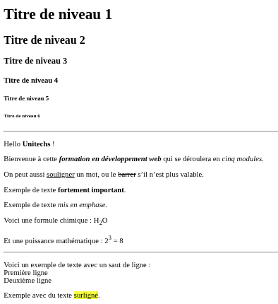
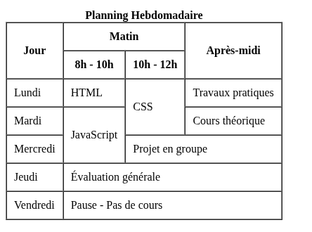

# Les Bases du Développement Web
## Formation Complète pour Débutants

<div class="pt-12">
  <span class="text-lg">
    HTML5 • CSS3 • JavaScript ES6+ • DOM & Événements
  </span>
</div>

<div class="pt-8">
  <span @click="$slidev.nav.next" class="px-4 py-2 rounded cursor-pointer bg-blue-600 text-white hover:bg-blue-700">
    Commencer le cours <carbon:arrow-right class="inline"/>
  </span>
</div>

---
layout: two-cols
---

# Plan du Cours

## 📚 Programme Détaillé

**Partie 1: HTML5 Structure et Sémantique**
- Structure de base HTML5
- Éléments sémantiques
- Formulaires et validation
- Accessibilité
- TP: Page web sémantique

**Partie 2: CSS3 et Design Responsive**
- Sélecteurs et propriétés CSS3
- Flexbox et Grid
- Design responsive
- Animations et transitions
- TP: Site responsive

::right::

**Partie 3: JavaScript ES6+ Fondamentaux**
- Variables et types de données
- Fonctions et classes ES6+
- Structures de contrôle
- Modules et imports
- TP: Application interactive

**Partie 4: DOM et Événements**
- Manipulation du DOM
- Gestion des événements
- AJAX et Fetch API
- Local Storage
- TP: Application complète

**🎯 Projet Final: Plateforme Web Responsive**

---
layout: center
class: text-center
---

# Partie 1
## HTML5 Structure et Sémantique

<div class="text-6xl text-orange-500 mb-8">
  <carbon-html />
</div>

Maîtriser la structure et la sémantique HTML5 pour créer des bases solides

---

# 1.1 Introduction à HTML5

## Qu'est-ce que HTML ?

- HTML (HyperText Markup Language) est le langage standard utilisé pour créer et structurer des pages web. Il permet de décrire la structure d’un document en utilisant des balises (ou "tags").
- HTML5 (HyperText Markup Language 5) est la dernière version du langage de balisage standard pour créer des pages web.
- Une balise (ou tag en anglais) est un élément de base du langage HTML qui sert à marquer ou délimiter des portions de texte pour indiquer leur rôle ou leur signification sur une page web. On distingue deux types:
     - Les balises simples
     - Les balises doubles

### Nouveautés HTML5 :
- **Éléments sémantiques** : `<header>`, `<nav>`, `<main>`, `<section>`, `<article>`, `<aside>`, `<footer>`
- **APIs intégrées** : Canvas, Audio/Video, Geolocation, Local Storage
- **Formulaires améliorés** : nouveaux types d'input et validation native
- **Meilleure accessibilité** et SEO(pour Search Engine Optimization)

---
layout: two-cols
---

### Structure de base HTML5 :

```html
<!DOCTYPE html>
<html lang="fr">
  <head>
    <meta charset="UTF-8" />
    <title>Titre Page</title>
  </head>
  <body>
    Bonjour, UniTechs
  </body>
</html>

```
::right::

### Explication des balises

- `<!DOCTYPE html>`	Indique que le document est en HTML5
- `<html lang="fr">`	Conteneur de tout le document, ici en français
- `<head>`	Contient les métadonnées (non visibles)
- `<meta charset="UTF-8">`	Permet l'encodage universel (accent, caractères spéciaux)
- `<title>`	Titre affiché dans l’onglet du navigateur
- `<body>`	Contient tout le contenu affiché à l’écran

---

# 1.2 Le Corps du document - body

## Les Commentaires
```html
<!-- Ceci est un commentaire HTML -->
```

## Titres

Les balises de titre vont de `<h1>` (le plus important) à `<h6>` (le moins important).

```html
<h1>Titre principal</h1>
<h2>Sous-titre</h2>
<h3>Sous-sous-titre</h3>
```


## Les Paragraphes 

Chaque paragraphe de texte se place entre balises `<p>` :
```html
<p>Ceci est un paragraphe de texte.</p>

```

---
layout: two-cols
---

## Mise en forme du texte

- `<strong>` `<b>`	Texte en gras (sémantique importante)
- `<em>` `<i>`	Texte en italique (accent mis sur le mot)
- `<mark>`	Texte surligné
- `<u>`	Texte souligné (moins utilisé)
- `<s>` Texte barré 
- `<sup>` Text en exposant
- `<sub>` Text en indice 
- `<br>`	Saut de ligne
- `<hr>`	Ligne horizontale de séparation

::right::

## Exemple
```html
<!DOCTYPE html>
<html lang="fr">
  <head>
    <meta charset="UTF-8" />
    <title>Texte HTML</title>
  </head>
  <body>
    <h1>Mon titre principal</h1>
    <h2>Un sous-titre</h2>
    <p>Ceci est un paragraphe <b>avec du gras</b>.</p>
    <p>Un autre paragraphe <i>avec de l’italique</i>.</p>
    <p>Ligne 1<br>Ligne 2</p>
    <hr>
    <!-- Commentaire invisible à l'écran -->
  </body>
</html>

```

---

## 📝 Exercice 1
 Realisez le visuel ci dessous
 

---
layout: two-cols
---

## Liens et Navigation
🎯 Objectifs
- Créer des liens vers d’autres pages ou sites
- Créer des ancres dans une même page
- Utiliser des liens pour envoyer un email ou télécharger un fichier

### a. Creer un lien
La balise `<a>` permet de créer un hyperlien. Elle comprend en son sein plusieurs attributs dont:
- `href`	Cible du lien (URL ou fichier local)
- `target` il existe plusieurs valeurs 
    - `_self` Affichage dans le cadre courant(Par defaut)
    - `_blank` Ouvre dans un nouvel onglet

::right::	
     - `_top` Affichage dans la totalite de la fenetre ouvrante
- `title`	Texte au survol
- `download` Pour telecharger un document
```html
<a href="https://www.example.com">Visiter un site</a>
<a href="https://openai.com" target="_blank" title="Visitez OpenAI">OpenAI</a>
<a href="page2.html">Aller à la page 2</a>
<a href="fichier.pdf" download>Télécharger le PDF</a>
```

---

### b. Les liens email
Vous pouvez permettre a vos utilisateurs d'ecrire sur votre adresses emails avec la syntaxe `mailto`
```html
<a href="mailto:unietechsdev@gmail.com">Envoyer un mail</a>
```
Vous pouvez renseigner un sujet par defaut, ainsi qu'un corps voire meme les deux:
```html
<a href="mailto:unietechsdev@gmail.com?subject=Sujet du mail">Envoyer un mail</a>
<a href="mailto:unietechsdev@gmail.com?body=Corp du mail">Envoyer un mail</a>
<!-- Pour les deux -->
 <a href="mailto:unietechsdev@gmail.com?subject=Sujet du mail&body=Corps du mail">Envoyer un mail</a>
```


### c. Ancres internes (lien vers une section)

Étape 1 : Ajouter un id à une section
```html
<h2 id="section1">Chapitre 1</h2>
```
Étape 2 : Lien vers cette section
```html
<a href="#section1">Aller au chapitre 1</a>
```

---

### 📝 Exercice 3
Creer une page contenant :
- un lien vers le site "https://wwww.wikipedia.org"
- un lien permettant d'ouvrir sur un autre onglet votre projet de l'exercice1 developpé precedement
- un lien qui télécharge un fichier pdf
- un lien vers votre adresse email
- Une ancre pour aller directement a une section "Contact"

---

## Les Images
La balise `` permet d'afficher une image avec html qu'elle soit en locale ou distante. Pour cela elle dispose en sont sein plusieurs attributs dont:
- `src`	Lien vers l’image (fichier local ou URL)
- `alt`	Texte alternatif si l’image ne s’affiche pas
- `title`	Texte au survol
- `width`, `height`	Taille en pixels ou en %
```html


```
---

## Les Listes
Les listes en HTML permettent d'organiser le contenu sous forme d'éléments ordonnés ou non ordonnés.
### a. Liste non ordonnée
Utilisée pour afficher des éléments sans ordre particulier 
```html
<p>Liste de courses :</p>
<ul>
  <li>Pomme</li>
  <li>Banane</li>
  <li>Orange</li>
</ul>
```

On va pouvoir jouer sur le design des puces a l'aide de trois types differents. On renseigne le type des puces avec l'attribut `type` de la balise `<ul>`
- `disc` par defaut au niveau 1 d'imbrication
- `circle` par defaut au niveau 2 d'imbrication
- `square` par defaut au niveau 3 et suivant d'imbrication
  
---

### b. Liste ordonnée
Elles sont introduites par la balise `<ol>` et chacun des items est encadré par la balise `<li>`
```html
<p>Top 3 des activitées sportives: </p>
<ol>
  <li>Football</li>
  <li>Basket</li>
  <li>Handball</li>
</ol>
```

Il existe cinq manieres differentes de numéroter les listes ordonnées. On renseigne le type de numerotation avec l'attribut `type` de la balise `<ol>`. Les types sont:
- `1`: numerotation par les chiffres arabes(par défaut)
- `I`: numerotation par les chiffres romains
- `i`: numerotation par les chiffres romains minuscules
- `A`: numerotation par les lettres de l'alphabet
- `a`: numerotation par les lettres de l'alphabet


---

### c. Liste imbriqué
L'imbrication des listes permet une présentation claire et detaillée d'un mmenu ou d'un sommaire

```html
<ul>
  <li>Fruits
    <ul>
      <li>Pomme</li>
      <li>Raisin</li>
    </ul>
  </li>
  <li>Légumes
    <ul>
      <li>Carotte</li>
      <li>Tomate</li>
    </ul>
  </li>
</ul>
```

---

### 📝 Exercice 4
Créer une page contenant :
- Une liste de vos 3 langages préférés
- Une liste numérotée des étapes d’installation de Visual Studio Code
- Une liste imbriquée de vos hobbies (ex: Sport → Foot, Basket / Musique → Jazz, Rap, ...)


---

# 1.3 Exercice - Structure HTML5

## 🎯 Exercice Pratique

Créez une page HTML5 pour un restaurant avec :
- En-tête avec nom du restaurant et navigation
- Section "À propos" avec description
- Section "Menu" avec 3 plats (nom, description, prix)
- Section "Contact" avec adresse et téléphone
- Pied de page avec horaires

### Critères d'évaluation :
- ✅ Structure HTML5 valide
- ✅ Utilisation correcte des éléments sémantiques
- ✅ Métadonnées appropriées
- ✅ Navigation fonctionnelle

**Temps estimé : 30 minutes**

---
layout: two-cols
---

# 1.4  Les Tableaux en HTML

Suite de lignes et de colonnes qui forment un ensemble de cellules. Elles servent avant tout a presenter des données tabulaires
## Bases d'un tableau
1. Un tableau est delimite par la balise `<table>`. Le contenue d'un tableau est genere horizontalement(lignes par lignes).
2. Pour créer un tableau, nous commencons par des lignes graces aux balises `<tr>` puis nous inserons dans ses lignes les cellules du tableau avec les balises `<th>` `<td>`
3. Le contenu (textes, images, ...) se trouvent uniquement dans les balises `<td>` ou `<th>` et ne doivent en aucun cas se trouver en dehors.

::right::

## Structure de base d’un tableau
```html
<table>
  <tr>
    <th>Eleves</th>
    <th>Francais</th>
    <th>Mathématiques</th>
    <th>Histoire</th>
    <th>Sport</th>
  </tr>
  <tr>
    <td>Laure</td>
    <td>15</td>
    <td>10</td>
    <td>11</td>
    <td>13</td>
  </tr>
  <tr>
    <td>Philippe</td>
    <td>8.5</td>
    <td>12</td>
    <td>9</td>
    <td>15</td>
  </tr>
</table>
```

---

## Ajouter un titre au tableau
```html
<caption>Liste des étudiants</caption>

<caption align="bottom">Liste des étudiants</caption>
```

##  Fusion de cellules
La fusion de cellules peut se faire de deux maniere: 
- 🔸Fusion horizontale : `colspan`, 
- 🔸 Fusion verticale : `rowspan`
## Les differentes parties d'un tableau
Quand on arrive a avoir un tableau de grande taille, il devient moins évident a gérer. Pour cela on peut regrouper les lignes par grandes parties
- 🔸 l'en-tete avec la balise `<thead>`    🔸 le corps avec la balise `<tbody>`  🔸 le pied avec la balise `<tfoot>`

<i>Note: Elles doivent apparaitre dans l'ordre suivant: `<thead>`, `<tfoot>` et `<tbody>`</i>
---
layout: two-cols
---

## 📝 Exercice 5
Donner le code html permettant d'afficher le rendu/visuel ci-dessous:


::right::



---

## 🎯 Exercice Pratique

Créez une page HTML5 permettant d'afficher :


### Critères d'évaluation :
- ✅ Structure HTML5 valide
- ✅ Utilisation correcte des éléments sémantiques
- ✅ Métadonnées appropriées

**Temps estimé : 10 minutes**

---

# 1.5 Formulaires HTML

## Qu'est-ce qu'un formulaire ?
Un formulaires permet de collecter des informations saisies par l'utilisateur et de les envoyer à un serveur pour traitement.Elles sont dotés de divers controles comme:
- des champs de saisie,
- des boutons
- listes
- ...

---

## 🏗️ Structure générale

```html
<!DOCTYPE html>
<html lang="fr">
<head>
    <meta charset="UTF-8">
    <title>Mon Formulaire</title>
</head>
<body>
    <form>
        <!-- Éléments du formulaire -->
        <input type="text" name="nom">
        <button type="submit">Envoyer</button>
    </form>
</body>
</html>
```
<p>
  <strong>💡 À retenir :</strong> Un formulaire est un conteneur qui regroupe des éléments interactifs pour collecter des données utilisateur.
</p>

---

# Anatomie d'un Formulaire
Découvrons les composants essentiels d'un formulaire HTML.

```html
<form action="/traitement.php" method="post">
    <!-- 1. Étiquette -->
    <label for="nom">Votre nom :</label>
    
    <!-- 2. Champ de saisie -->
    <input type="text" id="nom" name="nom">
    
    <!-- 3. Bouton d'envoi -->
    <button type="submit">Envoyer</button>
</form>
```

### Rôles des éléments :
- **`<form>`** : Conteneur principal
- **`<label>`** : Étiquette descriptive
- **`<input>`** : Champ de saisie
- **`<button>`** : Bouton d'action
---

## ⚙️ Attributs importants

### Élément `<form>`
- **`action`** : URL de destination des données
- **`method`** : Méthode d'envoi (GET/POST)

### Élément `<input>`
- **`type`** : Type de champ (text, email, date, number, time,...)
- **`name`** : Nom du champ pour le serveur
- **`id`** : Identifiant unique

### Élément `<label>`
- **`for`** : Lie l'étiquette au champ (même valeur que l'`id`)

---
layout: two-cols
---

## 📝 Exercice 6 
Créez votre premier formulaire HTML simple :

### Objectifs :
1. Créer un fichier `exercice6.html`
2. Ajouter un formulaire avec :
   - Un champ "Prénom"
   - Un champ "Nom de famille"
   - un champ "Email"
   - Un bouton "Valider"
3. Utiliser les bonnes pratiques :
   - Associer les labels aux inputs
   - Définir les attributs `name` et `id`
::right::

### ✅ À faire

1. **Créer** le fichier HTML avec la structure de base
2. **Ajouter** le formulaire avec les champs demandés
3. **Vérifier** que vous pouvez saisir du texte et cliquer sur le bouton
---
layout: two-cols
---

## L'élément `<form>` et ses Attributs
L'élément `<form>` est le conteneur principal qui définit comment les données seront envoyées.

### `action` - Destination des données
```html
<!-- Envoie vers un fichier PHP -->
<form action="traitement.php">

<!-- Envoie vers une URL complète -->
<form action="https://exemple.com/contact">

<!-- Envoie vers la même page (par défaut) -->
<form action="">
<form> <!-- Sans action = même page -->
```

::right::

### `method` - Méthode d'envoi
```html
<!-- GET : données visibles dans l'URL -->
<form method="get">

<!-- POST : données cachées (recommandé) -->
<form method="post">
```

### `name` - Nom du formulaire
```html
<form name="contact" action="traitement.php">
```

### `target` - Fenêtre de destination
```html
<!-- Ouvre dans une nouvelle fenêtre -->
<form target="_blank">

<!-- Ouvre dans la même fenêtre (défaut) -->
<form target="_self">
```

---
layout: two-cols
---
# Différence entre GET et POST

Comprendre les méthodes d'envoi est crucial pour bien utiliser les formulaires.

## 📤 Méthode GET

Les valeurs envoyes en `GET` passent par l'URL

```html
<form action="recherche.php" method="get">
    <label for="motcle">Rechercher :</label>
    <input type="text" id="motcle" name="q">
    <button type="submit">Chercher</button>
</form>
```


**Résultat dans l'URL :**
```
https://exemple.com/recherche.php?q=formation
```

::right::
### ✅ Avantages :
- URL partageable
- Résultat mis en favoris
- Navigation avec boutons précédent/suivant

### ❌ Inconvénients :
- Données visibles dans l'URL
- Limite de longueur (~2000 caractères)
- Pas sécurisé pour données sensibles

---
layout: two-cols
---

## 📨 Méthode POST

```html
<form action="inscription.php" method="post">
    <label for="email">Email :</label>
    <input type="email" id="email" name="email">
    
    <label for="password">Mot de passe :</label>
    <input type="password" id="password" name="password">
    
    <button type="submit">S'inscrire</button>
</form>
```
**Les données sont envoyées de manière cachée**

::right::

### ✅ Avantages :
- Données cachées dans l'URL
- Pas de limite de taille
- Plus sécurisé
- Permet l'envoi de fichiers

### ❌ Inconvénients :
- URL non partageable
- Pas de favoris possible
- Actualisation = renvoi des données

---

# Quand utiliser GET ou POST ?

## 🔍 Utilisez GET pour :

- **Recherche** : Moteurs de recherche
- **Filtres** : Tri de produits
- **Navigation** : Pagination
- **Consultation** : Affichage de données

```html
<!-- Formulaire de recherche -->
<form action="recherche.php" method="get">
    <input type="search" name="q" placeholder="Rechercher...">
    <button type="submit">🔍</button>
</form>

<!-- Filtre de produits -->
<form method="get">
    <select name="categorie">
        <option value="tous">Tous</option>
        <option value="vetements">Vêtements</option>
    </select>
    <button type="submit">Filtrer</button>
</form>
```

---

## 📝 Utilisez POST pour :

- **Inscription/Connexion** : Données sensibles
- **Contact** : Messages privés
- **Commandes** : Informations personnelles
- **Upload** : Envoi de fichiers

```html
<!-- Formulaire de contact -->
<form action="contact.php" method="post">
    <input type="email" name="email" required>
    <textarea name="message" required></textarea>
    <button type="submit">Envoyer</button>
</form>

<!-- Upload de fichier -->
<form method="post" enctype="multipart/form-data">
    <input type="file" name="photo">
    <button type="submit">Télécharger</button>
</form>
```

---
layout: two-cols
---

## 📝 Exercice 7 : Formulaires GET et POST
Créez deux formulaires pour comprendre la différence entre GET et POST :

### Formulaire 1 - Recherche
- Champ de recherche
- Bouton "Rechercher"
- Action vers `recherche.php`

### Formulaire 2 - Contact
- Champ "Nom"
- Champ "Email"
- Zone de "Message"
- Bouton "Envoyer"
- Action vers `contact.php`

::right::

## 🎯 Travail a Faire

1. **Créer** `exercice7.html`
2. **Implémenter** les deux formulaires
3. **Tester** en remplissant les champs
4. **Observer** la différence dans l'URL après soumission
5. **Comprendre** quand utiliser chaque méthode

---

# Champs de Saisie `<input>`
L'élément `<input>` est polyvalent et change de comportement selon son attribut `type`.

## 🎛️ Syntaxe de base

```html
<input type="type" name="nom" id="identifiant">
```

### Attributs essentiels :
- **`type`** : Définit le type de champ
- **`name`** : Nom du champ (côté serveur)
- **`id`** : Identifiant unique (pour `<label>`)

### Attributs optionnels :
- **`value`** : Valeur par défaut
- **`placeholder`** : Texte d'aide
- **`required`** : Champ obligatoire
- **`disabled`** : Champ désactivé
- **`readonly`** : Lecture seule
---

## 📝 Types d'input principaux

| Type | Usage |
|------|-------|
| `text` | Texte simple |
| `email` | Adresse email |
| `password` | Mot de passe |
| `number` | Nombre |
| `tel` | Téléphone |
| `url` | URL |
| `date` | Date |
| `checkbox` | Case à cocher |
| `radio` | Bouton radio |
| `file` | Fichier |
| `submit` | Bouton d'envoi |
| `reset` | Bouton de renitialisation |
| `button` | Bouton simple |
---

## Types de Texte

Les différents types de champs texte et leurs spécificités.

### 📝 Type `text` - Texte simple

```html
<!-- Champ texte basique -->
<label for="nom">Nom :</label>
<input type="text" id="nom" name="nom">

<!-- Avec valeur par défaut -->
<input type="text" name="ville" value="Paris">

<!-- Avec placeholder -->
<input type="text" name="prenom" 
       placeholder="Entrez votre prénom">

<!-- Avec contraintes -->
<input type="text" name="pseudo" 
       minlength="3" maxlength="20"
       placeholder="3 à 20 caractères">
```

### ✨ Attributs spécifiques :
- `minlength` / `maxlength` : Longueur min/max
- `pattern` : Expression régulière
- `autocomplete` : Autocomplétion

---

## 📧 Type `email` - Adresse email

```html
<!-- Email simple -->
<label for="email">Email :</label>
<input type="email" id="email" name="email">

<!-- Email obligatoire -->
<input type="email" name="email" required
       placeholder="votre@email.com">

<!-- Plusieurs emails -->
<input type="email" name="emails" multiple
       placeholder="email1@test.com, email2@test.com">
```

## 🔔 Type `tel` - Téléphone

```html
<!-- Téléphone -->
<label for="tel">Téléphone :</label>
<input type="tel" id="tel" name="telephone">

<!-- Avec pattern pour format français -->
<input type="tel" name="tel" 
       pattern="0[1-9][0-9]{8}"
       placeholder="0123456789">
```

---

# Types Spécialisés
Découvrons les types d'input plus spécifiques.

## 🔒 Type `password` - Mot de passe

```html
<!-- Mot de passe simple -->
<label for="password">Mot de passe :</label>
<input type="password" id="password" name="password">

<!-- Avec contraintes -->
<input type="password" name="password"
       minlength="8" required
       placeholder="8 caractères minimum">

<!-- Confirmation -->
<label for="confirm">Confirmer :</label>
<input type="password" id="confirm" name="confirm">
```

## 🌐 Type `url` - URL

```html
<!-- URL simple -->
<input type="url" name="site" 
       placeholder="https://monsite.com">

<!-- URL obligatoire -->
<input type="url" name="portfolio" required>
```

---

## 🔢 Type `number` - Nombre

```html
<!-- Nombre simple -->
<label for="age">Âge :</label>
<input type="number" id="age" name="age">

<!-- Avec limites -->
<input type="number" name="note" 
       min="0" max="20" step="0.5"
       placeholder="Note sur 20">

<!-- Quantité -->
<input type="number" name="quantite" 
       min="1" value="1">
```

## 🔍 Type `search` - Recherche

```html
<!-- Champ de recherche -->
<input type="search" name="q" 
       placeholder="Rechercher...">

<!-- Avec autocomplete -->
<input type="search" name="recherche"
       autocomplete="on">
```

---

# Types de Date et Heure

HTML5 offre plusieurs types pour gérer les dates et heures.

## 📅 Dates

```html
<!-- Date complète -->
<label for="naissance">Date de naissance :</label>
<input type="date" id="naissance" name="naissance">

<!-- Avec limites -->
<input type="date" name="reservation"
       min="2024-01-01" max="2024-12-31">

<!-- Mois uniquement -->
<label for="mois">Mois :</label>
<input type="month" id="mois" name="mois">

<!-- Semaine -->
<label for="semaine">Semaine :</label>
<input type="week" id="semaine" name="semaine">
```

---

## ⏰ Heures

```html
<!-- Heure -->
<label for="heure">Heure :</label>
<input type="time" id="heure" name="heure">

<!-- Avec valeur par défaut -->
<input type="time" name="rendez-vous" 
       value="09:30">

<!-- Date et heure complète -->
<label for="datetime">Date et heure :</label>
<input type="datetime-local" id="datetime" 
       name="datetime">

<!-- Avec minimum  -->
<input type="datetime-local" name="reservation"
       min="2025-07-30T10:00">
```

---

## 📝 Exercice 8 : Types d'Input
Créez un formulaire d'inscription utilisant différents types d'input :

### Champs à créer :
1. **Prénom** (text, obligatoire)
1. **Nom** (text, obligatoire)
2. **Email** (email, obligatoire)
3. **Mot de passe** (password, min 8 caractères)
4. **Téléphone** (tel, format french)
5. **Site web** (url, optionnel)
6. **Âge** (number, 16-99 ans)
7. **Date de naissance** (date)
8. **Heure préférée** (time)

### Contraintes :
- Tous les champs obligatoires sauf site web
- Placeholders informatifs
- Validation HTML5 appropriée

---

# 1.7 TP Partie 1 - Site Portfolio

## 🛠️ Travail Pratique : Créer un Portfolio Personnel

### Objectifs :
Créer un site portfolio personnel avec HTML5 sémantique et accessible

### Cahier des charges :
1. **Page d'accueil** avec présentation personnelle
2. **Section Compétences** avec liste de technologies
3. **Portfolio de projets** (3 projets minimum)
4. **Section Contact** avec formulaire de contact
5. **Navigation** entre toutes les sections
6. **Accessibilité** : ARIA, alt, navigation clavier
7. **Validation HTML5** pour le formulaire

---

### Structure attendue :
```
portfolio/
├── index.html
├── images/
│   ├── photo-profil.jpg
│   ├── projet1.jpg
│   ├── projet2.jpg
│   └── projet3.jpg
└── README.md
```

**Temps alloué : 2 heures**

### Ressources :
- Validateur W3C : https://validator.w3.org/
- Images Pexels : https://www.pexels.com/
- Guide ARIA : https://developer.mozilla.org/fr/docs/Web/Accessibility/ARIA


---
layout: center
class: text-center
---

# Partie 2
## CSS3 et Design Responsive

<div class="text-6xl text-blue-500 mb-8">
  <carbon-screen />
</div>

Maîtriser CSS3 et créer des designs responsives modernes

---
layout: two-cols
---

# 2.6 Exercice - Site E-commerce Responsive

## 🎯 Exercice Pratique

Créer la page d'accueil d'un site e-commerce responsive avec :

### Composants à créer :
1. **Header** : Logo, navigation, panier (Flexbox)
2. **Section Hero** : Bannière promotionnelle
3. **Grille de produits** : 4 colonnes desktop, 2 tablette, 1 mobile (CSS Grid)
4. **Cards produits** : Image, titre, prix, bouton
5. **Footer** : Liens, réseaux sociaux

::right::

### Spécifications techniques :
- ✅ Mobile First
- ✅ Breakpoints : 768px, 1024px
- ✅ Flexbox pour la navigation
- ✅ CSS Grid pour les produits
- ✅ Animations au hover
- ✅ Images responsives

### Breakpoints attendus :
- **Mobile** : < 768px (1 colonne)
- **Tablette** : 768px - 1023px (2 colonnes)
- **Desktop** : ≥ 1024px (4 colonnes)

**Temps estimé : 35 minutes**

---
layout: two-cols
---

# 2.8 TP Partie 2 - Dashboard Responsive

## 🛠️ Travail Pratique : Dashboard Admin Responsive

### Objectifs :
Créer un dashboard d'administration responsive avec CSS Grid et Flexbox

### Cahier des charges :
1. **Layout principal** : Sidebar + Header + Main content (CSS Grid)
2. **Sidebar** : Navigation verticale, collapsible sur mobile
3. **Header** : Titre, notifications, profil utilisateur
4. **Dashboard widgets** : Statistiques en cards responsives
5. **Tableau de données** : Responsive avec scroll horizontal
6. **Animations** : Transitions fluides, micro-interactions

::right::

### Composants requis :
- **4 widgets statistiques** (Users, Revenue, Orders, Growth)
- **Graphique en placeholder** avec responsive
- **Tableau utilisateurs** (nom, email, statut, actions)
- **Navigation mobile** avec menu hamburger

### Breakpoints :
- **Mobile** : < 768px (sidebar en overlay)
- **Tablette** : 768px - 1023px (sidebar réduite)
- **Desktop** : ≥ 1024px (sidebar complète)

**Temps alloué : 1h30**

---

# 2.9 Correction TP Dashboard

## 💡 Solution Dashboard Responsive

*Structure HTML et CSS complète pour un dashboard admin moderne avec toutes les fonctionnalités responsive demandées...*
le code va inclure:
- Layout CSS Grid principal
- Sidebar responsive avec menu hamburger
- Widgets de statistiques en CSS Grid
- Tableau responsive avec scroll
- Animations CSS avancées
- Media queries complètes

---
layout: center
class: text-center
---

# Partie 3
## JavaScript ES6+ Fondamentaux

<div class="text-6xl text-yellow-500 mb-8">
  <!-- <carbon-logo-javascript /> -->
  JavaScript
</div>

Maîtriser JavaScript moderne pour créer des applications interactives

---
layout: two-cols
---

# 3.6 Exercice - Application Todo List

## 🎯 Exercice Pratique

Créer une application Todo List complète avec JavaScript ES6+

### Fonctionnalités requises :
1. **Ajouter une tâche** avec titre et description
2. **Marquer comme terminée/non terminée**
3. **Supprimer une tâche**
4. **Filtrer** : Toutes, Actives, Terminées
5. **Compteur** de tâches restantes
6. **Persistance** avec localStorage
7. **Validation** des données d'entrée

### Spécifications techniques :
- ✅ Classes ES6+ pour la structure
- ✅ Modules pour organiser le code
- ✅ Async/Await si API simulation

::right::

- ✅ Destructuring et spread operator
- ✅ Array methods (map, filter, reduce)
- ✅ Template literals pour le HTML

### Architecture suggérée :
```
js/
├── models/Task.js
├── models/TodoList.js
├── storage/LocalStorage.js
├── views/TodoView.js
├── controllers/TodoController.js
└── app.js
```

**Temps estimé : 1 heure**

---
layout: two-cols
---

# 3.8 TP Partie 3 - Gestionnaire de Contacts

## 🛠️ Travail Pratique : Application de Gestion de Contacts

### Objectifs :
Créer une application complète de gestion de contacts avec JavaScript ES6+

### Fonctionnalités avancées :
1. **CRUD complet** : Create, Read, Update, Delete
2. **Recherche et filtrage** : Par nom, email, catégorie
3. **Validation avancée** : Email, téléphone, formulaires
4. **Import/Export** : JSON, CSV
5. **Gestion des groupes** : Création et assignation
6. **Interface modale** pour l'édition
7. **Pagination** pour les grandes listes

### Spécifications techniques :
- ✅ Architecture MVC complète
- ✅ Classes ES6+ avec héritage
- ✅ Modules ES6 bien organisés
- ✅ Async/Await pour les opérations
- ✅ Gestion d'erreurs robuste
- ✅ localStorage + sessionStorage
- ✅ Animations et transitions

::right::

### Architecture :
```
js/
├── models/
│   ├── Contact.js
│   ├── Group.js
│   └── ContactManager.js
├── views/
│   ├── ContactView.js
│   ├── ModalView.js
│   └── SearchView.js
├── controllers/
│   └── AppController.js
├── services/
│   ├── StorageService.js
│   ├── ValidationService.js
│   └── ExportService.js
└── app.js
```

**Temps alloué : 3 heures**

---
layout: center
class: text-center
---

# Partie 4
## DOM et Événements

<div class="text-6xl text-green-500 mb-8">
  <carbon-cursor-1 />
</div>

Maîtriser la manipulation du DOM et la gestion des événements


---
layout: two-cols
---

# 4.6 Exercice - Application Web Interactive

## 🎯 Exercice Pratique

Créer une application de gestion d'inventaire interactive avec DOM et événements

### Fonctionnalités requises :
1. **CRUD complet** avec interface dynamique
2. **Recherche et filtrage** en temps réel
3. **Glisser-déposer** pour réorganiser
4. **Validation en temps réel** des formulaires
5. **Sauvegarde automatique** avec localStorage
6. **Undo/Redo** pour les actions
7. **Notifications** pour les actions utilisateur

### Spécifications techniques :
- ✅ Manipulation DOM native (pas de framework)
- ✅ Délégation d'événements
- ✅ Custom events pour la communication

::right::

- ✅ State management avec historique
- ✅ Validation de formulaires avancée
- ✅ API Fetch pour simulation serveur
- ✅ Animations CSS3 déclenchées par JS

### Interface attendue :
- **Header** : Recherche, filtres, boutons d'action
- **Liste d'items** : Cards avec drag & drop
- **Modal** : Formulaire d'ajout/édition
- **Toast notifications** : Feedback utilisateur
- **Footer** : Statistiques et boutons undo/redo

**Temps estimé : 1h30**

---

# 4.8 TP Partie 4 - Dashboard Analytics

## 🛠️ Travail Pratique : Dashboard Analytics Interactif

### Objectifs :
Créer un dashboard d'analytics interactif avec DOM manipulation avancée

### Fonctionnalités avancées :
1. **Widgets interactifs** : Graphiques, métriques, tableaux
2. **Filtres temporels** : Jour, semaine, mois, année
3. **Drag & Drop** : Réorganisation des widgets
4. **Zoom et pan** : Sur les graphiques (simulation)
5. **Export de données** : PDF, CSV, JSON
6. **Thème dynamique** : Clair/sombre avec préférences
7. **Notifications temps réel** : WebSocket simulation
8. **Responsive design** : Adaptation mobile/desktop

### Architecture technique :
- **State management** : Gestion centralisée des données
- **Event system** : Custom events pour communication
- **Storage management** : Préférences et cache
- **API simulation** : Données mock avec délais
- **Performance** : Virtual scrolling, lazy loading
- **Accessibility** : ARIA, navigation clavier

### Widgets à implémenter :
- **KPI Cards** : Revenus, utilisateurs, conversions
- **Charts** : Line, bar, pie (canvas/SVG)
- **Data Table** : Tri, pagination, recherche
- **Real-time feed** : Activité en temps réel
- **Heat map** : Données géographiques
- **Progress indicators** : Objectifs et progression

**Temps alloué : 4 heures**

---
layout: center
class: text-center
---

# Projet Final
## Plateforme Web Responsive Complète

<div class="text-6xl text-purple-500 mb-8">
  <carbon-application-web />
</div>

Intégrer toutes les compétences acquises dans un projet complet

---

# Projet Final - Spécifications

## 🎯 Mission : Créer une Plateforme E-Learning

### Fonctionnalités Core :
1. **Authentification** : Inscription, connexion, profils
2. **Catalogue de cours** : Liste, détails, catégories
3. **Lecture de contenu** : Vidéos, articles, quiz
4. **Progression** : Suivi, certificats, statistiques
5. **Interaction** : Commentaires, notes, favoris
6. **Administration** : Gestion des cours et utilisateurs

### Technologies imposées :
- ✅ **HTML5 sémantique** : Structure accessible
- ✅ **CSS3 responsive** : Mobile-first, animations
- ✅ **JavaScript ES6+** : Classes, modules, async/await
- ✅ **DOM manipulation** : Interfaces dynamiques
- ✅ **State management** : Gestion des données
- ✅ **localStorage** : Persistance locale
- ✅ **Fetch API** : Simulation d'API REST

### Livrables attendus :
- **Code source** organisé en modules
- **Documentation** technique complète
- **Tests fonctionnels** de chaque feature
- **Présentation** de 10 minutes

---

# Architecture du Projet

## 📁 Structure de Fichiers

```
elearning-platform/
├── index.html
├── assets/
│   ├── css/
│   │   ├── main.css
│   │   ├── components.css
│   │   └── responsive.css
│   ├── js/
│   │   ├── models/
│   │   │   ├── User.js
│   │   │   ├── Course.js
│   │   │   └── Progress.js
│   │   ├── views/
│   │   │   ├── LoginView.js
│   │   │   ├── CourseView.js
│   │   │   └── ProfileView.js
│   │   ├── controllers/
│   │   │   └── AppController.js
│   │   ├── services/
│   │   │   ├── AuthService.js
│   │   │   ├── CourseService.js
│   │   │   └── StorageService.js
│   │   ├── utils/
│   │   │   ├── helpers.js
│   │   │   └── validators.js
│   │   └── app.js
│   └── images/
│       ├── avatars/
│       ├── courses/
│       └── icons/
├── pages/
│   ├── dashboard.html
│   ├── courses.html
│   ├── profile.html
│   └── admin.html
└── README.md
```

## 🏗️ Architecture MVC

- **Models** : Classes métier (User, Course, Progress)
- **Views** : Gestion de l'affichage et interactions
- **Controllers** : Logique applicative et coordination
- **Services** : API, stockage, authentification
- **Utils** : Fonctions utilitaires réutilisables

---

# Critères d'Évaluation

## 📊 Grille de Notation (100 points)

### HTML5 Sémantique (20 points)
- ✅ Structure sémantique correcte
- ✅ Accessibilité (ARIA, alt, navigation)
- ✅ Formulaires avec validation native
- ✅ Métadonnées et SEO

### CSS3 Responsive (25 points)
- ✅ Design mobile-first
- ✅ Flexbox et Grid Layout
- ✅ Animations et transitions fluides
- ✅ Cohérence visuelle et UX
- ✅ Performance (pas de layout thrashing)

### JavaScript ES6+ (30 points)
- ✅ Classes et héritage
- ✅ Modules bien organisés
- ✅ Async/await et promises
- ✅ Gestion d'erreurs robuste
- ✅ Code propre et commenté

### DOM et Événements (15 points)
- ✅ Manipulation DOM efficace
- ✅ Délégation d'événements
- ✅ Gestion d'état avancée
- ✅ Performance (pas de fuites mémoire)

### Intégration et Finition (10 points)
- ✅ Fonctionnalités complètes
- ✅ Tests et debugging
- ✅ Documentation
- ✅ Présentation professionnelle

---

# Ressources et Aide

## 📚 Documentation de Référence

### HTML5 & Accessibilité
- [MDN HTML Elements](https://developer.mozilla.org/fr/docs/Web/HTML/Element)
- [WCAG Guidelines](https://www.w3.org/WAI/WCAG21/quickref/)
- [ARIA Authoring Practices](https://www.w3.org/WAI/ARIA/apg/)

### CSS3 & Responsive
- [CSS Grid Guide](https://css-tricks.com/snippets/css/complete-guide-grid/)
- [Flexbox Guide](https://css-tricks.com/snippets/css/a-guide-to-flexbox/)
- [Can I Use](https://caniuse.com/) - Compatibilité navigateurs

### JavaScript ES6+
- [ES6 Features](https://github.com/lukehoban/es6features)
- [JavaScript.info](https://javascript.info/) - Guide complet
- [MDN JavaScript](https://developer.mozilla.org/fr/docs/Web/JavaScript)

### Outils Utiles
- [Validator W3C](https://validator.w3.org/) - Validation HTML
- [Lighthouse](https://developers.google.com/web/tools/lighthouse) - Audit qualité
- [JSONPlaceholder](https://jsonplaceholder.typicode.com/) - API de test

---

# Planning et Organisation

## ⏰ Échéancier (5 jours)

### Jour 1 : Fondations
- **Matin** : Structure HTML et navigation
- **Après-midi** : CSS de base et responsive

### Jour 2 : Authentification
- **Matin** : Formulaires et validation
- **Après-midi** : Gestion utilisateurs

### Jour 3 : Catalogue de Cours
- **Matin** : Liste et recherche
- **Après-midi** : Détails et interactions

### Jour 4 : Fonctionnalités Avancées
- **Matin** : Progression et statistiques
- **Après-midi** : Administration

### Jour 5 : Finalisation
- **Matin** : Tests et debugging
- **Après-midi** : Documentation et présentation

## 🤝 Méthodologie de Travail

1. **Planification** : Définir les priorités
2. **Développement itératif** : Feature par feature
3. **Tests réguliers** : Validation continue
4. **Refactoring** : Amélioration du code
5. **Documentation** : Au fur et à mesure

---
layout: center
class: text-center
---

# Félicitations ! 🎉

## Vous maîtrisez maintenant les bases du développement web moderne

<div class="grid grid-cols-4 gap-8 mt-12">
  <div class="text-center">
    <div class="text-4xl mb-2">🏗️</div>
    <div class="font-bold">HTML5</div>
    <div class="text-sm">Structure sémantique</div>
  </div>
  <div class="text-center">
    <div class="text-4xl mb-2">🎨</div>
    <div class="font-bold">CSS3</div>
    <div class="text-sm">Design responsive</div>
  </div>
  <div class="text-center">
    <div class="text-4xl mb-2">⚡</div>
    <div class="font-bold">JavaScript</div>
    <div class="text-sm">ES6+ moderne</div>
  </div>
  <div class="text-center">
    <div class="text-4xl mb-2">🎯</div>
    <div class="font-bold">DOM</div>
    <div class="text-sm">Interactivité</div>
  </div>
</div>

<br>

### Prochaines étapes recommandées :
**Frameworks Frontend** : React, Angular  
**Backend** : Node.js, APIs REST  
**Bases de données** : MongoDB, PostgreSQL  
**DevOps** : Git, CI/CD, déploiement

---
layout: center
class: text-center
---

# Merci pour votre attention ! 

## Questions & Discussions

<div class="pt-12">
  <span class="text-lg">
    🚀 Continuez à coder et à apprendre !
  </span>
</div>

<div class="pt-8 text-sm opacity-75">
  Formation complète - Bases du Développement Web 2025
</div>